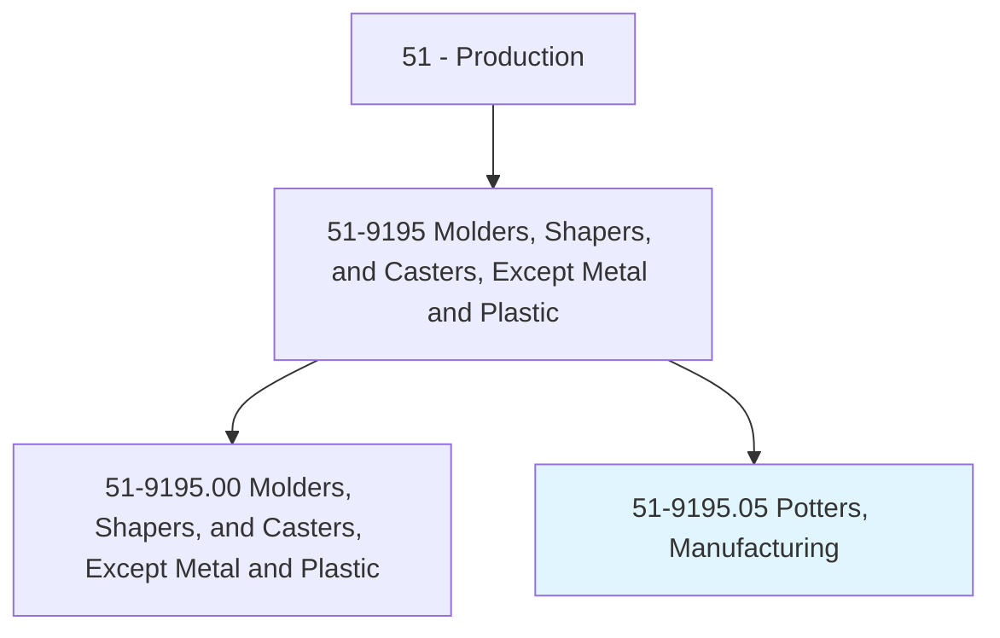
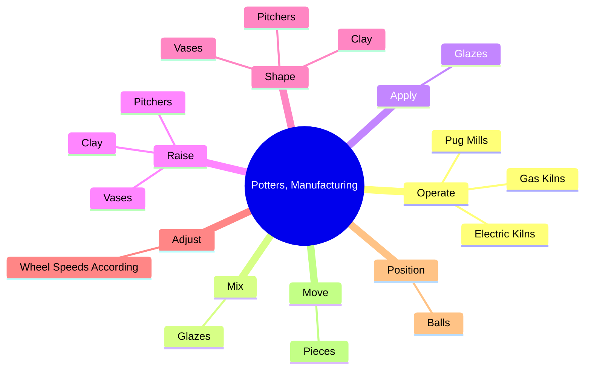

# Potters, Manufacturing

> Operate production machines such as pug mill, jigger machine, or potter's wheel to process clay in manufacture of ceramic, pottery and stoneware products.

## Overview

Potters, Manufacturing is classified under Production (SOC 51). Operate production machines such as pug mill, jigger machine, or potter's wheel to process clay in manufacture of ceramic, pottery and stoneware products.

## Classification Hierarchy

## Key Statistics

| Metric | Value |
|--------|-------|
| SOC Code | 51-9195.05 |
| Category | [Production](/occupations/Production) |
| Task Count | 90 |
| Source | O*NET |

## Core Tasks

### operate.GasKilns

Potters, Manufacturing operate gas kilns as part of their core responsibilities.

**Actions:**
- `operate.GasKilns.to.fire.PotteryPieces`
- `operate.ElectricKilns.to.fire.PotteryPieces`
- `operate.PugMills.to.blend.Clay`
- `operate.PugMills.to.ExtrudeClay`

### mix.Glazes

Potters, Manufacturing mix glazes as part of their core responsibilities.

**Actions:**
- `mix.Glazes.to.PotteryPieces`
- `mix.Glazes.to.UsingTools`
- `mix.Glazes.to.spray.Guns`

### apply.Glazes

Potters, Manufacturing apply glazes as part of their core responsibilities.

**Actions:**
- `apply.Glazes.to.PotteryPieces`
- `apply.Glazes.to.UsingTools`
- `apply.Glazes.to.spray.Guns`

## Skills & Competencies

### Technical Skills
- **Machine Operation** - Advanced
- **Quality Control** - Advanced
- **Production Processes** - Advanced

### Soft Skills
- **Communication** - Essential
- **Problem Solving** - Essential
- **Critical Thinking** - Important
- **Teamwork** - Important
- **Adaptability** - Important

## Related Occupations

## Industries

This occupation is found across multiple industries. See [Industries](/industries) for sector-specific employment data.

## Career Progression

---

*Source: O*NET 51-9195.05 - ONETOccupation*
