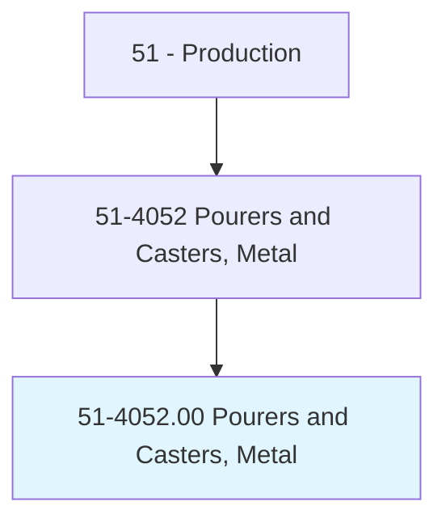
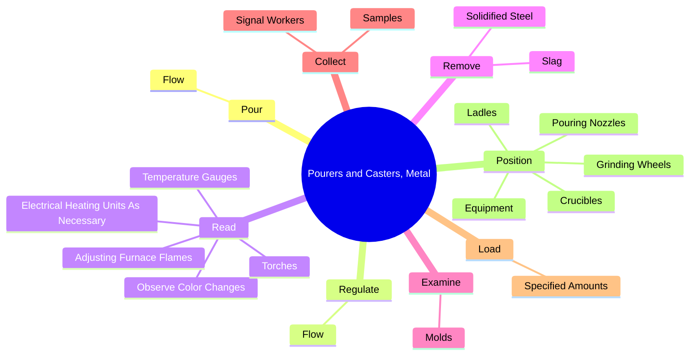
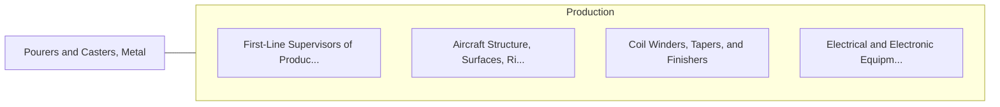

# Pourers and Casters, Metal

> Operate hand-controlled mechanisms to pour and regulate the flow of molten metal into molds to produce castings or ingots.

## Overview

Pourers and Casters, Metal is classified under Production (SOC 51). Operate hand-controlled mechanisms to pour and regulate the flow of molten metal into molds to produce castings or ingots.

## Classification Hierarchy

## Key Statistics

| Metric | Value |
|--------|-------|
| SOC Code | 51-4052.00 |
| Category | [Production](/occupations/Production) |
| Task Count | 88 |
| Source | O*NET |

## Core Tasks

### pour.Flow

Pourers and Casters, Metal pour flow as part of their core responsibilities.

**Actions:**
- `pour.Flow.of.MoltenMetalIntoMolds`
- `pour.Flow.of.Forms.to.produce.IngotsCastings`
- `pour.Flow.of.OtherCastings`
- `pour.Flow.of.UsingLadles`

### regulate.Flow

Pourers and Casters, Metal regulate flow as part of their core responsibilities.

**Actions:**
- `regulate.Flow.of.MoltenMetalIntoMolds`
- `regulate.Flow.of.Forms.to.produce.IngotsCastings`
- `regulate.Flow.of.OtherCastings`
- `regulate.Flow.of.UsingLadles`

### read.TemperatureGauges

Pourers and Casters, Metal read temperature gauges as part of their core responsibilities.

**Actions:**
- `read.TemperatureGauges.to.melt.MetalToSpecifications`
- `read.ObserveColorChanges.to.melt.MetalToSpecifications`
- `read.AdjustingFurnaceFlames.to.melt.MetalToSpecifications`
- `read.Torches.to.melt.MetalToSpecifications`

## Skills & Competencies

### Technical Skills
- **Machine Operation** - Advanced
- **Quality Control** - Advanced
- **Production Processes** - Advanced

### Soft Skills
- **Communication** - Essential
- **Problem Solving** - Essential
- **Critical Thinking** - Important
- **Teamwork** - Important
- **Adaptability** - Important

## Related Occupations

## Industries

This occupation is found across multiple industries. See [Industries](/industries) for sector-specific employment data.

## Career Progression

---

*Source: O*NET 51-4052.00 - ONETOccupation*
