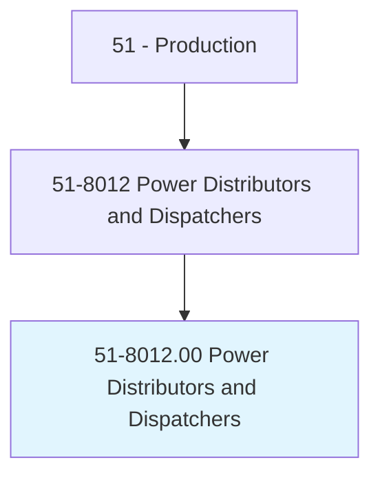
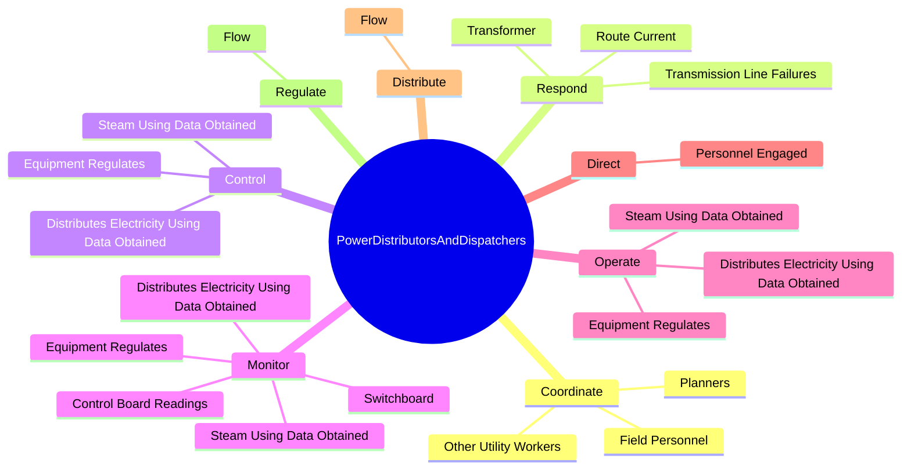
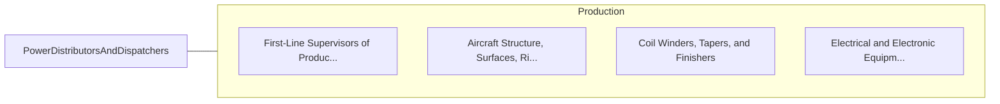

# Power Distributors and Dispatchers

> Coordinate, regulate, or distribute electricity or steam.

## Overview

Power Distributors and Dispatchers is classified under Production (SOC 51). Coordinate, regulate, or distribute electricity or steam.

## Classification Hierarchy

## Key Statistics

| Metric | Value |
|--------|-------|
| SOC Code | 51-8012.00 |
| Category | [Production](/occupations/Production/index) |
| Task Count | 87 |
| Source | O*NET |

## Core Tasks

### coordinate.Planners

Power Distributors and Dispatchers coordinate planners as part of their core responsibilities.

**Actions:**
- `coordinate.Planners.to.provide.Information`
- `coordinate.Planners.to.Clearances`
- `coordinate.Planners.to.SwitchingOrders`
- `coordinate.Planners.to.DistributionProcessChanges`

### respond.Transformer

Power Distributors and Dispatchers respond transformer as part of their core responsibilities.

**Actions:**
- `respond.Transformer`
- `respond.TransmissionLineFailures`
- `respond.RouteCurrent.around.AffectedAreas`

### control.EquipmentRegulates

Power Distributors and Dispatchers control equipment regulates as part of their core responsibilities.

**Actions:**
- `control.EquipmentRegulates.from.Instruments`
- `control.EquipmentRegulates.from.Computers`
- `control.DistributesElectricityUsingDataObtained.from.Instruments`
- `control.DistributesElectricityUsingDataObtained.from.Computers`

## Skills & Competencies

### Technical Skills
- **Machine Operation** - Advanced
- **Quality Control** - Advanced
- **Production Processes** - Advanced

### Soft Skills
- **Communication** - Essential
- **Problem Solving** - Essential
- **Critical Thinking** - Important
- **Teamwork** - Important
- **Adaptability** - Important

## Related Occupations

## Industries

This occupation is found across multiple industries. See [Industries](/industries) for sector-specific employment data.

## Career Progression

---

*Source: O*NET 51-8012.00 - ONETOccupation*
