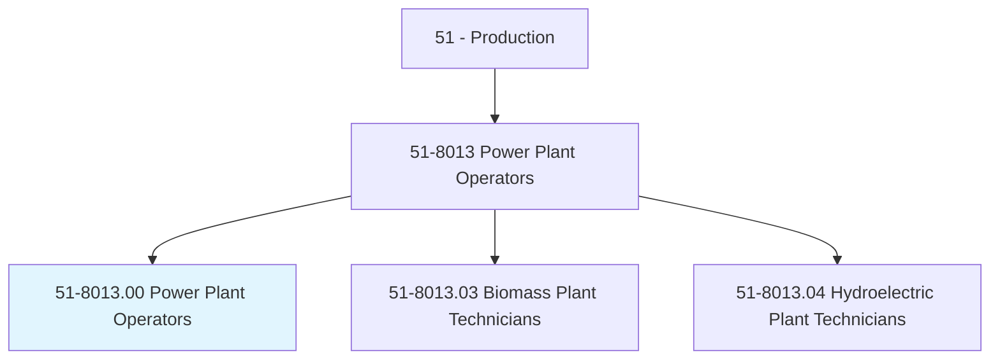
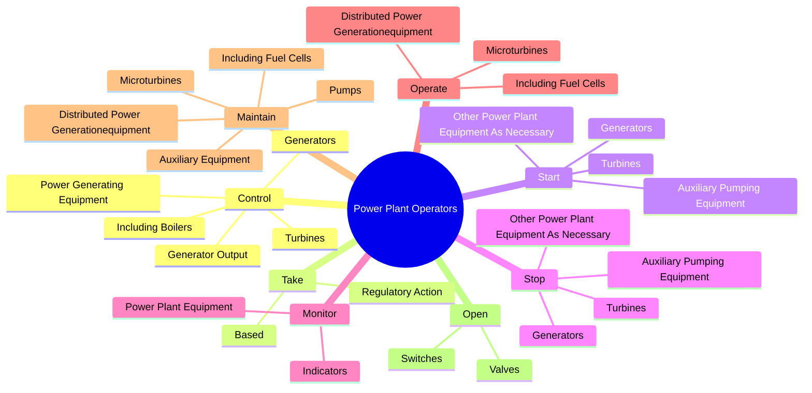
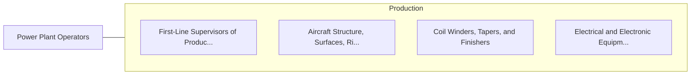

# Power Plant Operators

> Control, operate, or maintain machinery to generate electric power. Includes auxiliary equipment operators.

## Overview

Power Plant Operators is an occupation within the Production category. Control, operate, or maintain machinery to generate electric power. 

## Classification Hierarchy

## Key Statistics

| Metric | Value |
|--------|-------|
| SOC Code | 51-8013.00 |
| Category | [Production](/occupations/Production/index) |
| Task Count | 301 |
| Source | O*NET |

## Core Tasks

### control.GeneratorOutput

Power Plant Operators control generator output as part of their core responsibilities.

**Actions:**
- `control.GeneratorOutput.to.match.Phase`
- `control.GeneratorOutput.to.Frequency`
- `control.GeneratorOutput.to.VoltageOfElectricitySuppliedToPanels`
- `control.PowerGeneratingEquipment`

### take.RegulatoryAction

Power Plant Operators take regulatory action as part of their core responsibilities.

**Actions:**
- `take.RegulatoryAction.on.Readings.from.Charts`
- `take.RegulatoryAction.on.Meters`
- `take.RegulatoryAction.on.Gauges`
- `take.RegulatoryAction.on.AtEstablishedIntervals`

### start.Generators

Power Plant Operators start generators as part of their core responsibilities.

**Actions:**
- `start.Generators`
- `start.AuxiliaryPumpingEquipment`
- `start.Turbines`
- `start.OtherPowerPlantEquipmentAsNecessary`

## Skills & Competencies

### Technical Skills
- **Machine Operation** - Advanced
- **Quality Control** - Advanced
- **Production Processes** - Advanced

### Soft Skills
- **Communication** - Essential
- **Problem Solving** - Essential
- **Critical Thinking** - Important
- **Teamwork** - Important
- **Adaptability** - Important

## Related Occupations

## Industries

This occupation is found across multiple industries. See [Industries](/industries) for sector-specific employment data.

## Career Progression

---

*Source: O*NET 51-8013.00 - ONETOccupation*
