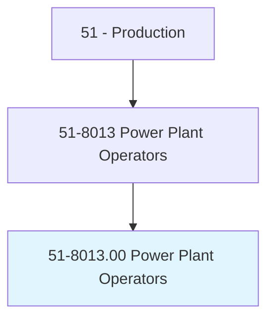
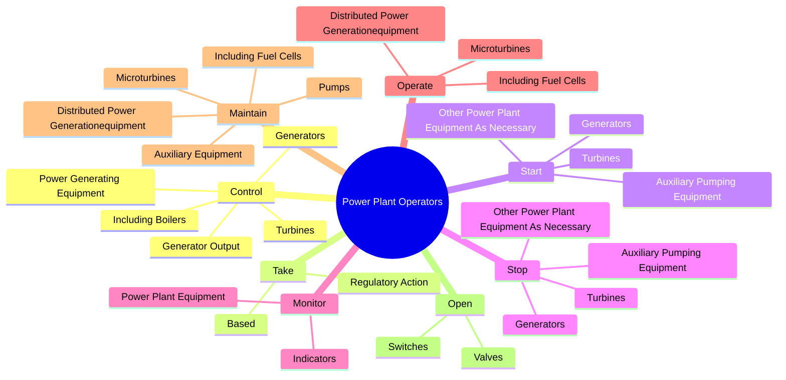
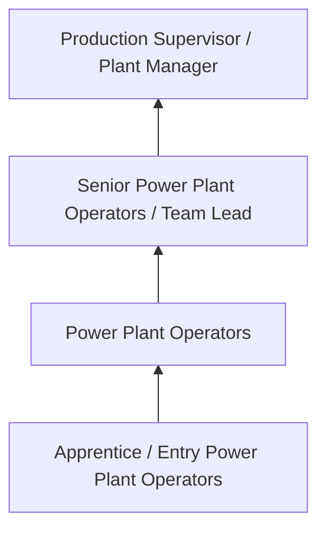
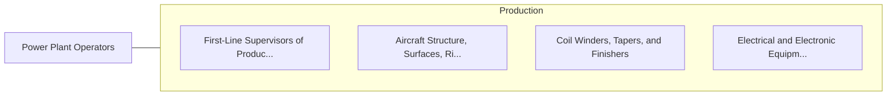

# Power Plant Operators

> Control, operate, or maintain machinery to generate electric power. Includes auxiliary equipment operators.

## Overview

Power Plant Operators professionals control, operate, or maintain machinery to generate electric power. This occupation falls within the Production category and requires a combination of specialized knowledge, technical skills, and practical experience.

These professionals work across diverse settings and organizational contexts, applying their expertise to meet the demands of their field. They must stay current with industry standards, emerging practices, and regulatory requirements that affect their work. The role demands both independent judgment and collaborative skills, as practitioners regularly interact with colleagues, stakeholders, and the public.

As the field continues to evolve, Power Plant Operators professionals increasingly leverage technology and data-driven approaches to enhance their effectiveness. Career opportunities span the public and private sectors, with demand influenced by economic conditions, demographic shifts, and technological advancement.

## Classification Hierarchy



## Key Statistics

| Metric | Value |
|--------|-------|
| SOC Code | 51-8013.00 |
| Job Zone | N/A |
| Category | [Production](/occupations/Production/index) |
| Core Tasks | 301+ |
| Salary Range | $28,000 - $65,000 |
| Median Salary | $40,000 |
| Growth Outlook | 1% (Little or no change) |
| Source | O*NET |

## Core Tasks



### control.GeneratorOutput

Power Plant Operators control generator output as part of their core responsibilities.

**Actions:**
- `control.GeneratorOutput.to.match.Phase` - Control generator output to match the phase, frequency, or voltage of electri...
- `control.GeneratorOutput.to.Frequency` - Control generator output to match the phase, frequency, or voltage of electri...
- `control.GeneratorOutput.to.VoltageOfElectricitySuppliedToPanels` - Control generator output to match the phase, frequency, or voltage of electri...
- `control.PowerGeneratingEquipment` - Control power generating equipment, including boilers, turbines, generators, ...
- `control.IncludingBoilers` - Control power generating equipment, including boilers, turbines, generators, ...

### maintain.DistributedPowerGenerationequipment

Power Plant Operators maintain distributed power generationequipment as part of their core responsibilities.

**Actions:**
- `maintain.DistributedPowerGenerationequipment.to.produce.EnergyOnSiteForManufacturingCommercialPurposes` - Operate or maintain distributed power generation equipment, including fuel ce...
- `maintain.DistributedPowerGenerationequipment.to.OtherCommercialPurposes` - Operate or maintain distributed power generation equipment, including fuel ce...
- `maintain.IncludingFuelCells.to.produce.EnergyOnSiteForManufacturingCommercialPurposes` - Operate or maintain distributed power generation equipment, including fuel ce...
- `maintain.IncludingFuelCells.to.OtherCommercialPurposes` - Operate or maintain distributed power generation equipment, including fuel ce...
- `maintain.Microturbines.to.produce.EnergyOnSiteForManufacturingCommercialPurposes` - Operate or maintain distributed power generation equipment, including fuel ce...

### operate.DistributedPowerGenerationequipment

Power Plant Operators operate distributed power generationequipment as part of their core responsibilities.

**Actions:**
- `operate.DistributedPowerGenerationequipment.to.produce.EnergyOnSiteForManufacturingCommercialPurposes` - Operate or maintain distributed power generation equipment, including fuel ce...
- `operate.DistributedPowerGenerationequipment.to.OtherCommercialPurposes` - Operate or maintain distributed power generation equipment, including fuel ce...
- `operate.IncludingFuelCells.to.produce.EnergyOnSiteForManufacturingCommercialPurposes` - Operate or maintain distributed power generation equipment, including fuel ce...
- `operate.IncludingFuelCells.to.OtherCommercialPurposes` - Operate or maintain distributed power generation equipment, including fuel ce...
- `operate.Microturbines.to.produce.EnergyOnSiteForManufacturingCommercialPurposes` - Operate or maintain distributed power generation equipment, including fuel ce...

### monitor.PowerPlantEquipment

Power Plant Operators monitor power plant equipment as part of their core responsibilities.

**Actions:**
- `monitor.PowerPlantEquipment.to.detect.EvidenceOfOperatingProblems` - Monitor power plant equipment and indicators to detect evidence of operating ...
- `monitor.Indicators.to.detect.EvidenceOfOperatingProblems` - Monitor power plant equipment and indicators to detect evidence of operating ...
- `monitor.Equipment.to.capture` - Operate, control, or monitor equipment, such as acid or gas carbon dioxide re...
- `monitor.Equipment.to.store` - Operate, control, or monitor equipment, such as acid or gas carbon dioxide re...
- `monitor.Equipment.to.transport.CarbonDioxideExhaust` - Operate, control, or monitor equipment, such as acid or gas carbon dioxide re...


## Skills & Competencies

### Technical Skills
- **Machine Operation** - Advanced
- **Quality Inspection** - Advanced
- **Safety Procedures** - Advanced
- **Blueprint Reading** - Proficient
- **Measurement Tools** - Proficient
- **Process Control** - Proficient

### Soft Skills
- **Attention to Detail** - Critical
- **Reliability** - Critical
- **Physical Dexterity** - Essential
- **Teamwork** - Essential
- **Problem Solving** - Important

## Education & Certifications

| Requirement | Details |
|-------------|---------|
| Typical Education | High school diploma or equivalent; some positions require technical training |
| Work Experience | 0-2 years manufacturing experience |
| On-the-Job Training | Moderate - equipment operation and safety procedures |
| Certifications | OSHA certifications, quality management certifications |

## Career Progression



## Industry Variations

### Discrete Manufacturing
Assembly of distinct products such as automobiles, electronics, or machinery. Power Plant Operators professionals work with precision equipment and quality standards.

### Process Manufacturing
Continuous production of chemicals, food, or materials. Focus on process control and consistency.

### Custom and Job Shop
Small-batch or custom production work. Requires versatility and ability to adapt to varied specifications.

### Automated Manufacturing
Technology-driven production with robotics and advanced systems. Increasing emphasis on programming and monitoring skills.

## Technology & Tools

- **Manufacturing execution systems (MES)**
- **Computer numerical control (CNC) machines**
- **Quality management software**
- **Programmable logic controllers (PLC)**
- **Enterprise resource planning (ERP) systems**

## Related Occupations



## Industries

- [Manufacturing](/industries/Manufacturing) - High Employment
- [Food Processing](/industries/FoodProcessing) - High Employment
- [Automotive](/industries/Automotive) - Moderate Employment
- [Electronics](/industries/Electronics) - Moderate Employment

## Departments

This occupation typically works in:
- [Manufacturing](/departments/Manufacturing)
- [Quality Control](/departments/QualityControl)
- [Production Planning](/departments/ProductionPlanning)

## GraphDL Semantic Structure

```
Power Plant Operators perform:
- control.GeneratorOutput.to.match.Phase
- control.GeneratorOutput.to.Frequency
- control.GeneratorOutput.to.VoltageOfElectricitySuppliedToPanels
- take.RegulatoryAction.on.Readings.from.Charts
- take.RegulatoryAction.on.Meters
- take.RegulatoryAction.on.Gauges
```

---

*Source: O*NET 51-8013.00 - ONETOccupation*
