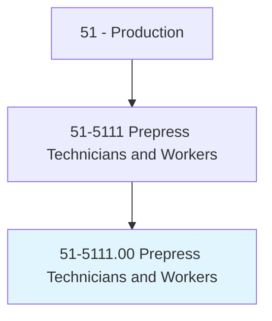
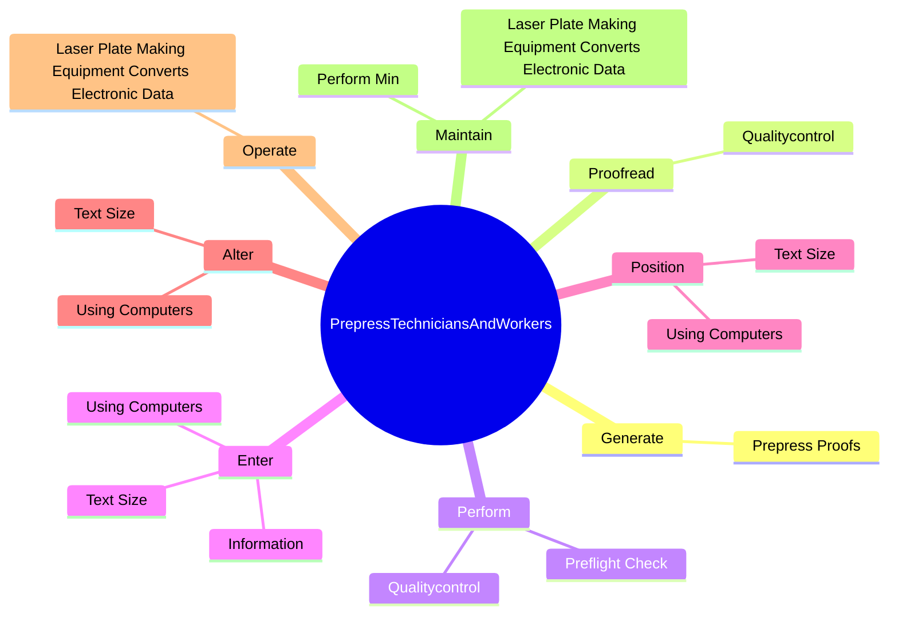

# Prepress Technicians and Workers

> Format and proof text and images submitted by designers and clients into finished pages that can be printed. Includes digital and photo typesetting. May produce printing plates.

## Overview

Prepress Technicians and Workers is an occupation within the Production category. Format and proof text and images submitted by designers and clients into finished pages that can be printed. Includes digital and photo typesetting.

## Classification Hierarchy

## Key Statistics

| Metric | Value |
|--------|-------|
| SOC Code | 51-5111.00 |
| Category | [Production](/occupations/Production/index) |
| Task Count | 57 |
| Source | O*NET |

## Core Tasks

### generate.PrepressProofs

Prepress Technicians and Workers generate prepress proofs as part of their core responsibilities.

**Actions:**
- `generate.PrepressProofs.in.DigitalFormat.to.approximate.AppearanceOfFinalPrintedPiece`
- `generate.PrepressProofs.in.OtherFormat.to.approximate.AppearanceOfFinalPrintedPiece`

### proofread.Qualitycontrol

Prepress Technicians and Workers proofread qualitycontrol as part of their core responsibilities.

**Actions:**
- `proofread.Qualitycontrol.of.Text`
- `proofread.Qualitycontrol.of.Images`

### perform.Qualitycontrol

Prepress Technicians and Workers perform qualitycontrol as part of their core responsibilities.

**Actions:**
- `perform.Qualitycontrol.of.Text`
- `perform.Qualitycontrol.of.Images`
- `perform.PreflightCheck.of.RequiredFont`
- `perform.PreflightCheck.of.Graphic`

## Skills & Competencies

### Technical Skills
- **Machine Operation** - Advanced
- **Quality Control** - Advanced
- **Production Processes** - Advanced

### Soft Skills
- **Communication** - Essential
- **Problem Solving** - Essential
- **Critical Thinking** - Important
- **Teamwork** - Important
- **Adaptability** - Important

## Related Occupations

## Industries

This occupation is found across multiple industries. See [Industries](/industries) for sector-specific employment data.

## Career Progression

---

*Source: O*NET 51-5111.00 - ONETOccupation*
