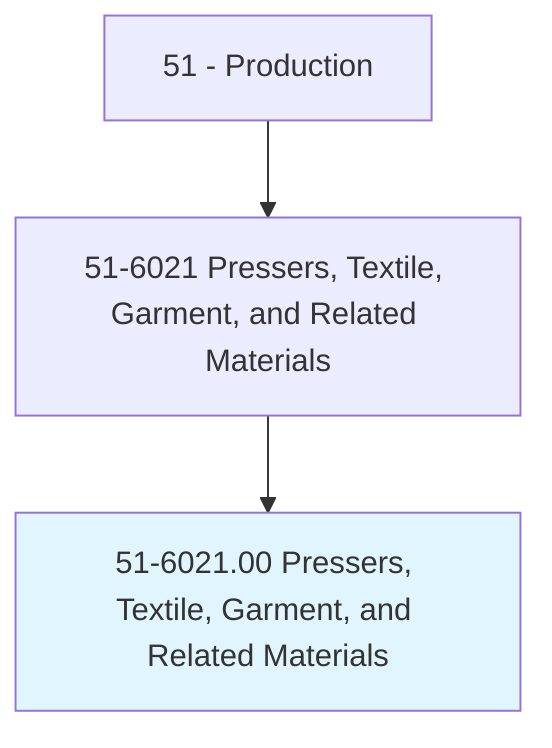
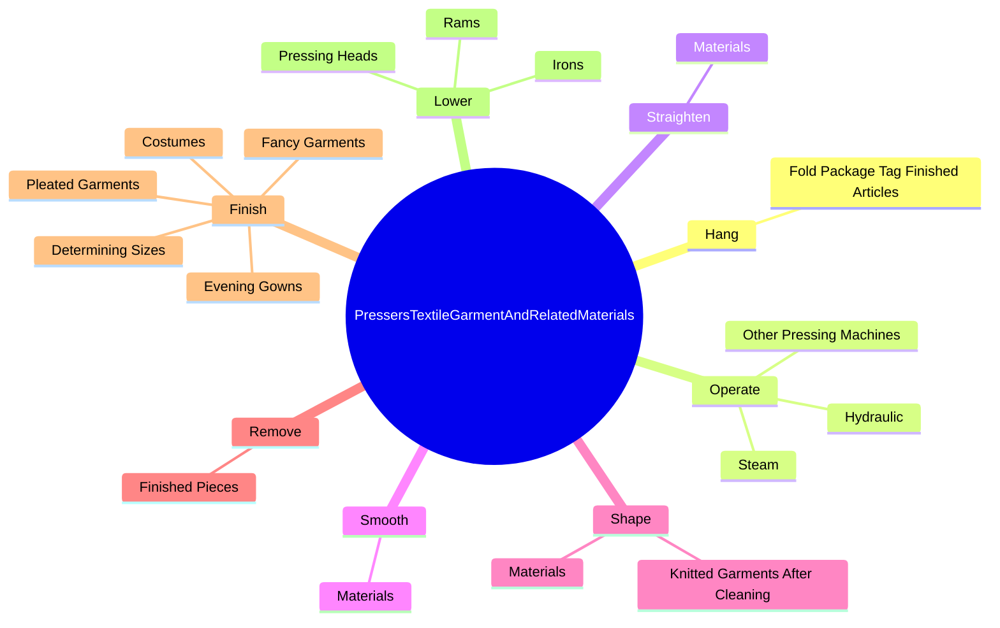
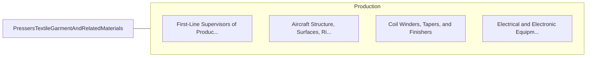

# Pressers, Textile, Garment, and Related Materials

> Press or shape articles by hand or machine.

## Overview

Pressers, Textile, Garment, and Related Materials is classified under Production (SOC 51). Press or shape articles by hand or machine.

## Classification Hierarchy

## Key Statistics

| Metric | Value |
|--------|-------|
| SOC Code | 51-6021.00 |
| Category | [Production](/occupations/Production) |
| Task Count | 139 |
| Source | O*NET |

## Core Tasks

### hang.FoldPackageTagFinishedArticles

Pressers, Textile, Garment, and Related Materials hang fold package tag finished articles as part of their core responsibilities.

**Actions:**
- `hang.FoldPackageTagFinishedArticles.for.Delivery.to.Customers`

### operate.Steam

Pressers, Textile, Garment, and Related Materials operate steam as part of their core responsibilities.

**Actions:**
- `operate.Steam.to.remove.WrinklesFromGarmentsItems`
- `operate.Steam.to.FlatworkItems`
- `operate.Steam.to.ToShape`
- `operate.Steam.to.form`

### straighten.Materials

Pressers, Textile, Garment, and Related Materials straighten materials as part of their core responsibilities.

**Actions:**
- `straighten.Materials.to.prepare.ThemForPressing`

## Skills & Competencies

### Technical Skills
- **Machine Operation** - Advanced
- **Quality Control** - Advanced
- **Production Processes** - Advanced

### Soft Skills
- **Communication** - Essential
- **Problem Solving** - Essential
- **Critical Thinking** - Important
- **Teamwork** - Important
- **Adaptability** - Important

## Related Occupations

## Industries

This occupation is found across multiple industries. See [Industries](/industries) for sector-specific employment data.

## Career Progression

---

*Source: O*NET 51-6021.00 - ONETOccupation*
