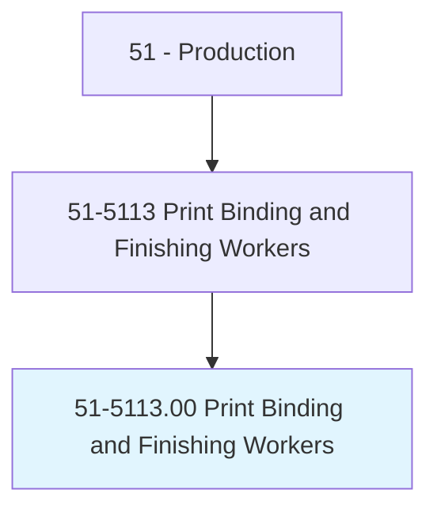
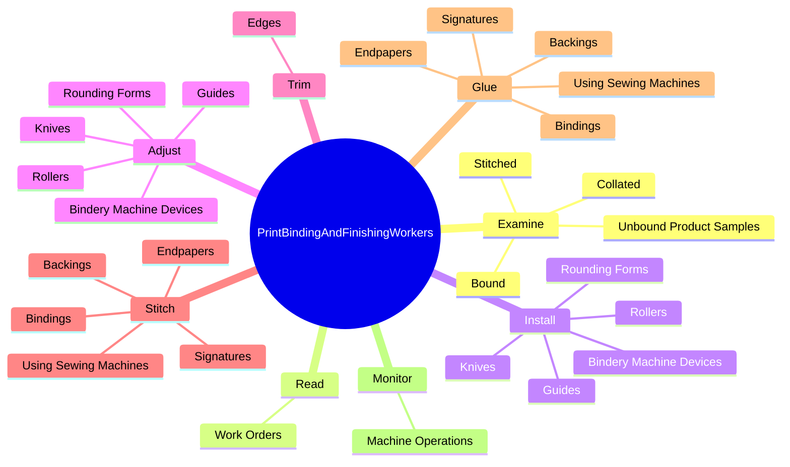

# Print Binding and Finishing Workers

> Bind books and other publications or finish printed products by hand or machine. May set up binding and finishing machines.

## Overview

Print Binding and Finishing Workers is an occupation within the Production category. Bind books and other publications or finish printed products by hand or machine. 

## Classification Hierarchy

## Key Statistics

| Metric | Value |
|--------|-------|
| SOC Code | 51-5113.00 |
| Category | [Production](/occupations/Production/index) |
| Task Count | 184 |
| Source | O*NET |

## Core Tasks

### examine.Stitched

Print Binding and Finishing Workers examine stitched as part of their core responsibilities.

**Actions:**
- `examine.Stitched.for.Defects`
- `examine.Stitched.for.ImperfectBindings`
- `examine.Stitched.for.InkSpots`
- `examine.Stitched.for.TornPages`

### read.WorkOrders

Print Binding and Finishing Workers read work orders as part of their core responsibilities.

**Actions:**
- `read.WorkOrders.to.determine.InstructionsForMachineSetUp`
- `read.WorkOrders.to.SpecificationsForMachineSetUp`

### install.BinderyMachineDevices

Print Binding and Finishing Workers install bindery machine devices as part of their core responsibilities.

**Actions:**
- `install.BinderyMachineDevices.to.accommodate.Sheets`
- `install.BinderyMachineDevices.to.Signatures`
- `install.BinderyMachineDevices.to.books.OfSpecifiedSizes`
- `install.Knives.to.accommodate.Sheets`

## Skills & Competencies

### Technical Skills
- **Machine Operation** - Advanced
- **Quality Control** - Advanced
- **Production Processes** - Advanced

### Soft Skills
- **Communication** - Essential
- **Problem Solving** - Essential
- **Critical Thinking** - Important
- **Teamwork** - Important
- **Adaptability** - Important

## Related Occupations

## Industries

This occupation is found across multiple industries. See [Industries](/industries) for sector-specific employment data.

## Career Progression

---

*Source: O*NET 51-5113.00 - ONETOccupation*
