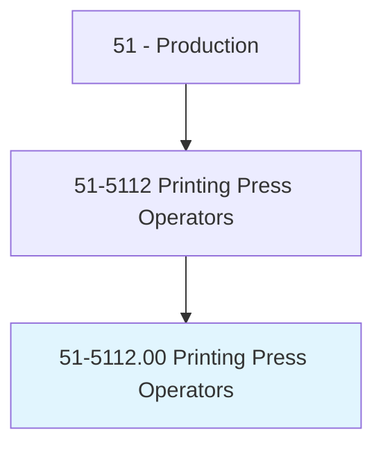
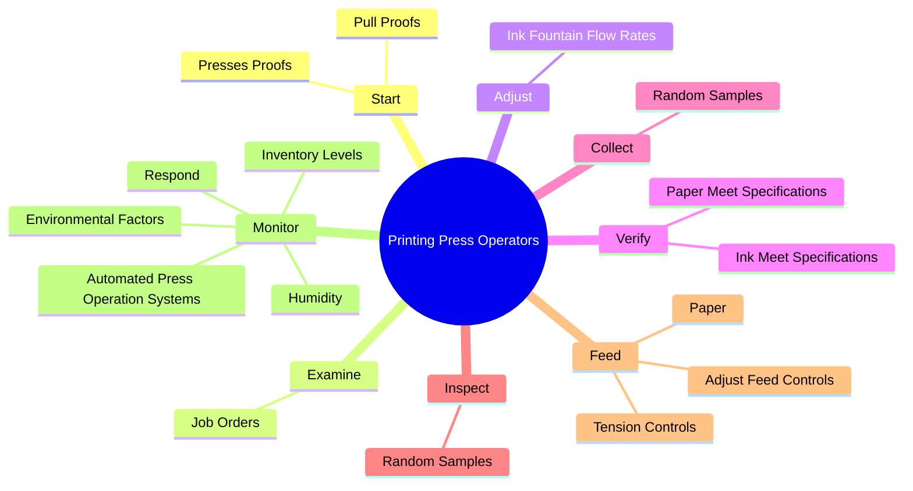
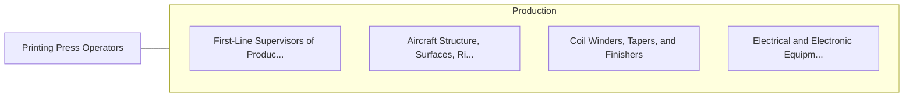

# Printing Press Operators

> Set up and operate digital, letterpress, lithographic, flexographic, gravure, or other printing machines. Includes short-run offset printing presses.

## Overview

Printing Press Operators is an occupation within the Production category. Set up and operate digital, letterpress, lithographic, flexographic, gravure, or other printing machines. 

## Classification Hierarchy

## Key Statistics

| Metric | Value |
|--------|-------|
| SOC Code | 51-5112.00 |
| Category | [Production](/occupations/Production) |
| Task Count | 76 |
| Source | O*NET |

## Core Tasks

### start.PressesProofs

Printing Press Operators start presses proofs as part of their core responsibilities.

**Actions:**
- `start.PressesProofs.to.check.ForInkCoverage`
- `start.PressesProofs.to.Density`
- `start.PressesProofs.to.Alignment`
- `start.PressesProofs.to.Registration`

### examine.JobOrders

Printing Press Operators examine job orders as part of their core responsibilities.

**Actions:**
- `examine.JobOrders.to.determine.QuantitiesToBePrinted`
- `examine.JobOrders.to.stock.Specifications`
- `examine.JobOrders.to.Colors`
- `examine.JobOrders.to.SpecialPrintingInstructions`

### adjust.InkFountainFlowRates

Printing Press Operators adjust ink fountain flow rates as part of their core responsibilities.

**Actions:**
- `adjust.InkFountainFlowRates`

## Skills & Competencies

### Technical Skills
- **Machine Operation** - Advanced
- **Quality Control** - Advanced
- **Production Processes** - Advanced

### Soft Skills
- **Communication** - Essential
- **Problem Solving** - Essential
- **Critical Thinking** - Important
- **Teamwork** - Important
- **Adaptability** - Important

## Related Occupations

## Industries

This occupation is found across multiple industries. See [Industries](/industries) for sector-specific employment data.

## Career Progression

---

*Source: O*NET 51-5112.00 - ONETOccupation*
