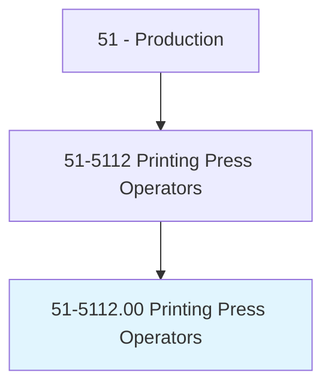
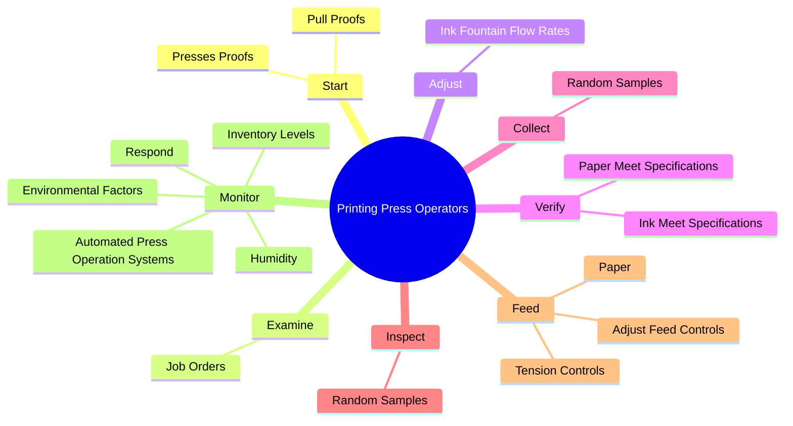
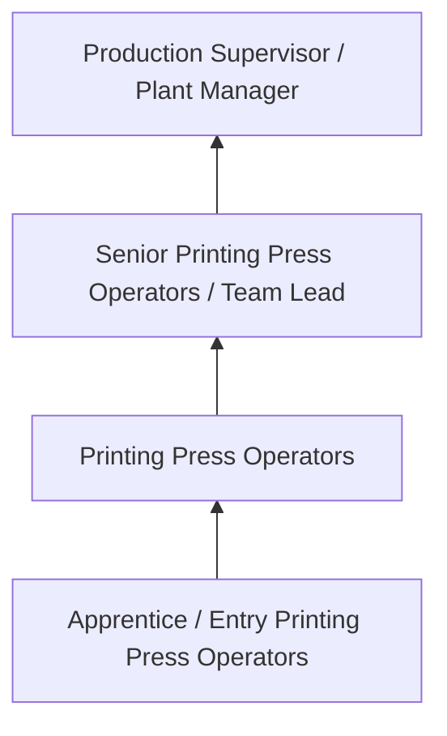
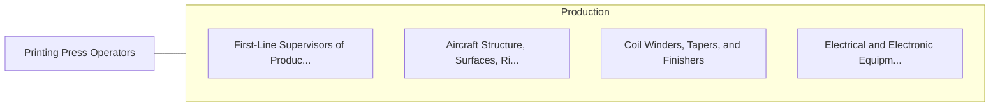

# Printing Press Operators

> Set up and operate digital, letterpress, lithographic, flexographic, gravure, or other printing machines. Includes short-run offset printing presses.

## Overview

Printing Press Operators professionals set up and operate digital, letterpress, lithographic, flexographic, gravure, or other printing machines. This occupation falls within the Production category and requires a combination of specialized knowledge, technical skills, and practical experience.

These professionals work across diverse settings and organizational contexts, applying their expertise to meet the demands of their field. They must stay current with industry standards, emerging practices, and regulatory requirements that affect their work. The role demands both independent judgment and collaborative skills, as practitioners regularly interact with colleagues, stakeholders, and the public.

As the field continues to evolve, Printing Press Operators professionals increasingly leverage technology and data-driven approaches to enhance their effectiveness. Career opportunities span the public and private sectors, with demand influenced by economic conditions, demographic shifts, and technological advancement.

## Classification Hierarchy



## Key Statistics

| Metric | Value |
|--------|-------|
| SOC Code | 51-5112.00 |
| Job Zone | N/A |
| Category | [Production](/occupations/Production/index) |
| Core Tasks | 76+ |
| Salary Range | $28,000 - $65,000 |
| Median Salary | $40,000 |
| Growth Outlook | 1% (Little or no change) |
| Source | O*NET |

## Core Tasks



### monitor.AutomatedPressOperationSystems

Printing Press Operators monitor automated press operation systems as part of their core responsibilities.

**Actions:**
- `monitor.AutomatedPressOperationSystems.to.Fault` - Monitor automated press operation systems and respond to fault, error, or ale...
- `monitor.AutomatedPressOperationSystems.to.Error` - Monitor automated press operation systems and respond to fault, error, or ale...
- `monitor.AutomatedPressOperationSystems.to.alert.Messages` - Monitor automated press operation systems and respond to fault, error, or ale...
- `monitor.Respond.to.Fault` - Monitor automated press operation systems and respond to fault, error, or ale...
- `monitor.Respond.to.Error` - Monitor automated press operation systems and respond to fault, error, or ale...

### start.PressesProofs

Printing Press Operators start presses proofs as part of their core responsibilities.

**Actions:**
- `start.PressesProofs.to.check.ForInkCoverage` - Start presses and pull proofs to check for ink coverage and density, alignmen...
- `start.PressesProofs.to.Density` - Start presses and pull proofs to check for ink coverage and density, alignmen...
- `start.PressesProofs.to.Alignment` - Start presses and pull proofs to check for ink coverage and density, alignmen...
- `start.PressesProofs.to.Registration` - Start presses and pull proofs to check for ink coverage and density, alignmen...
- `start.PullProofs.to.check.ForInkCoverage` - Start presses and pull proofs to check for ink coverage and density, alignmen...

### set.OperateAuxiliaryEquipment

Printing Press Operators set operate auxiliary equipment as part of their core responsibilities.

**Actions:**
- `set.OperateAuxiliaryEquipment` - Set up or operate auxiliary equipment, such as cutting, folding, plate-making...
- `set.Cutting` - Set up or operate auxiliary equipment, such as cutting, folding, plate-making...
- `set.Folding` - Set up or operate auxiliary equipment, such as cutting, folding, plate-making...
- `set.PlateMaking` - Set up or operate auxiliary equipment, such as cutting, folding, plate-making...
- `set.Drilling` - Set up or operate auxiliary equipment, such as cutting, folding, plate-making...

### adjust.InkFountainFlowRates

Printing Press Operators adjust ink fountain flow rates as part of their core responsibilities.

**Actions:**
- `adjust.InkFountainFlowRates` - Adjust ink fountain flow rates.
- `adjust.DigitalFiles.to.alter.PrintElements` - Adjust digital files to alter print elements, such as fonts, graphics, or col...
- `adjust.DigitalFiles.to.Fonts` - Adjust digital files to alter print elements, such as fonts, graphics, or col...
- `adjust.DigitalFiles.to.Graphics` - Adjust digital files to alter print elements, such as fonts, graphics, or col...
- `adjust.DigitalFiles.to.ColorSeparations` - Adjust digital files to alter print elements, such as fonts, graphics, or col...


## Skills & Competencies

### Technical Skills
- **Machine Operation** - Advanced
- **Quality Inspection** - Advanced
- **Safety Procedures** - Advanced
- **Blueprint Reading** - Proficient
- **Measurement Tools** - Proficient
- **Process Control** - Proficient

### Soft Skills
- **Attention to Detail** - Critical
- **Reliability** - Critical
- **Physical Dexterity** - Essential
- **Teamwork** - Essential
- **Problem Solving** - Important

## Education & Certifications

| Requirement | Details |
|-------------|---------|
| Typical Education | High school diploma or equivalent; some positions require technical training |
| Work Experience | 0-2 years manufacturing experience |
| On-the-Job Training | Moderate - equipment operation and safety procedures |
| Certifications | OSHA certifications, quality management certifications |

## Career Progression



## Industry Variations

### Discrete Manufacturing
Assembly of distinct products such as automobiles, electronics, or machinery. Printing Press Operators professionals work with precision equipment and quality standards.

### Process Manufacturing
Continuous production of chemicals, food, or materials. Focus on process control and consistency.

### Custom and Job Shop
Small-batch or custom production work. Requires versatility and ability to adapt to varied specifications.

### Automated Manufacturing
Technology-driven production with robotics and advanced systems. Increasing emphasis on programming and monitoring skills.

## Technology & Tools

- **Manufacturing execution systems (MES)**
- **Computer numerical control (CNC) machines**
- **Quality management software**
- **Programmable logic controllers (PLC)**
- **Enterprise resource planning (ERP) systems**

## Related Occupations



## Industries

- [Manufacturing](/industries/Manufacturing) - High Employment
- Food Processing - High Employment
- [Automotive](/industries/Manufacturing) - Moderate Employment
- [Electronics](/industries/Electronics) - Moderate Employment

## Departments

This occupation typically works in:
- [Manufacturing](/departments/Operations)
- Quality Control
- Production Planning

## GraphDL Semantic Structure

```graphdl
Printing Press Operators perform:
- start.PressesProofs.to.check.ForInkCoverage
- start.PressesProofs.to.Density
- start.PressesProofs.to.Alignment
- start.PressesProofs.to.Registration
- start.PullProofs.to.check.ForInkCoverage
- start.PullProofs.to.Density
```

---

*Source: O*NET 51-5112.00 - ONETOccupation*
