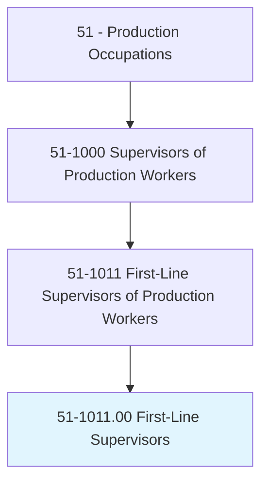
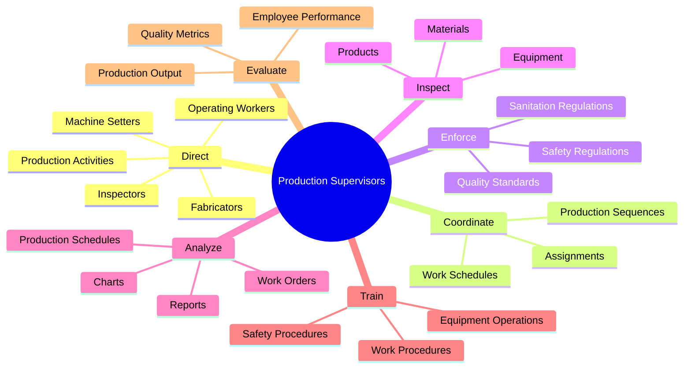
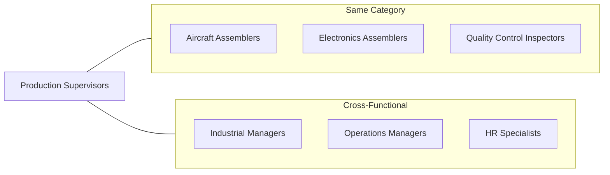
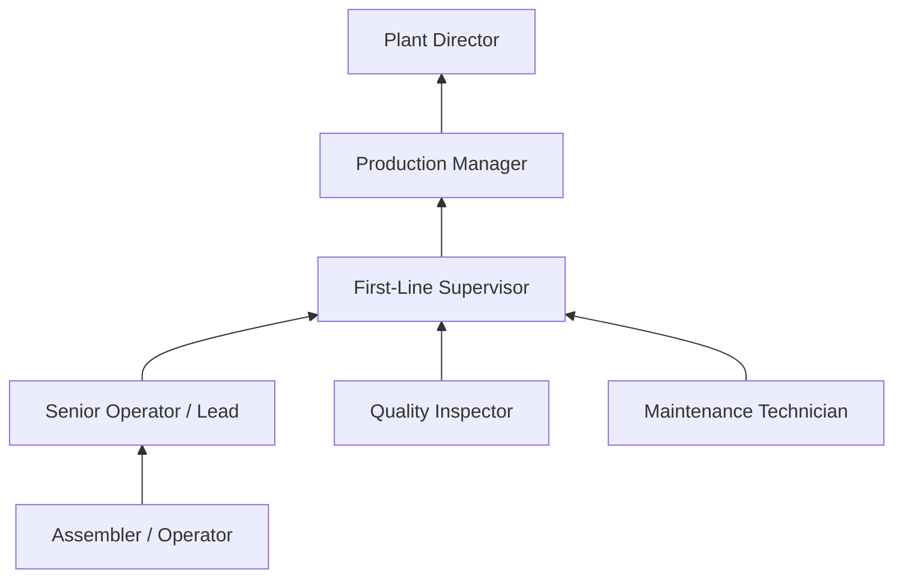
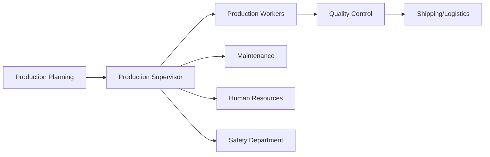

# First-Line Supervisors of Production and Operating Workers

> Directly supervise and coordinate the activities of production and operating workers, such as inspectors, precision workers, machine setters and operators, assemblers, fabricators, and plant and system operators. Excludes team or work leaders.

## Overview

First-Line Supervisors of Production and Operating Workers serve as the critical link between management and the production floor. They oversee day-to-day manufacturing operations, ensuring production targets are met while maintaining quality standards and workplace safety. These supervisors coordinate worker schedules, train new employees, troubleshoot production issues, and implement company policies. Their role demands technical expertise in production processes combined with strong leadership and communication skills to motivate teams and resolve workplace challenges effectively.

## Classification Hierarchy

## Key Statistics

| Metric | Value |
|--------|-------|
| SOC Code | 51-1011.00 |
| Job Zone | 3 (Medium Preparation) |
| Category | [Production](/occupations/Production) |
| Core Tasks | 20+ |
| Source | O*NET |

## Core Tasks

### direct.Activities

Production Supervisors direct and coordinate the activities of production workers to achieve manufacturing objectives.

**Actions:**
- `direct.Activities.of.Employees.engaged.in.Production` - Oversee workers involved in manufacturing processes
- `direct.Activities.of.Inspectors` - Guide quality inspection activities
- `direct.Activities.of.MachineSetters` - Coordinate machine setup operations
- `direct.Activities.of.Fabricators` - Supervise fabrication processes
- `coordinate.Activities.of.Processing.of.Goods` - Synchronize goods processing operations

### enforce.SafetyRegulations

Production Supervisors ensure compliance with safety and sanitation standards across the production floor.

**Actions:**
- `enforce.SafetyRegulations` - Implement and monitor workplace safety protocols
- `enforce.SanitationRegulations` - Maintain cleanliness and hygiene standards
- `observe.WorkGauges.to.ensure.OperatorsConformToProduction` - Monitor compliance through observation
- `observe.Dials.to.ProcessingStandards` - Check equipment indicators for standard compliance

### inspect.MaterialsProducts

Production Supervisors examine materials, products, and equipment to identify defects and malfunctions.

**Actions:**
- `inspect.Materials.to.detect.Defects` - Identify material quality issues
- `inspect.Products.to.detect.Defects` - Find product defects before shipping
- `inspect.Equipment.to.detect.Defects` - Check equipment for maintenance needs
- `inspect.Equipment.to.Malfunctions` - Identify equipment operational issues

### plan.WorkSchedules

Production Supervisors develop and manage production schedules to meet organizational goals.

**Actions:**
- `plan.WorkSchedules.to.meet.ProductionGoals` - Create schedules aligned with targets
- `plan.Assignments.to.meet.ProductionGoals` - Allocate tasks to workers effectively
- `plan.ProductionSequences.to.meet.ProductionGoals` - Sequence operations for efficiency
- `establish.WorkSchedules.to.meet.ProductionGoals` - Implement scheduling systems

### conduct.EmployeeTraining

Production Supervisors train and develop production workers on equipment, procedures, and safety.

**Actions:**
- `conduct.EmployeeTraining.in.EquipmentOperations` - Train workers on machinery
- `conduct.EmployeeTraining.in.WorkProcedures` - Teach standard operating procedures
- `conduct.EmployeeTraining.in.SafetyProcedures` - Deliver safety training
- `interpret.Specifications.for.Workers` - Explain technical requirements to team

### analyze.ProductionData

Production Supervisors read and analyze production data to evaluate performance and plan improvements.

**Actions:**
- `analyze.Charts.to.determine.ProductionRequirements` - Interpret production charts
- `analyze.WorkOrders.to.ToEvaluateCurrentProductionEstimatesOutputs` - Review work order data
- `analyze.ProductionSchedules.to.determine.ProductionRequirements` - Assess scheduling effectiveness
- `read.Reports.to.ToEvaluateCurrentProductionEstimatesOutputs` - Review performance reports

### determine.Standards

Production Supervisors establish production standards, budgets, and goals based on organizational factors.

**Actions:**
- `determine.Standards.on.CompanyPolicies` - Set standards aligned with policies
- `determine.Budgets.on.Equipment` - Create equipment-based budgets
- `determine.ProductionGoals.on.LaborAvailability` - Set goals considering workforce
- `determine.Rates.on.Workloads` - Establish production rates

## Skills & Competencies

### Technical Skills
- **Production Management** - Advanced
- **Quality Control** - Advanced
- **Equipment Operation** - Proficient
- **Blueprint Reading** - Proficient
- **Safety Compliance** - Advanced
- **Inventory Management** - Proficient

### Soft Skills
- **Leadership** - Critical
- **Communication** - Critical
- **Problem Solving** - Essential
- **Time Management** - Essential
- **Conflict Resolution** - Important
- **Decision Making** - Critical

## Related Occupations

## Industries

- [Manufacturing](/industries/Manufacturing) - Highest Employment
- [Food Processing](/industries/FoodProcessing) - High Employment
- [Chemical Manufacturing](/industries/ChemicalManufacturing) - High Employment
- [Automotive Manufacturing](/industries/Automotive) - High Employment
- [Pharmaceutical Manufacturing](/industries/Pharmaceutical) - Moderate Employment

## Career Progression

## Education & Training

| Requirement | Details |
|-------------|---------|
| Typical Education | High School Diploma; some positions require Associate's degree |
| Work Experience | 1-5 years of production experience |
| On-the-Job Training | Moderate; typically 1-12 months |
| Common Certifications | Six Sigma, Lean Manufacturing, OSHA Safety |

## Industry Variations

### Automotive Manufacturing
- Focus on just-in-time production
- Strong emphasis on lean principles
- High-volume, fast-paced environment
- Union environment considerations

### Food Processing
- FDA and USDA compliance critical
- HACCP certification often required
- Temperature and sanitation focus
- Shift work common (24/7 operations)

### Aerospace Manufacturing
- FAA regulatory compliance
- Extensive documentation requirements
- Highest quality standards
- Security clearance may be required

### Pharmaceutical Manufacturing
- GMP (Good Manufacturing Practice) compliance
- Cleanroom environment supervision
- Strict batch documentation
- FDA audit preparation

## Departments

This occupation typically works in:
- [Production / Manufacturing](/departments/Production)
- [Operations](/departments/Operations)
- [Quality Assurance](/departments/QualityAssurance)

## Workflow Integration

---

*Source: O*NET 51-1011.00 - ONETOccupation*
