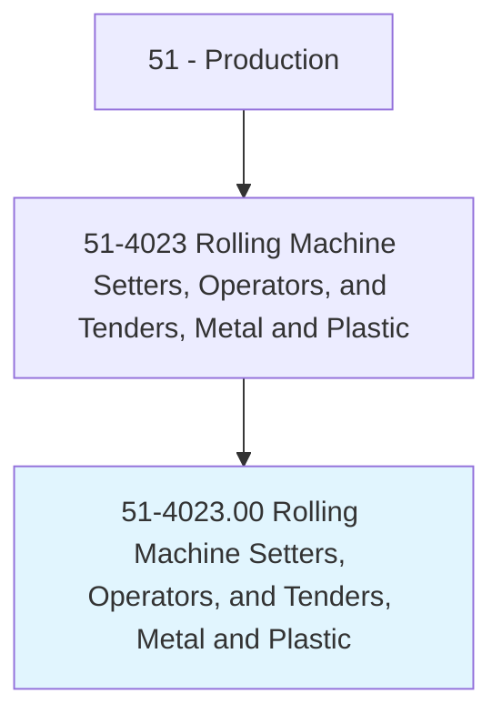
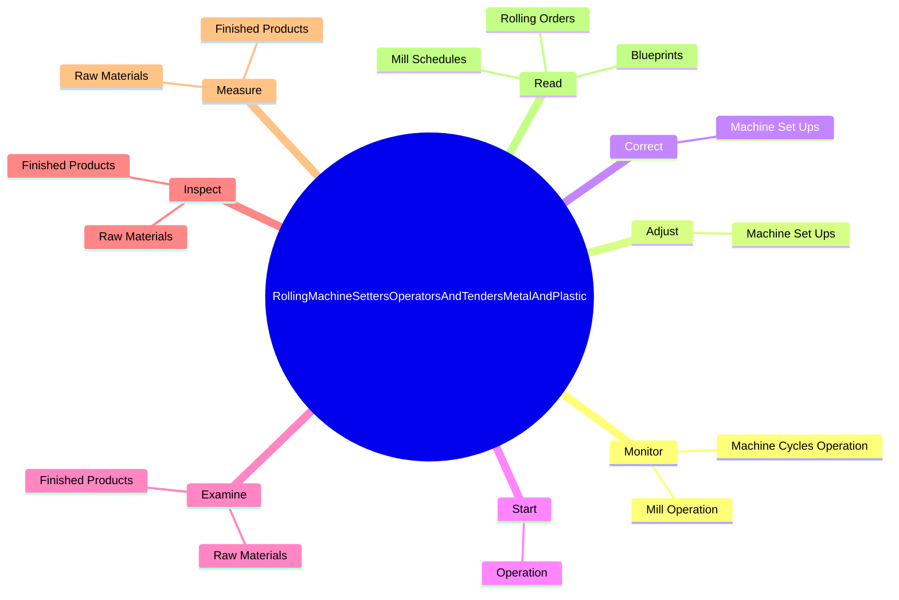

# Rolling Machine Setters, Operators, and Tenders, Metal and Plastic

> Set up, operate, or tend machines to roll steel or plastic forming bends, beads, knurls, rolls, or plate, or to flatten, temper, or reduce gauge of material.

## Overview

Rolling Machine Setters, Operators, and Tenders, Metal and Plastic is classified under Production (SOC 51). Set up, operate, or tend machines to roll steel or plastic forming bends, beads, knurls, rolls, or plate, or to flatten, temper, or reduce gauge of material.

## Classification Hierarchy

## Key Statistics

| Metric | Value |
|--------|-------|
| SOC Code | 51-4023.00 |
| Category | [Production](/occupations/Production) |
| Task Count | 125 |
| Source | O*NET |

## Core Tasks

### monitor.MachineCyclesOperation

Rolling Machine Setters, Operators, and Tenders, Metal and Plastic monitor machine cycles operation as part of their core responsibilities.

**Actions:**
- `monitor.MachineCyclesOperation.to.detect.JammingEnsureProductsConformToSpecifications`
- `monitor.MachineCyclesOperation.to.ToEnsureProductsConformToSpecifications`
- `monitor.MillOperation.to.detect.JammingEnsureProductsConformToSpecifications`
- `monitor.MillOperation.to.ToEnsureProductsConformToSpecifications`

### adjust.MachineSetUps

Rolling Machine Setters, Operators, and Tenders, Metal and Plastic adjust machine set ups as part of their core responsibilities.

**Actions:**
- `adjust.MachineSetUps.to.reduce.Thicknesses`
- `adjust.MachineSetUps.to.reshape.Products`
- `adjust.MachineSetUps.to.eliminate.ProductDefects`

### correct.MachineSetUps

Rolling Machine Setters, Operators, and Tenders, Metal and Plastic correct machine set ups as part of their core responsibilities.

**Actions:**
- `correct.MachineSetUps.to.reduce.Thicknesses`
- `correct.MachineSetUps.to.reshape.Products`
- `correct.MachineSetUps.to.eliminate.ProductDefects`

## Skills & Competencies

### Technical Skills
- **Machine Operation** - Advanced
- **Quality Control** - Advanced
- **Production Processes** - Advanced

### Soft Skills
- **Communication** - Essential
- **Problem Solving** - Essential
- **Critical Thinking** - Important
- **Teamwork** - Important
- **Adaptability** - Important

## Related Occupations

## Industries

This occupation is found across multiple industries. See [Industries](/industries) for sector-specific employment data.

## Career Progression

---

*Source: O*NET 51-4023.00 - ONETOccupation*
