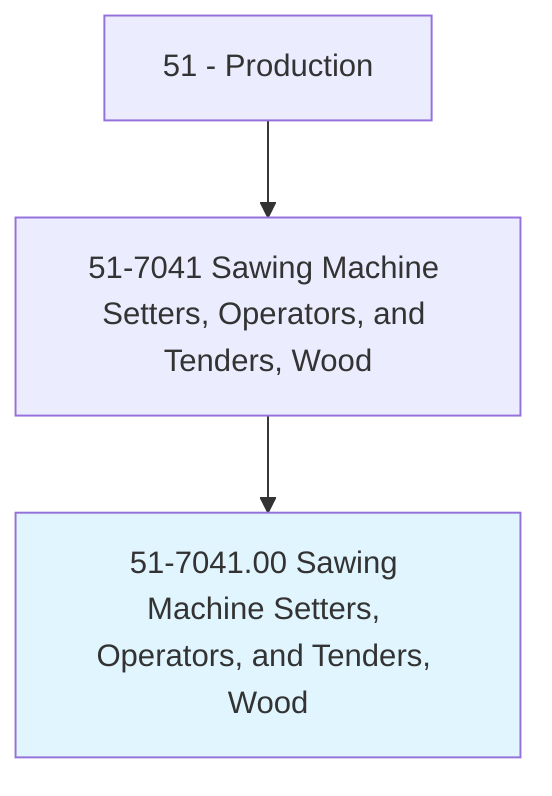
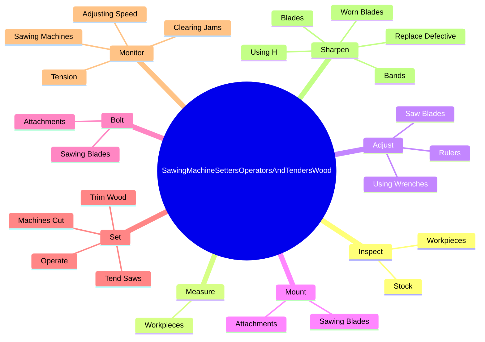

# Sawing Machine Setters, Operators, and Tenders, Wood

> Set up, operate, or tend wood sawing machines. May operate computer numerically controlled (CNC) equipment. Includes lead sawyers.

## Overview

Sawing Machine Setters, Operators, and Tenders, Wood is an occupation within the Production category. Set up, operate, or tend wood sawing machines. May operate computer numerically controlled (CNC) equipment.

## Classification Hierarchy

## Key Statistics

| Metric | Value |
|--------|-------|
| SOC Code | 51-7041.00 |
| Category | [Production](/occupations/Production) |
| Task Count | 154 |
| Source | O*NET |

## Core Tasks

### inspect.Workpieces

Sawing Machine Setters, Operators, and Tenders, Wood inspect workpieces as part of their core responsibilities.

**Actions:**
- `inspect.Workpieces.to.mark.ForCutsVerifyAccuracyOfCuts`
- `inspect.Workpieces.to.ToVerifyAccuracyOfCuts`
- `inspect.Workpieces.to.UsingRulers`
- `inspect.Workpieces.to.Squares`

### measure.Workpieces

Sawing Machine Setters, Operators, and Tenders, Wood measure workpieces as part of their core responsibilities.

**Actions:**
- `measure.Workpieces.to.mark.ForCutsVerifyAccuracyOfCuts`
- `measure.Workpieces.to.ToVerifyAccuracyOfCuts`
- `measure.Workpieces.to.UsingRulers`
- `measure.Workpieces.to.Squares`

### adjust.SawBlades

Sawing Machine Setters, Operators, and Tenders, Wood adjust saw blades as part of their core responsibilities.

**Actions:**
- `adjust.SawBlades.by.TurningHandwheels`
- `adjust.SawBlades.by.PressingPedals`
- `adjust.SawBlades.by.Levers`
- `adjust.SawBlades.by.PanelButtons`

## Skills & Competencies

### Technical Skills
- **Machine Operation** - Advanced
- **Quality Control** - Advanced
- **Production Processes** - Advanced

### Soft Skills
- **Communication** - Essential
- **Problem Solving** - Essential
- **Critical Thinking** - Important
- **Teamwork** - Important
- **Adaptability** - Important

## Related Occupations

## Industries

This occupation is found across multiple industries. See [Industries](/industries) for sector-specific employment data.

## Career Progression

---

*Source: O*NET 51-7041.00 - ONETOccupation*
