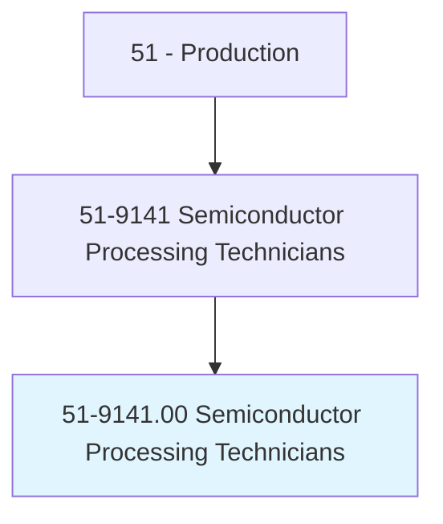
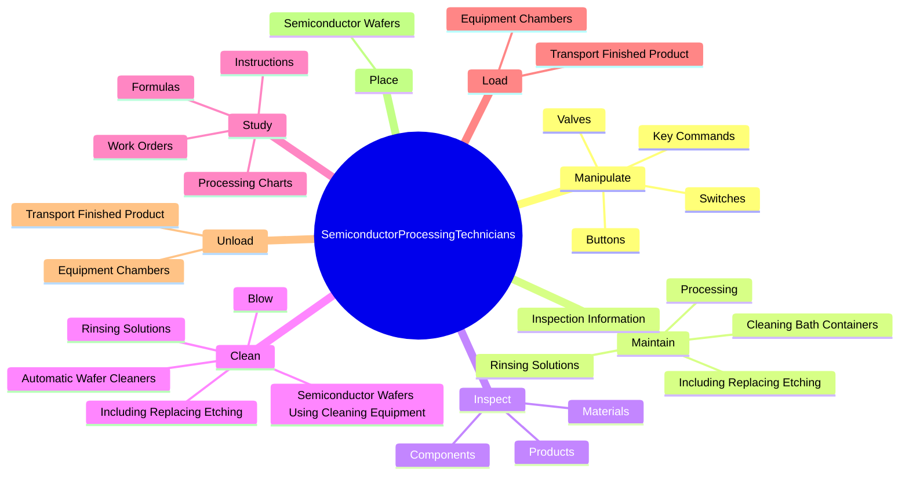

# Semiconductor Processing Technicians

> Perform any or all of the following functions in the manufacture of electronic semiconductors: load semiconductor material into furnace; saw formed ingots into segments; load individual segment into crystal growing chamber and monitor controls; locate crystal axis in ingot using x-ray equipment and saw ingots into wafers; and clean, polish, and load wafers into series of special purpose furnaces, chemical baths, and equipment used to form circuitry and change conductive properties.

## Overview

Semiconductor Processing Technicians is classified under Production (SOC 51). Perform any or all of the following functions in the manufacture of electronic semiconductors: load semiconductor material into furnace; saw formed ingots into segments; load individual segment into crystal growing chamber and monitor controls; locate crystal axis in ingot using x-ray equipment and saw ingots into wafers; and clean, polish, and load wafers into series of special purpose furnaces, chemical baths, and equipment used to form circuitry and change conductive properties.

## Classification Hierarchy

## Key Statistics

| Metric | Value |
|--------|-------|
| SOC Code | 51-9141.00 |
| Category | [Production](/occupations/Production/index) |
| Task Count | 143 |
| Source | O*NET |

## Core Tasks

### manipulate.Valves

Semiconductor Processing Technicians manipulate valves as part of their core responsibilities.

**Actions:**
- `manipulate.Valves.to.start.SemiconductorProcessingCycles`
- `manipulate.Switches.to.start.SemiconductorProcessingCycles`
- `manipulate.Buttons.to.start.SemiconductorProcessingCycles`
- `manipulate.KeyCommands.into.ControlPanels.to.start.SemiconductorProcessingCycles`

### maintain.Processing

Semiconductor Processing Technicians maintain processing as part of their core responsibilities.

**Actions:**
- `maintain.Processing`
- `maintain.InspectionInformation`
- `maintain.IncludingReplacingEtching`
- `maintain.RinsingSolutions`

### inspect.Materials

Semiconductor Processing Technicians inspect materials as part of their core responsibilities.

**Actions:**
- `inspect.Materials.for.SurfaceDefects`
- `inspect.Materials.for.MeasureCircuitry`
- `inspect.Materials.for.UsingElectronicTestEquipment`
- `inspect.Materials.for.PrecisionMeasuringInstruments`

## Skills & Competencies

### Technical Skills
- **Machine Operation** - Advanced
- **Quality Control** - Advanced
- **Production Processes** - Advanced

### Soft Skills
- **Communication** - Essential
- **Problem Solving** - Essential
- **Critical Thinking** - Important
- **Teamwork** - Important
- **Adaptability** - Important

## Related Occupations

## Industries

This occupation is found across multiple industries. See [Industries](/industries) for sector-specific employment data.

## Career Progression

---

*Source: O*NET 51-9141.00 - ONETOccupation*
