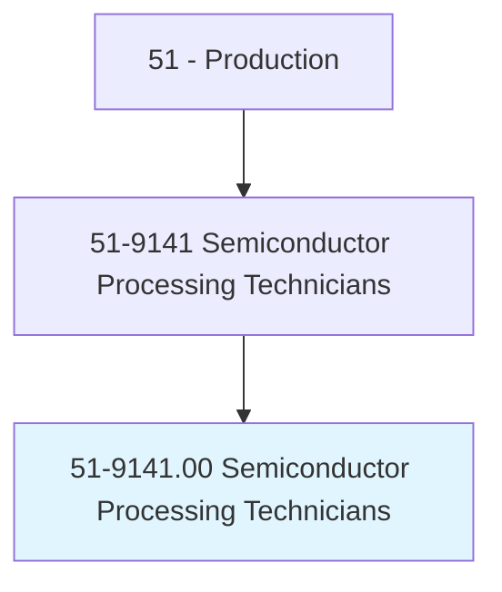
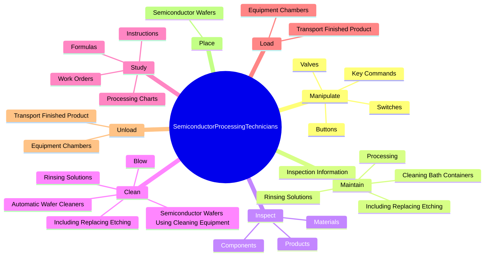
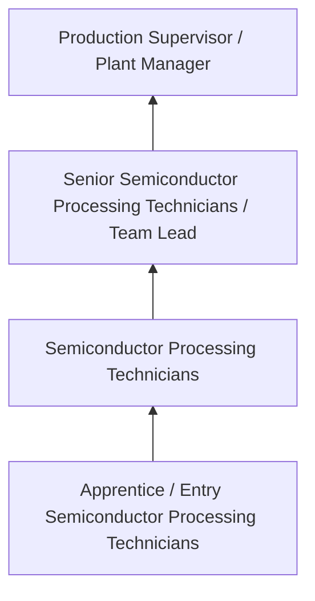

# Semiconductor Processing Technicians

> Perform any or all of the following functions in the manufacture of electronic semiconductors: load semiconductor material into furnace; saw formed ingots into segments; load individual segment into crystal growing chamber and monitor controls; locate crystal axis in ingot using x-ray equipment and saw ingots into wafers; and clean, polish, and load wafers into series of special purpose furnaces, chemical baths, and equipment used to form circuitry and change conductive properties.

## Overview

Semiconductor Processing Technicians professionals perform any or all of the following functions in the manufacture of electronic semiconductors: load semiconductor material into furnace; saw formed ingots into segments; load individual segment into crystal growing chamber and monitor controls; locate crystal axis in ingot using x-ray equipment and saw ingots into wafers; and clean, polish, and load wafers into series of special purpose furnaces, chemical baths, and equipment used to form circuitry and change conductive properties.. This occupation falls within the Production category and requires a combination of specialized knowledge, technical skills, and practical experience.

These professionals work across diverse settings and organizational contexts, applying their expertise to meet the demands of their field. They must stay current with industry standards, emerging practices, and regulatory requirements that affect their work. The role demands both independent judgment and collaborative skills, as practitioners regularly interact with colleagues, stakeholders, and the public.

As the field continues to evolve, Semiconductor Processing Technicians professionals increasingly leverage technology and data-driven approaches to enhance their effectiveness. Career opportunities span the public and private sectors, with demand influenced by economic conditions, demographic shifts, and technological advancement.

## Classification Hierarchy



## Key Statistics

| Metric | Value |
|--------|-------|
| SOC Code | 51-9141.00 |
| Job Zone | N/A |
| Category | [Production](/occupations/Production/index) |
| Core Tasks | 143+ |
| Salary Range | $28,000 - $65,000 |
| Median Salary | $40,000 |
| Growth Outlook | 1% (Little or no change) |
| Source | O*NET |

## Core Tasks



### inspect.Materials

Semiconductor Processing Technicians inspect materials as part of their core responsibilities.

**Actions:**
- `inspect.Materials.for.SurfaceDefects` - Inspect materials, components, or products for surface defects and measure ci...
- `inspect.Materials.for.MeasureCircuitry` - Inspect materials, components, or products for surface defects and measure ci...
- `inspect.Materials.for.UsingElectronicTestEquipment` - Inspect materials, components, or products for surface defects and measure ci...
- `inspect.Materials.for.PrecisionMeasuringInstruments` - Inspect materials, components, or products for surface defects and measure ci...
- `inspect.Materials.for.Microscope` - Inspect materials, components, or products for surface defects and measure ci...

### etch.Wafers

Semiconductor Processing Technicians etch wafers as part of their core responsibilities.

**Actions:**
- `etch.Wafers.to.form.Circuitry` - Etch, lap, polish, or grind wafers or ingots to form circuitry and change con...
- `etch.Wafers.to.change.ConductiveProperties` - Etch, lap, polish, or grind wafers or ingots to form circuitry and change con...
- `etch.Wafers.to.UsingEtching` - Etch, lap, polish, or grind wafers or ingots to form circuitry and change con...
- `etch.Wafers.to.Lapping` - Etch, lap, polish, or grind wafers or ingots to form circuitry and change con...
- `etch.Wafers.to.Polishing` - Etch, lap, polish, or grind wafers or ingots to form circuitry and change con...

### polish.Wafers

Semiconductor Processing Technicians polish wafers as part of their core responsibilities.

**Actions:**
- `polish.Wafers.to.form.Circuitry` - Etch, lap, polish, or grind wafers or ingots to form circuitry and change con...
- `polish.Wafers.to.change.ConductiveProperties` - Etch, lap, polish, or grind wafers or ingots to form circuitry and change con...
- `polish.Wafers.to.UsingEtching` - Etch, lap, polish, or grind wafers or ingots to form circuitry and change con...
- `polish.Wafers.to.Lapping` - Etch, lap, polish, or grind wafers or ingots to form circuitry and change con...
- `polish.Wafers.to.Polishing` - Etch, lap, polish, or grind wafers or ingots to form circuitry and change con...

### grind.Wafers

Semiconductor Processing Technicians grind wafers as part of their core responsibilities.

**Actions:**
- `grind.Wafers.to.form.Circuitry` - Etch, lap, polish, or grind wafers or ingots to form circuitry and change con...
- `grind.Wafers.to.change.ConductiveProperties` - Etch, lap, polish, or grind wafers or ingots to form circuitry and change con...
- `grind.Wafers.to.UsingEtching` - Etch, lap, polish, or grind wafers or ingots to form circuitry and change con...
- `grind.Wafers.to.Lapping` - Etch, lap, polish, or grind wafers or ingots to form circuitry and change con...
- `grind.Wafers.to.Polishing` - Etch, lap, polish, or grind wafers or ingots to form circuitry and change con...


## Skills & Competencies

### Technical Skills
- **Machine Operation** - Advanced
- **Quality Inspection** - Advanced
- **Safety Procedures** - Advanced
- **Blueprint Reading** - Proficient
- **Measurement Tools** - Proficient
- **Process Control** - Proficient

### Soft Skills
- **Attention to Detail** - Critical
- **Reliability** - Critical
- **Physical Dexterity** - Essential
- **Teamwork** - Essential
- **Problem Solving** - Important

## Education & Certifications

| Requirement | Details |
|-------------|---------|
| Typical Education | High school diploma or equivalent; some positions require technical training |
| Work Experience | 0-2 years manufacturing experience |
| On-the-Job Training | Moderate - equipment operation and safety procedures |
| Certifications | OSHA certifications, quality management certifications |

## Career Progression



## Industry Variations

### Discrete Manufacturing
Assembly of distinct products such as automobiles, electronics, or machinery. Semiconductor Processing Technicians professionals work with precision equipment and quality standards.

### Process Manufacturing
Continuous production of chemicals, food, or materials. Focus on process control and consistency.

### Custom and Job Shop
Small-batch or custom production work. Requires versatility and ability to adapt to varied specifications.

### Automated Manufacturing
Technology-driven production with robotics and advanced systems. Increasing emphasis on programming and monitoring skills.

## Technology & Tools

- **Manufacturing execution systems (MES)**
- **Computer numerical control (CNC) machines**
- **Quality management software**
- **Programmable logic controllers (PLC)**
- **Enterprise resource planning (ERP) systems**

## Related Occupations


## Industries

- [Manufacturing](/industries/Manufacturing) - High Employment
- [Food Processing](/industries/FoodProcessing) - High Employment
- [Automotive](/industries/Automotive) - Moderate Employment
- [Electronics](/industries/Electronics) - Moderate Employment

## Departments

This occupation typically works in:
- [Manufacturing](/departments/Manufacturing)
- [Quality Control](/departments/QualityControl)
- [Production Planning](/departments/ProductionPlanning)

## GraphDL Semantic Structure

```
Semiconductor Processing Technicians perform:
- manipulate.Valves.to.start.SemiconductorProcessingCycles
- manipulate.Switches.to.start.SemiconductorProcessingCycles
- manipulate.Buttons.to.start.SemiconductorProcessingCycles
- manipulate.KeyCommands.into.ControlPanels.to.start.SemiconductorProcessingCycles
- maintain.Processing
- maintain.InspectionInformation
```

---

*Source: O*NET 51-9141.00 - ONETOccupation*
