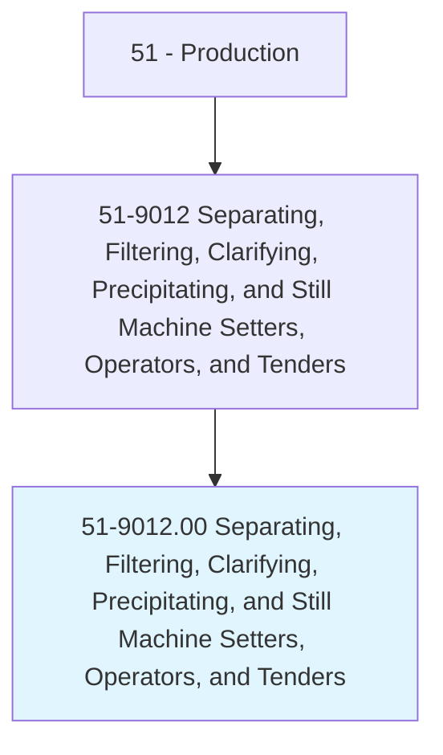
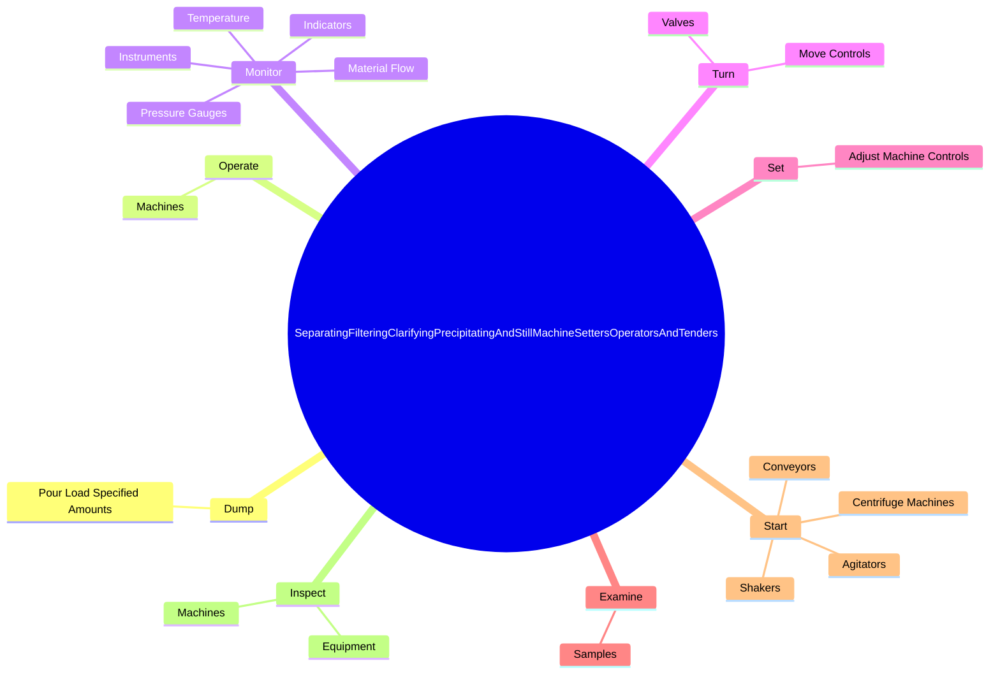
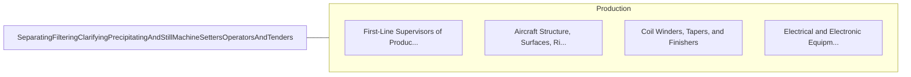

# Separating, Filtering, Clarifying, Precipitating, and Still Machine Setters, Operators, and Tenders

> Set up, operate, or tend continuous flow or vat-type equipment; filter presses; shaker screens; centrifuges; condenser tubes; precipitating, fermenting, or evaporating tanks; scrubbing towers; or batch stills. These machines extract, sort, or separate liquids, gases, or solids from other materials to recover a refined product. Includes dairy processing equipment operators.

## Overview

Separating, Filtering, Clarifying, Precipitating, and Still Machine Setters, Operators, and Tenders is an occupation within the Production category. Set up, operate, or tend continuous flow or vat-type equipment; filter presses; shaker screens; centrifuges; condenser tubes; precipitating, fermenting, or evaporating tanks; scrubbing towers; or batch stills. These machines extract, sort, or separate liquids, gases, or solids from other materials to recover a refined product.

## Classification Hierarchy

## Key Statistics

| Metric | Value |
|--------|-------|
| SOC Code | 51-9012.00 |
| Category | [Production](/occupations/Production/index) |
| Task Count | 148 |
| Source | O*NET |

## Core Tasks

### dump.PourLoadSpecifiedAmounts

Separating, Filtering, Clarifying, Precipitating, and Still Machine Setters, Operators, and Tenders dump pour load specified amounts as part of their core responsibilities.

**Actions:**
- `dump.PourLoadSpecifiedAmounts.of.RefinedUnrefinedMaterialsIntoEquipmentContainers.for.FurtherProcessingStorage`

### operate.Machines

Separating, Filtering, Clarifying, Precipitating, and Still Machine Setters, Operators, and Tenders operate machines as part of their core responsibilities.

**Actions:**
- `operate.Machines.to.process.MaterialsInComplianceWithApplicableSafety`
- `operate.Machines.to.Energy`
- `operate.Machines.to.EnvironmentalRegulations`

### monitor.MaterialFlow

Separating, Filtering, Clarifying, Precipitating, and Still Machine Setters, Operators, and Tenders monitor material flow as part of their core responsibilities.

**Actions:**
- `monitor.MaterialFlow.to.ensure.OptimalProcessingConditions`
- `monitor.Instruments.to.ensure.OptimalProcessingConditions`
- `monitor.Temperature.to.ensure.OptimalProcessingConditions`
- `monitor.PressureGauges.to.ensure.OptimalProcessingConditions`

## Skills & Competencies

### Technical Skills
- **Machine Operation** - Advanced
- **Quality Control** - Advanced
- **Production Processes** - Advanced

### Soft Skills
- **Communication** - Essential
- **Problem Solving** - Essential
- **Critical Thinking** - Important
- **Teamwork** - Important
- **Adaptability** - Important

## Related Occupations

## Industries

This occupation is found across multiple industries. See [Industries](/industries) for sector-specific employment data.

## Career Progression

---

*Source: O*NET 51-9012.00 - ONETOccupation*
