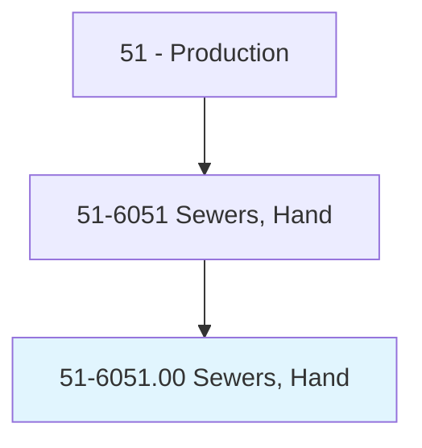
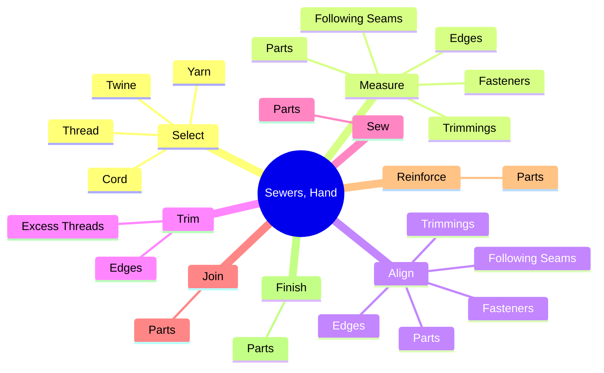
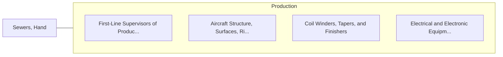

# Sewers, Hand

> Sew, join, reinforce, or finish, usually with needle and thread, a variety of manufactured items. Includes weavers and stitchers.

## Overview

Sewers, Hand is an occupation within the Production category. Sew, join, reinforce, or finish, usually with needle and thread, a variety of manufactured items. 

## Classification Hierarchy

## Key Statistics

| Metric | Value |
|--------|-------|
| SOC Code | 51-6051.00 |
| Category | [Production](/occupations/Production/index) |
| Task Count | 89 |
| Source | O*NET |

## Core Tasks

### select.Thread

Sewers, Hand select thread as part of their core responsibilities.

**Actions:**
- `select.Thread.to.BeUsed`
- `select.Thread.to.thread.Needles`
- `select.Twine.to.BeUsed`
- `select.Twine.to.thread.Needles`

### measure.Parts

Sewers, Hand measure parts as part of their core responsibilities.

**Actions:**
- `measure.Parts.on.Parts`
- `measure.Fasteners.on.Parts`
- `measure.Trimmings.on.Parts`
- `measure.FollowingSeams.on.Parts`

### align.Parts

Sewers, Hand align parts as part of their core responsibilities.

**Actions:**
- `align.Parts.on.Parts`
- `align.Fasteners.on.Parts`
- `align.Trimmings.on.Parts`
- `align.FollowingSeams.on.Parts`

## Skills & Competencies

### Technical Skills
- **Machine Operation** - Advanced
- **Quality Control** - Advanced
- **Production Processes** - Advanced

### Soft Skills
- **Communication** - Essential
- **Problem Solving** - Essential
- **Critical Thinking** - Important
- **Teamwork** - Important
- **Adaptability** - Important

## Related Occupations

## Industries

This occupation is found across multiple industries. See [Industries](/industries) for sector-specific employment data.

## Career Progression

---

*Source: O*NET 51-6051.00 - ONETOccupation*
