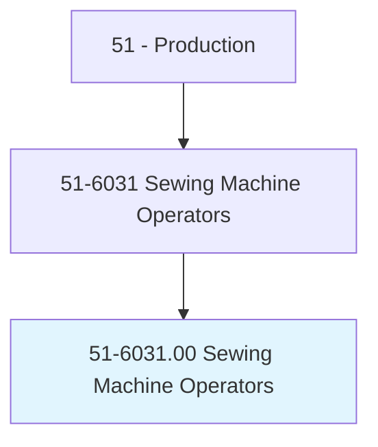
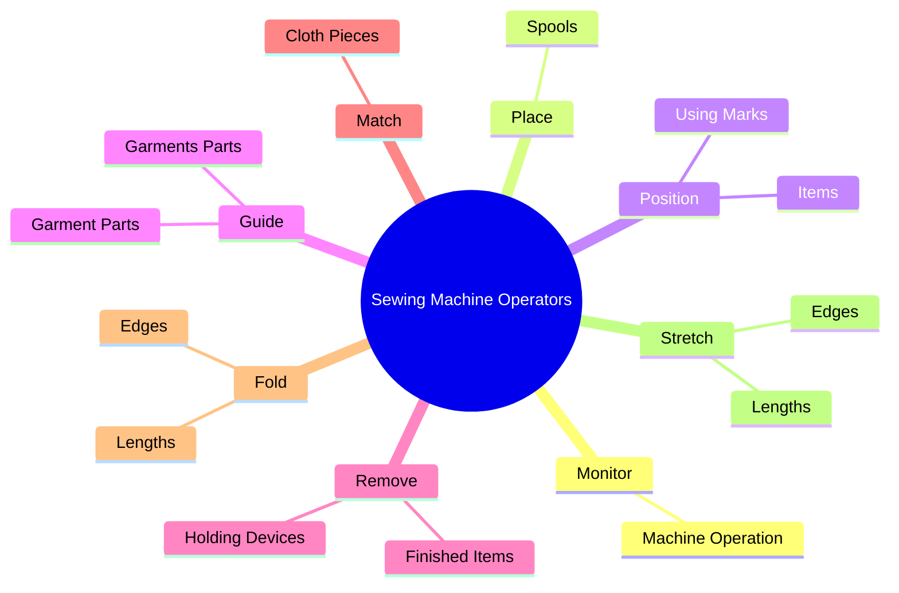
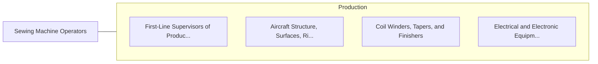

# Sewing Machine Operators

> Operate or tend sewing machines to join, reinforce, decorate, or perform related sewing operations in the manufacture of garment or nongarment products.

## Overview

Sewing Machine Operators is classified under Production (SOC 51). Operate or tend sewing machines to join, reinforce, decorate, or perform related sewing operations in the manufacture of garment or nongarment products.

## Classification Hierarchy

## Key Statistics

| Metric | Value |
|--------|-------|
| SOC Code | 51-6031.00 |
| Category | [Production](/occupations/Production) |
| Task Count | 150 |
| Source | O*NET |

## Core Tasks

### monitor.MachineOperation

Sewing Machine Operators monitor machine operation as part of their core responsibilities.

**Actions:**
- `monitor.MachineOperation.to.detect.Problems`
- `monitor.MachineOperation.to.DefectiveStitching`
- `monitor.MachineOperation.to.breaks.InThread`
- `monitor.MachineOperation.to.machine.Malfunctions`

### place.Spools

Sewing Machine Operators place spools as part of their core responsibilities.

**Actions:**
- `place.Spools.of.Thread`
- `place.Spools.of.Cord`
- `place.Spools.of.OtherMaterials.on.Spindles`
- `place.Spools.of.InsertBobbins`

### position.Items

Sewing Machine Operators position items as part of their core responsibilities.

**Actions:**
- `position.Items.under.Needles.on.Machines`
- `position.Items.under.Needles.on.Clamps`
- `position.Items.under.Needles.on.Templates`
- `position.Items.under.Needles.on.ClothAsGuides`

## Skills & Competencies

### Technical Skills
- **Machine Operation** - Advanced
- **Quality Control** - Advanced
- **Production Processes** - Advanced

### Soft Skills
- **Communication** - Essential
- **Problem Solving** - Essential
- **Critical Thinking** - Important
- **Teamwork** - Important
- **Adaptability** - Important

## Related Occupations

## Industries

This occupation is found across multiple industries. See [Industries](/industries) for sector-specific employment data.

## Career Progression

---

*Source: O*NET 51-6031.00 - ONETOccupation*
