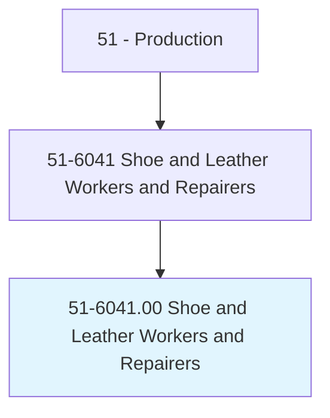
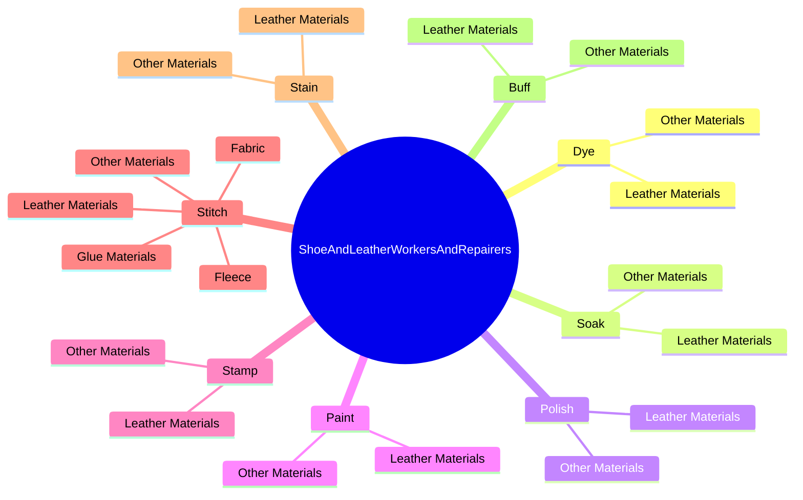

# Shoe and Leather Workers and Repairers

> Construct, decorate, or repair leather and leather-like products, such as luggage, shoes, and saddles. May use hand tools.

## Overview

Shoe and Leather Workers and Repairers is an occupation within the Production category. Construct, decorate, or repair leather and leather-like products, such as luggage, shoes, and saddles. 

## Classification Hierarchy

## Key Statistics

| Metric | Value |
|--------|-------|
| SOC Code | 51-6041.00 |
| Category | [Production](/occupations/Production) |
| Task Count | 277 |
| Source | O*NET |

## Core Tasks

### dye.LeatherMaterials

Shoe and Leather Workers and Repairers dye leather materials as part of their core responsibilities.

**Actions:**
- `dye.LeatherMaterials.to.obtain.DesiredEffects`
- `dye.LeatherMaterials.to.Decorations`
- `dye.LeatherMaterials.to.shapes`
- `dye.OtherMaterials.to.obtain.DesiredEffects`

### soak.LeatherMaterials

Shoe and Leather Workers and Repairers soak leather materials as part of their core responsibilities.

**Actions:**
- `soak.LeatherMaterials.to.obtain.DesiredEffects`
- `soak.LeatherMaterials.to.Decorations`
- `soak.LeatherMaterials.to.shapes`
- `soak.OtherMaterials.to.obtain.DesiredEffects`

### polish.LeatherMaterials

Shoe and Leather Workers and Repairers polish leather materials as part of their core responsibilities.

**Actions:**
- `polish.LeatherMaterials.to.obtain.DesiredEffects`
- `polish.LeatherMaterials.to.Decorations`
- `polish.LeatherMaterials.to.shapes`
- `polish.OtherMaterials.to.obtain.DesiredEffects`

## Skills & Competencies

### Technical Skills
- **Machine Operation** - Advanced
- **Quality Control** - Advanced
- **Production Processes** - Advanced

### Soft Skills
- **Communication** - Essential
- **Problem Solving** - Essential
- **Critical Thinking** - Important
- **Teamwork** - Important
- **Adaptability** - Important

## Related Occupations

## Industries

This occupation is found across multiple industries. See [Industries](/industries) for sector-specific employment data.

## Career Progression

---

*Source: O*NET 51-6041.00 - ONETOccupation*
