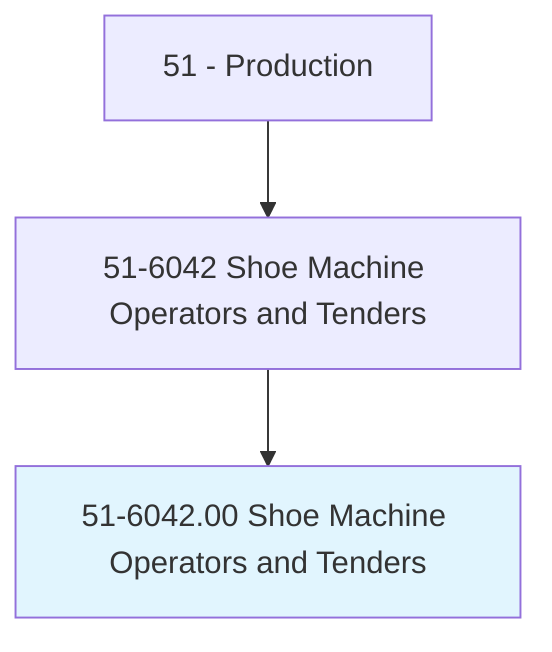
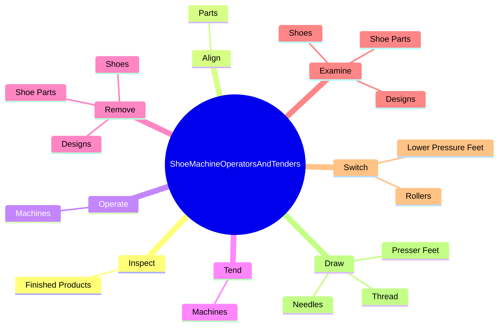
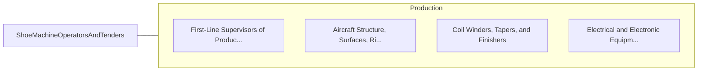

# Shoe Machine Operators and Tenders

> Operate or tend a variety of machines to join, decorate, reinforce, or finish shoes and shoe parts.

## Overview

Shoe Machine Operators and Tenders is classified under Production (SOC 51). Operate or tend a variety of machines to join, decorate, reinforce, or finish shoes and shoe parts.

## Classification Hierarchy

## Key Statistics

| Metric | Value |
|--------|-------|
| SOC Code | 51-6042.00 |
| Category | [Production](/occupations/Production/index) |
| Task Count | 85 |
| Source | O*NET |

## Core Tasks

### inspect.FinishedProducts

Shoe Machine Operators and Tenders inspect finished products as part of their core responsibilities.

**Actions:**
- `inspect.FinishedProducts.to.ensure.ShoesHaveBeenCompletedAccordingToSpecifications`

### align.Parts

Shoe Machine Operators and Tenders align parts as part of their core responsibilities.

**Actions:**
- `align.Parts.to.BeStitched`
- `align.Parts.to.FollowingSeams`
- `align.Parts.to.Edges`
- `align.Parts.to.Markings`

### operate.Machines

Shoe Machine Operators and Tenders operate machines as part of their core responsibilities.

**Actions:**
- `operate.Machines.to.join`
- `operate.Machines.to.decorate`
- `operate.Machines.to.reinforce`
- `operate.Machines.to.finish.ShoesParts`

## Skills & Competencies

### Technical Skills
- **Machine Operation** - Advanced
- **Quality Control** - Advanced
- **Production Processes** - Advanced

### Soft Skills
- **Communication** - Essential
- **Problem Solving** - Essential
- **Critical Thinking** - Important
- **Teamwork** - Important
- **Adaptability** - Important

## Related Occupations

## Industries

This occupation is found across multiple industries. See [Industries](/industries) for sector-specific employment data.

## Career Progression

---

*Source: O*NET 51-6042.00 - ONETOccupation*
