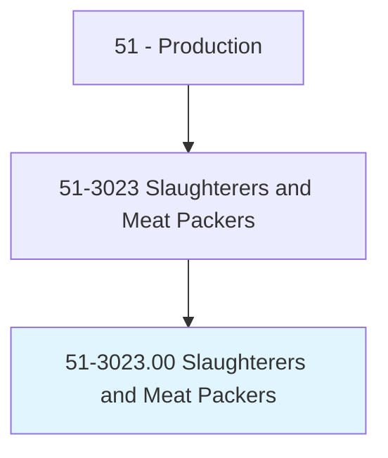
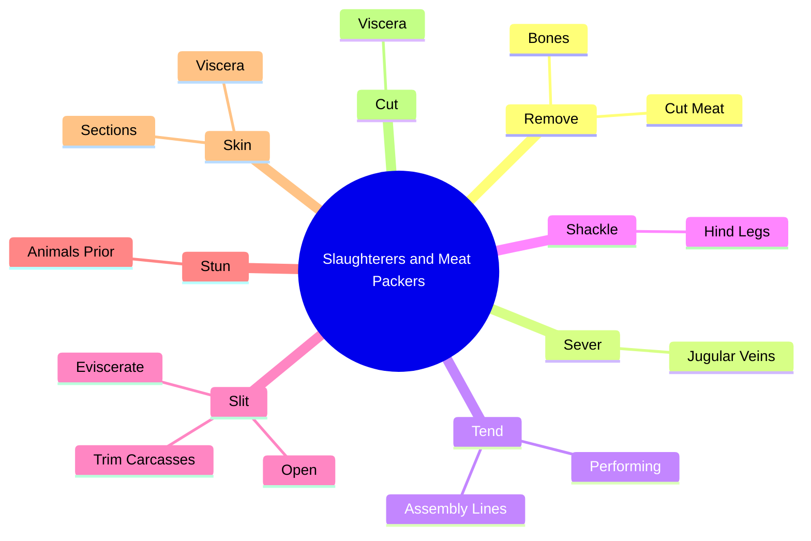

# Slaughterers and Meat Packers

> Perform nonroutine or precision functions involving the preparation of large portions of meat. Work may include specialized slaughtering tasks, cutting standard or premium cuts of meat for marketing, making sausage, or wrapping meats. Work typically occurs in slaughtering, meat packing, or wholesale establishments.

## Overview

Slaughterers and Meat Packers is an occupation within the Production category. Perform nonroutine or precision functions involving the preparation of large portions of meat. Work may include specialized slaughtering tasks, cutting standard or premium cuts of meat for marketing, making sausage, or wrapping meats.

## Classification Hierarchy

## Key Statistics

| Metric | Value |
|--------|-------|
| SOC Code | 51-3023.00 |
| Category | [Production](/occupations/Production/index) |
| Task Count | 42 |
| Source | O*NET |

## Core Tasks

### remove.Bones

Slaughterers and Meat Packers remove bones as part of their core responsibilities.

**Actions:**
- `remove.Bones.in.Preparation.for.Marketing`
- `remove.CutMeat.into.StandardCuts.in.PreparationForMarketing`

### sever.JugularVeins

Slaughterers and Meat Packers sever jugular veins as part of their core responsibilities.

**Actions:**
- `sever.JugularVeins.to.drain.Blood`
- `sever.JugularVeins.to.facilitate.Slaughtering`

### tend.AssemblyLines

Slaughterers and Meat Packers tend assembly lines as part of their core responsibilities.

**Actions:**
- `tend.AssemblyLines.of.CutsNeeded.to.process.Carcass`
- `tend.Performing.of.CutsNeeded.to.process.Carcass`

## Skills & Competencies

### Technical Skills
- **Machine Operation** - Advanced
- **Quality Control** - Advanced
- **Production Processes** - Advanced

### Soft Skills
- **Communication** - Essential
- **Problem Solving** - Essential
- **Critical Thinking** - Important
- **Teamwork** - Important
- **Adaptability** - Important

## Related Occupations

## Industries

This occupation is found across multiple industries. See [Industries](/industries) for sector-specific employment data.

## Career Progression

---

*Source: O*NET 51-3023.00 - ONETOccupation*
