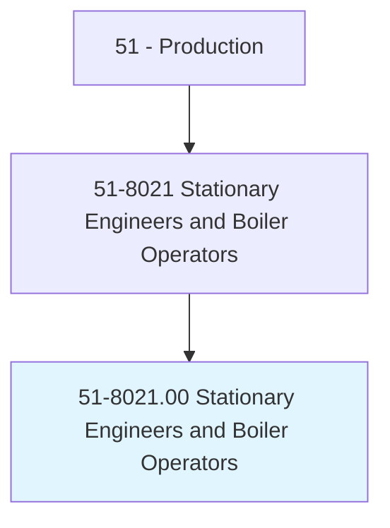
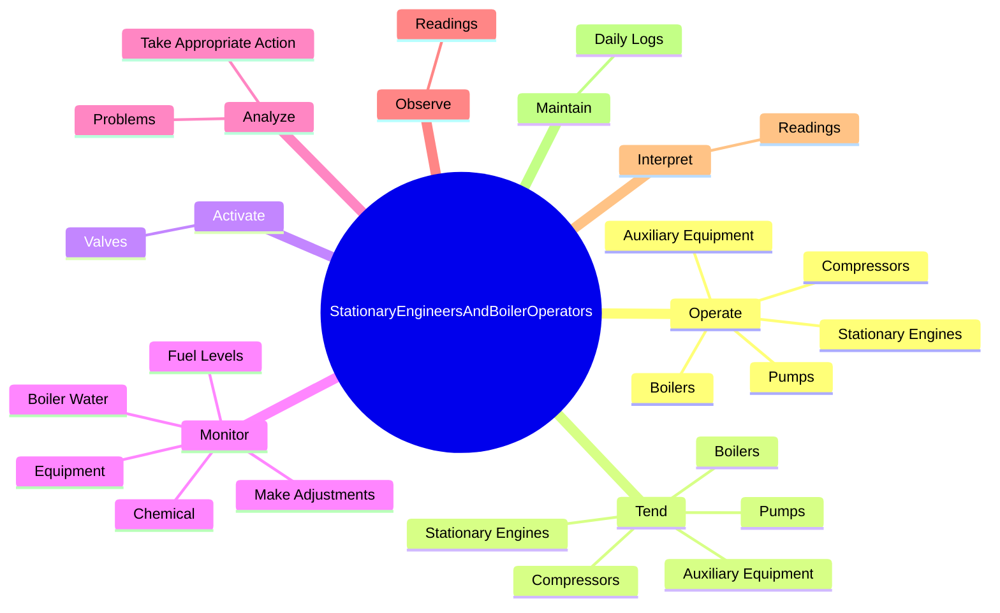
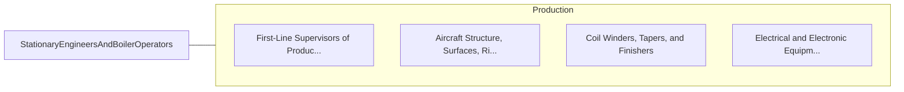

# Stationary Engineers and Boiler Operators

> Operate or maintain stationary engines, boilers, or other mechanical equipment to provide utilities for buildings or industrial processes. Operate equipment such as steam engines, generators, motors, turbines, and steam boilers.

## Overview

Stationary Engineers and Boiler Operators is an occupation within the Production category. Operate or maintain stationary engines, boilers, or other mechanical equipment to provide utilities for buildings or industrial processes. 

## Classification Hierarchy

## Key Statistics

| Metric | Value |
|--------|-------|
| SOC Code | 51-8021.00 |
| Category | [Production](/occupations/Production/index) |
| Task Count | 173 |
| Source | O*NET |

## Core Tasks

### operate.StationaryEngines

Stationary Engineers and Boiler Operators operate stationary engines as part of their core responsibilities.

**Actions:**
- `operate.StationaryEngines.to.supply.SteamHeatForBuildings`
- `operate.StationaryEngines.to.maintain.SteamHeatForBuildings`
- `operate.StationaryEngines.to.MarineVessels`
- `operate.StationaryEngines.to.PneumaticTools`

### tend.StationaryEngines

Stationary Engineers and Boiler Operators tend stationary engines as part of their core responsibilities.

**Actions:**
- `tend.StationaryEngines.to.supply.SteamHeatForBuildings`
- `tend.StationaryEngines.to.maintain.SteamHeatForBuildings`
- `tend.StationaryEngines.to.MarineVessels`
- `tend.StationaryEngines.to.PneumaticTools`

### activate.Valves

Stationary Engineers and Boiler Operators activate valves as part of their core responsibilities.

**Actions:**
- `activate.Valves.to.maintain.RequiredAmountsOfWaterInBoilers`
- `activate.Valves.to.ToAdjustSuppliesOfCombustionAir`
- `activate.Valves.to.ToControlFlowOfFuelIntoBurners`

## Skills & Competencies

### Technical Skills
- **Machine Operation** - Advanced
- **Quality Control** - Advanced
- **Production Processes** - Advanced

### Soft Skills
- **Communication** - Essential
- **Problem Solving** - Essential
- **Critical Thinking** - Important
- **Teamwork** - Important
- **Adaptability** - Important

## Related Occupations

## Industries

This occupation is found across multiple industries. See [Industries](/industries) for sector-specific employment data.

## Career Progression

---

*Source: O*NET 51-8021.00 - ONETOccupation*
