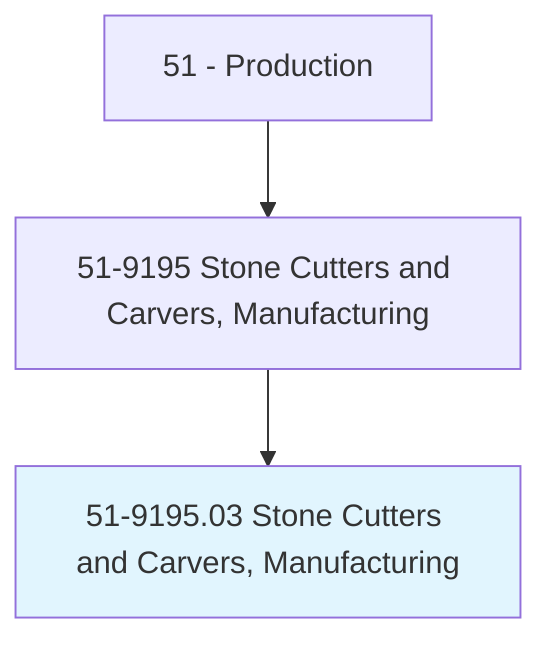
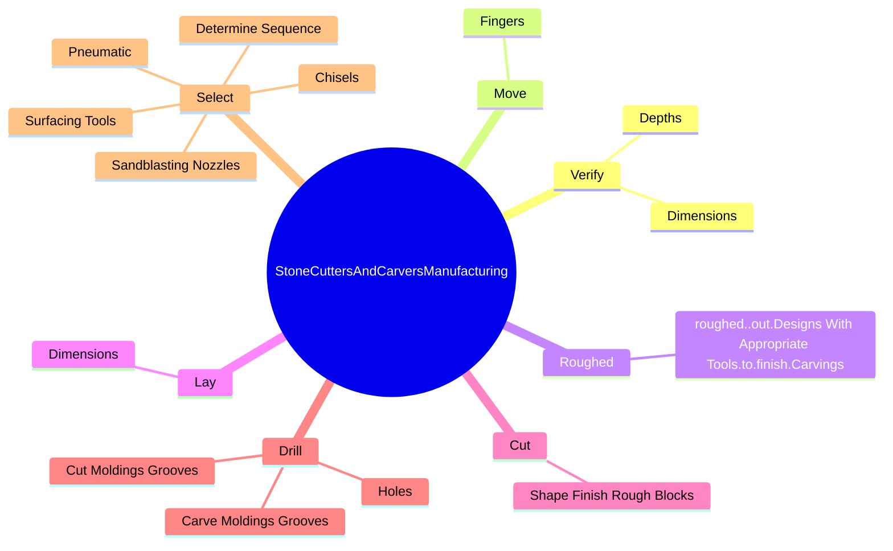
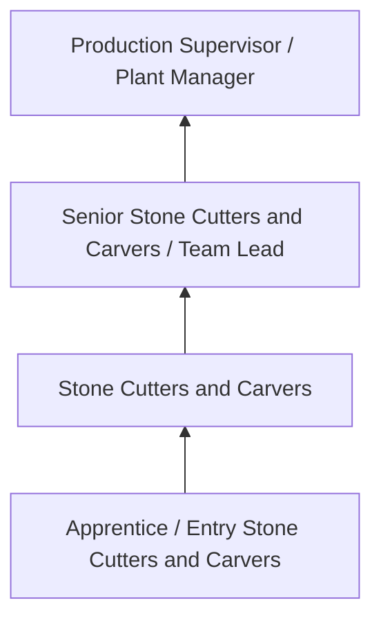

# Stone Cutters and Carvers, Manufacturing

> Cut or carve stone according to diagrams and patterns.

## Overview

Stone Cutters and Carvers, Manufacturing professionals cut or carve stone according to diagrams and patterns.. This occupation falls within the Production category and requires a combination of specialized knowledge, technical skills, and practical experience.

These professionals work across diverse settings and organizational contexts, applying their expertise to meet the demands of their field. They must stay current with industry standards, emerging practices, and regulatory requirements that affect their work. The role demands both independent judgment and collaborative skills, as practitioners regularly interact with colleagues, stakeholders, and the public.

As the field continues to evolve, Stone Cutters and Carvers professionals increasingly leverage technology and data-driven approaches to enhance their effectiveness. Career opportunities span the public and private sectors, with demand influenced by economic conditions, demographic shifts, and technological advancement.

## Classification Hierarchy



## Key Statistics

| Metric | Value |
|--------|-------|
| SOC Code | 51-9195.03 |
| Job Zone | N/A |
| Category | [Production](/occupations/Production/index) |
| Core Tasks | N/A+ |
| Salary Range | $28,000 - $65,000 |
| Median Salary | $40,000 |
| Growth Outlook | 1% (Little or no change) |
| Source | O*NET |

## Core Tasks



### verify.Depths

Stone Cutters and Carvers, Manufacturing verify depths as part of their core responsibilities.

**Actions:**
- `verify.Depths.of.Cuts.to.ensure.AdherenceToSpecifications`
- `verify.Depths.of.Carvings.to.ensure.AdherenceToSpecifications`
- `verify.Depths.of.Blueprints`
- `verify.Depths.of.Models`

### move.Fingers

Stone Cutters and Carvers, Manufacturing move fingers as part of their core responsibilities.

**Actions:**
- `move.Fingers.over.SurfacesOfCarvings.to.ensure.SmoothnessOfFinish`

### roughed.roughed..out.DesignsWithAppropriateTools.to.finish.Carvings

Stone Cutters and Carvers, Manufacturing roughed roughed..out.designs with appropriate tools.to.finish.carvings as part of their core responsibilities.

**Actions:**
- `roughed..out.DesignsWithAppropriateTools.to.finish.Carvings`

### Technical Skills
- **Machine Operation** - Advanced
- **Quality Control** - Advanced
- **Production Processes** - Advanced

### Soft Skills
- **Communication** - Essential
- **Problem Solving** - Essential
- **Critical Thinking** - Important
- **Teamwork** - Important
- **Adaptability** - Important


## Skills & Competencies

### Technical Skills
- **Machine Operation** - Advanced
- **Quality Inspection** - Advanced
- **Safety Procedures** - Advanced
- **Blueprint Reading** - Proficient
- **Measurement Tools** - Proficient
- **Process Control** - Proficient

### Soft Skills
- **Attention to Detail** - Critical
- **Reliability** - Critical
- **Physical Dexterity** - Essential
- **Teamwork** - Essential
- **Problem Solving** - Important

## Education & Certifications

| Requirement | Details |
|-------------|---------|
| Typical Education | High school diploma or equivalent; some positions require technical training |
| Work Experience | 0-2 years manufacturing experience |
| On-the-Job Training | Moderate - equipment operation and safety procedures |
| Certifications | OSHA certifications, quality management certifications |

## Career Progression



## Industry Variations

### Discrete Manufacturing
Assembly of distinct products such as automobiles, electronics, or machinery. Stone Cutters and Carvers professionals work with precision equipment and quality standards.

### Process Manufacturing
Continuous production of chemicals, food, or materials. Focus on process control and consistency.

### Custom and Job Shop
Small-batch or custom production work. Requires versatility and ability to adapt to varied specifications.

### Automated Manufacturing
Technology-driven production with robotics and advanced systems. Increasing emphasis on programming and monitoring skills.

## Technology & Tools

- **Manufacturing execution systems (MES)**
- **Computer numerical control (CNC) machines**
- **Quality management software**
- **Programmable logic controllers (PLC)**
- **Enterprise resource planning (ERP) systems**

## Related Occupations


## Industries

- [Manufacturing](/industries/Manufacturing) - High Employment
- Food Processing - High Employment
- [Automotive](/industries/Manufacturing) - Moderate Employment
- [Electronics](/industries/Electronics) - Moderate Employment

## Departments

This occupation typically works in:
- [Manufacturing](/departments/Operations)
- Quality Control
- Production Planning

## GraphDL Semantic Structure

```graphdl
Stone Cutters and Carvers, Manufacturing perform:
- operate.Equipment.for.ManufacturingProcesses
- inspect.Products.for.QualityStandards
- maintain.Equipment.for.OptimalPerformance
- follow.Procedures.for.SafetyCompliance
- record.Data.on.ProductionOutput
```

---

*Source: O*NET 51-9195.03 - ONETOccupation*
