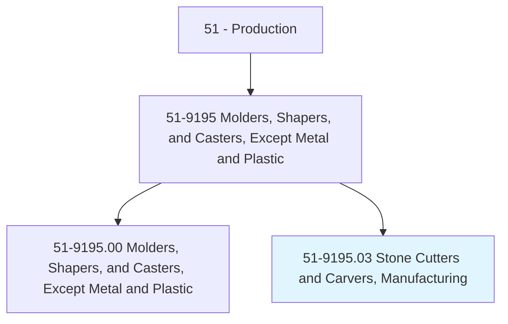
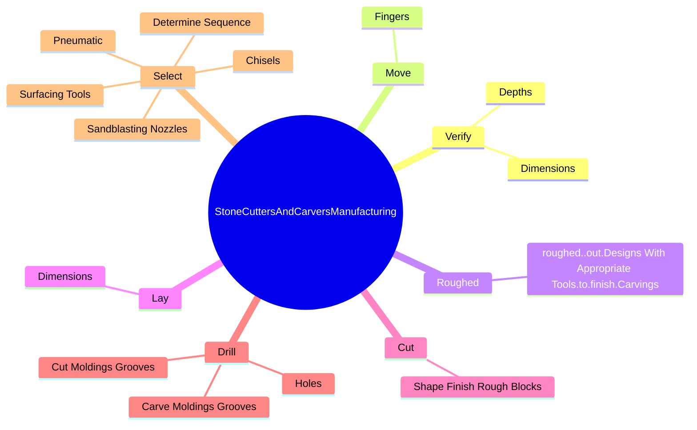

# Stone Cutters and Carvers, Manufacturing

> Cut or carve stone according to diagrams and patterns.

## Overview

Stone Cutters and Carvers, Manufacturing is classified under Production (SOC 51). Cut or carve stone according to diagrams and patterns.

## Classification Hierarchy

## Key Statistics

| Metric | Value |
|--------|-------|
| SOC Code | 51-9195.03 |
| Category | [Production](/occupations/Production) |
| Task Count | 79 |
| Source | O*NET |

## Core Tasks

### verify.Depths

Stone Cutters and Carvers, Manufacturing verify depths as part of their core responsibilities.

**Actions:**
- `verify.Depths.of.Cuts.to.ensure.AdherenceToSpecifications`
- `verify.Depths.of.Carvings.to.ensure.AdherenceToSpecifications`
- `verify.Depths.of.Blueprints`
- `verify.Depths.of.Models`

### move.Fingers

Stone Cutters and Carvers, Manufacturing move fingers as part of their core responsibilities.

**Actions:**
- `move.Fingers.over.SurfacesOfCarvings.to.ensure.SmoothnessOfFinish`

### roughed.roughed..out.DesignsWithAppropriateTools.to.finish.Carvings

Stone Cutters and Carvers, Manufacturing roughed roughed..out.designs with appropriate tools.to.finish.carvings as part of their core responsibilities.

**Actions:**
- `roughed..out.DesignsWithAppropriateTools.to.finish.Carvings`

## Skills & Competencies

### Technical Skills
- **Machine Operation** - Advanced
- **Quality Control** - Advanced
- **Production Processes** - Advanced

### Soft Skills
- **Communication** - Essential
- **Problem Solving** - Essential
- **Critical Thinking** - Important
- **Teamwork** - Important
- **Adaptability** - Important

## Related Occupations

## Industries

This occupation is found across multiple industries. See [Industries](/industries) for sector-specific employment data.

## Career Progression

---

*Source: O*NET 51-9195.03 - ONETOccupation*
