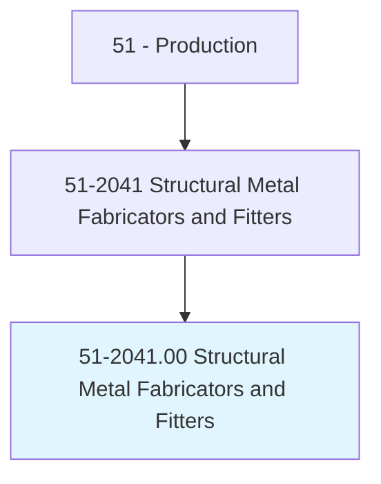
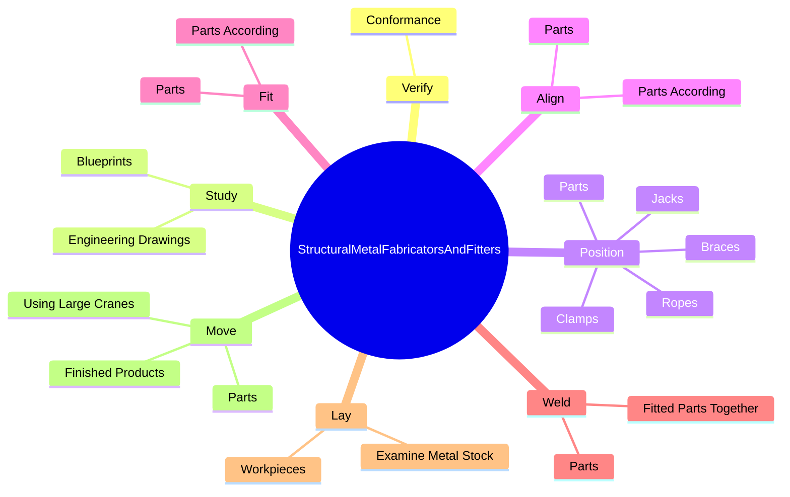
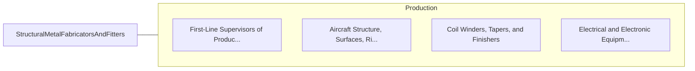

# Structural Metal Fabricators and Fitters

> Fabricate, position, align, and fit parts of structural metal products.

## Overview

Structural Metal Fabricators and Fitters is classified under Production (SOC 51). Fabricate, position, align, and fit parts of structural metal products.

## Classification Hierarchy

## Key Statistics

| Metric | Value |
|--------|-------|
| SOC Code | 51-2041.00 |
| Category | [Production](/occupations/Production/index) |
| Task Count | 210 |
| Source | O*NET |

## Core Tasks

### verify.Conformance

Structural Metal Fabricators and Fitters verify conformance as part of their core responsibilities.

**Actions:**
- `verify.Conformance.of.Workpieces.to.Specifications`
- `verify.Conformance.of.UsingSquares`
- `verify.Conformance.of.Rulers`
- `verify.Conformance.of.MeasuringTapes`

### study.EngineeringDrawings

Structural Metal Fabricators and Fitters study engineering drawings as part of their core responsibilities.

**Actions:**
- `study.EngineeringDrawings.to.determine.MaterialsRequirementsSequences`
- `study.EngineeringDrawings.to.TaskSequences`
- `study.Blueprints.to.determine.MaterialsRequirementsSequences`
- `study.Blueprints.to.TaskSequences`

### position.Parts

Structural Metal Fabricators and Fitters position parts as part of their core responsibilities.

**Actions:**
- `position.Parts.to.form.CompleteUnits`
- `position.Parts.to.Subunits`
- `position.Parts.to.FollowingBlueprints`
- `position.Parts.to.layout.Specifications`

## Skills & Competencies

### Technical Skills
- **Machine Operation** - Advanced
- **Quality Control** - Advanced
- **Production Processes** - Advanced

### Soft Skills
- **Communication** - Essential
- **Problem Solving** - Essential
- **Critical Thinking** - Important
- **Teamwork** - Important
- **Adaptability** - Important

## Related Occupations

## Industries

This occupation is found across multiple industries. See [Industries](/industries) for sector-specific employment data.

## Career Progression

---

*Source: O*NET 51-2041.00 - ONETOccupation*
