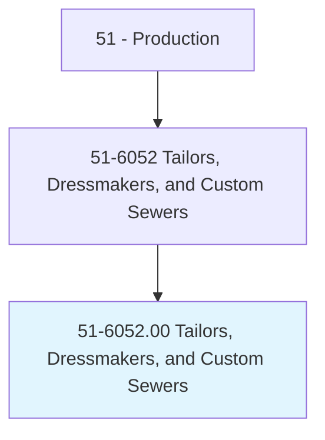
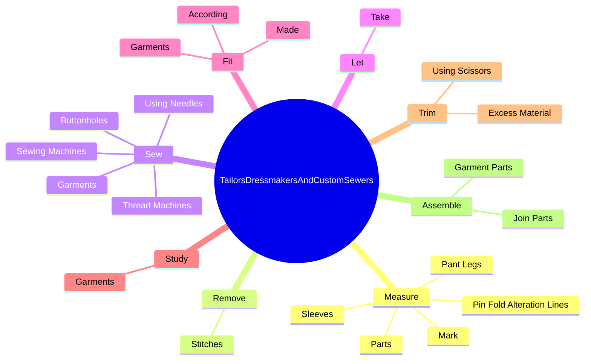
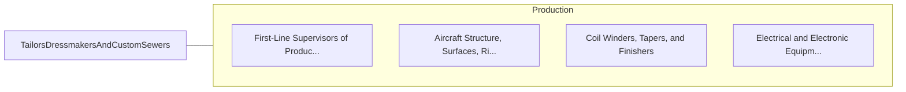

# Tailors, Dressmakers, and Custom Sewers

> Design, make, alter, repair, or fit garments.

## Overview

Tailors, Dressmakers, and Custom Sewers is classified under Production (SOC 51). Design, make, alter, repair, or fit garments.

## Classification Hierarchy

## Key Statistics

| Metric | Value |
|--------|-------|
| SOC Code | 51-6052.00 |
| Category | [Production](/occupations/Production) |
| Task Count | 108 |
| Source | O*NET |

## Core Tasks

### measure.Parts

Tailors, Dressmakers, and Custom Sewers measure parts as part of their core responsibilities.

**Actions:**
- `measure.Parts`
- `measure.Sleeves`
- `measure.PantLegs`
- `measure.Mark`

### remove.Stitches

Tailors, Dressmakers, and Custom Sewers remove stitches as part of their core responsibilities.

**Actions:**
- `remove.Stitches.from.GarmentsToBeAltered`
- `remove.Stitches.from.UsingRippers`
- `remove.Stitches.from.RazorBlades`

### sew.Garments

Tailors, Dressmakers, and Custom Sewers sew garments as part of their core responsibilities.

**Actions:**
- `sew.Garments`
- `sew.UsingNeedles`
- `sew.ThreadMachines`
- `sew.SewingMachines`

## Skills & Competencies

### Technical Skills
- **Machine Operation** - Advanced
- **Quality Control** - Advanced
- **Production Processes** - Advanced

### Soft Skills
- **Communication** - Essential
- **Problem Solving** - Essential
- **Critical Thinking** - Important
- **Teamwork** - Important
- **Adaptability** - Important

## Related Occupations

## Industries

This occupation is found across multiple industries. See [Industries](/industries) for sector-specific employment data.

## Career Progression

---

*Source: O*NET 51-6052.00 - ONETOccupation*
