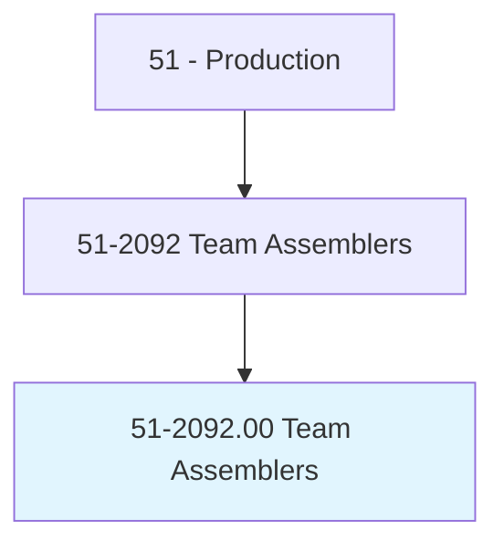
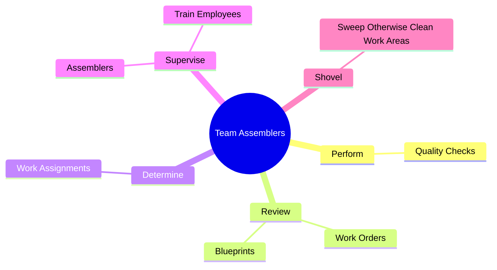
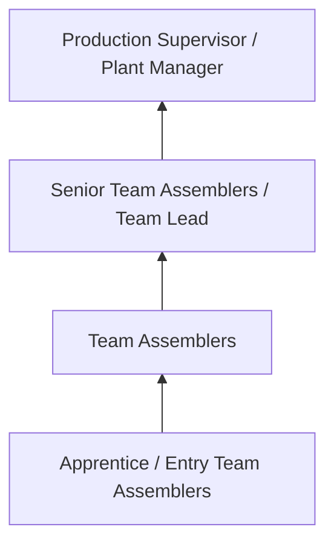
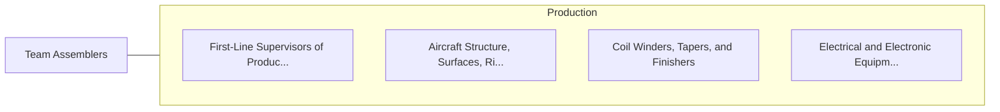

# Team Assemblers

> Work as part of a team having responsibility for assembling an entire product or component of a product. Team assemblers can perform all tasks conducted by the team in the assembly process and rotate through all or most of them, rather than being assigned to a specific task on a permanent basis. May participate in making management decisions affecting the work. Includes team leaders who work as part of the team.

## Overview

Team Assemblers professionals work as part of a team having responsibility for assembling an entire product or component of a product. This occupation falls within the Production category and requires a combination of specialized knowledge, technical skills, and practical experience.

These professionals work across diverse settings and organizational contexts, applying their expertise to meet the demands of their field. They must stay current with industry standards, emerging practices, and regulatory requirements that affect their work. The role demands both independent judgment and collaborative skills, as practitioners regularly interact with colleagues, stakeholders, and the public.

As the field continues to evolve, Team Assemblers professionals increasingly leverage technology and data-driven approaches to enhance their effectiveness. Career opportunities span the public and private sectors, with demand influenced by economic conditions, demographic shifts, and technological advancement.

## Classification Hierarchy



## Key Statistics

| Metric | Value |
|--------|-------|
| SOC Code | 51-2092.00 |
| Job Zone | N/A |
| Category | [Production](/occupations/Production/index) |
| Core Tasks | 15+ |
| Salary Range | $28,000 - $65,000 |
| Median Salary | $40,000 |
| Growth Outlook | 1% (Little or no change) |
| Source | O*NET |

## Core Tasks



### perform.QualityChecks

Team Assemblers perform quality checks as part of their core responsibilities.

**Actions:**
- `perform.QualityChecks.on.Products` - Perform quality checks on products and parts.
- `perform.QualityChecks.on.Parts` - Perform quality checks on products and parts.

### review.WorkOrders

Team Assemblers review work orders as part of their core responsibilities.

**Actions:**
- `review.WorkOrders.to.ensure.WorkIsPerformedAccordingToSpecifications` - Review work orders and blueprints to ensure work is performed according to sp...
- `review.Blueprints.to.ensure.WorkIsPerformedAccordingToSpecifications` - Review work orders and blueprints to ensure work is performed according to sp...

### supervise.Assemblers

Team Assemblers supervise assemblers as part of their core responsibilities.

**Actions:**
- `supervise.Assemblers.on.JobProcedures` - Supervise assemblers and train employees on job procedures.
- `supervise.TrainEmployees.on.JobProcedures` - Supervise assemblers and train employees on job procedures.

### package.FinishedProducts

Team Assemblers package finished products as part of their core responsibilities.

**Actions:**
- `package.FinishedProducts.for.Shipment` - Package finished products and prepare them for shipment.
- `package.PrepareThem.for.Shipment` - Package finished products and prepare them for shipment.


## Skills & Competencies

### Technical Skills
- **Machine Operation** - Advanced
- **Quality Inspection** - Advanced
- **Safety Procedures** - Advanced
- **Blueprint Reading** - Proficient
- **Measurement Tools** - Proficient
- **Process Control** - Proficient

### Soft Skills
- **Attention to Detail** - Critical
- **Reliability** - Critical
- **Physical Dexterity** - Essential
- **Teamwork** - Essential
- **Problem Solving** - Important

## Education & Certifications

| Requirement | Details |
|-------------|---------|
| Typical Education | High school diploma or equivalent; some positions require technical training |
| Work Experience | 0-2 years manufacturing experience |
| On-the-Job Training | Moderate - equipment operation and safety procedures |
| Certifications | OSHA certifications, quality management certifications |

## Career Progression



## Industry Variations

### Discrete Manufacturing
Assembly of distinct products such as automobiles, electronics, or machinery. Team Assemblers professionals work with precision equipment and quality standards.

### Process Manufacturing
Continuous production of chemicals, food, or materials. Focus on process control and consistency.

### Custom and Job Shop
Small-batch or custom production work. Requires versatility and ability to adapt to varied specifications.

### Automated Manufacturing
Technology-driven production with robotics and advanced systems. Increasing emphasis on programming and monitoring skills.

## Technology & Tools

- **Manufacturing execution systems (MES)**
- **Computer numerical control (CNC) machines**
- **Quality management software**
- **Programmable logic controllers (PLC)**
- **Enterprise resource planning (ERP) systems**

## Related Occupations



## Industries

- [Manufacturing](/industries/Manufacturing) - High Employment
- Food Processing - High Employment
- [Automotive](/industries/Manufacturing) - Moderate Employment
- [Electronics](/industries/Electronics) - Moderate Employment

## Departments

This occupation typically works in:
- [Manufacturing](/departments/Operations)
- Quality Control
- Production Planning

## GraphDL Semantic Structure

```graphdl
Team Assemblers perform:
- perform.QualityChecks.on.Products
- perform.QualityChecks.on.Parts
- review.WorkOrders.to.ensure.WorkIsPerformedAccordingToSpecifications
- review.Blueprints.to.ensure.WorkIsPerformedAccordingToSpecifications
- determine.WorkAssignments
- supervise.Assemblers.on.JobProcedures
```

---

*Source: O*NET 51-2092.00 - ONETOccupation*
