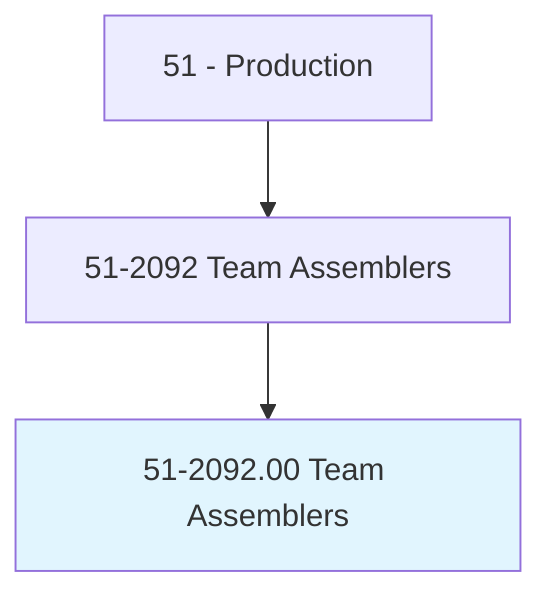
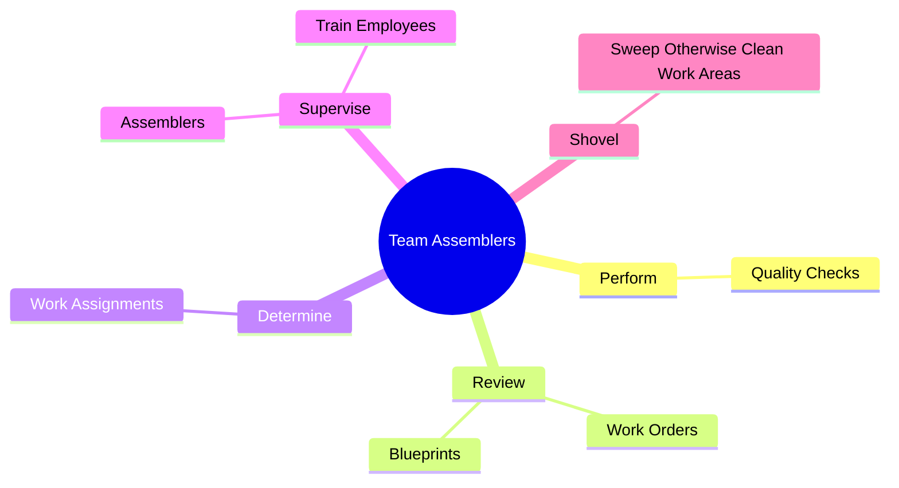
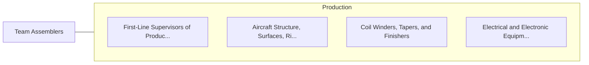

# Team Assemblers

> Work as part of a team having responsibility for assembling an entire product or component of a product. Team assemblers can perform all tasks conducted by the team in the assembly process and rotate through all or most of them, rather than being assigned to a specific task on a permanent basis. May participate in making management decisions affecting the work. Includes team leaders who work as part of the team.

## Overview

Team Assemblers is an occupation within the Production category. Work as part of a team having responsibility for assembling an entire product or component of a product. Team assemblers can perform all tasks conducted by the team in the assembly process and rotate through all or most of them, rather than being assigned to a specific task on a permanent basis.

## Classification Hierarchy

## Key Statistics

| Metric | Value |
|--------|-------|
| SOC Code | 51-2092.00 |
| Category | [Production](/occupations/Production/index) |
| Task Count | 15 |
| Source | O*NET |

## Core Tasks

### perform.QualityChecks

Team Assemblers perform quality checks as part of their core responsibilities.

**Actions:**
- `perform.QualityChecks.on.Products`
- `perform.QualityChecks.on.Parts`

### review.WorkOrders

Team Assemblers review work orders as part of their core responsibilities.

**Actions:**
- `review.WorkOrders.to.ensure.WorkIsPerformedAccordingToSpecifications`
- `review.Blueprints.to.ensure.WorkIsPerformedAccordingToSpecifications`

### determine.WorkAssignments

Team Assemblers determine work assignments as part of their core responsibilities.

**Actions:**
- `determine.WorkAssignments`

## Skills & Competencies

### Technical Skills
- **Machine Operation** - Advanced
- **Quality Control** - Advanced
- **Production Processes** - Advanced

### Soft Skills
- **Communication** - Essential
- **Problem Solving** - Essential
- **Critical Thinking** - Important
- **Teamwork** - Important
- **Adaptability** - Important

## Related Occupations

## Industries

This occupation is found across multiple industries. See [Industries](/industries) for sector-specific employment data.

## Career Progression

---

*Source: O*NET 51-2092.00 - ONETOccupation*
