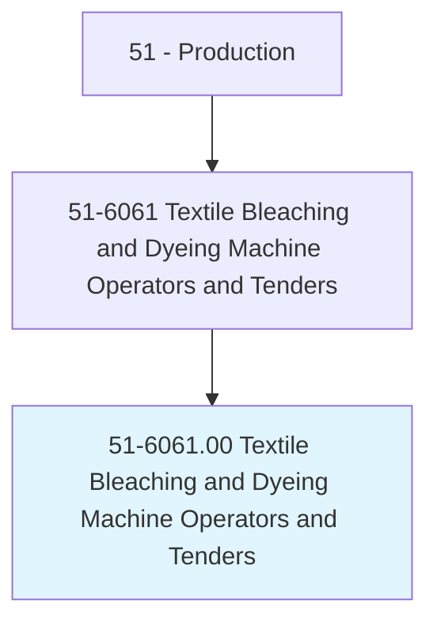
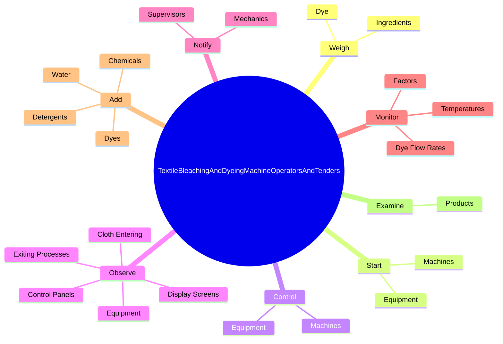

# Textile Bleaching and Dyeing Machine Operators and Tenders

> Operate or tend machines to bleach, shrink, wash, dye, or finish textiles or synthetic or glass fibers.

## Overview

Textile Bleaching and Dyeing Machine Operators and Tenders is classified under Production (SOC 51). Operate or tend machines to bleach, shrink, wash, dye, or finish textiles or synthetic or glass fibers.

## Classification Hierarchy

## Key Statistics

| Metric | Value |
|--------|-------|
| SOC Code | 51-6061.00 |
| Category | [Production](/occupations/Production/index) |
| Task Count | 112 |
| Source | O*NET |

## Core Tasks

### weigh.Ingredients

Textile Bleaching and Dyeing Machine Operators and Tenders weigh ingredients as part of their core responsibilities.

**Actions:**
- `weigh.Ingredients.to.BeMixedTogetherForUseInTextileProcessing`
- `weigh.Dye.to.BeMixedTogetherForUseInTextileProcessing`

### start.Machines

Textile Bleaching and Dyeing Machine Operators and Tenders start machines as part of their core responsibilities.

**Actions:**
- `start.Machines.to.wash`
- `start.Machines.to.bleach`
- `start.Machines.to.dye`
- `start.Machines.to.OtherwiseProcess`

### control.Machines

Textile Bleaching and Dyeing Machine Operators and Tenders control machines as part of their core responsibilities.

**Actions:**
- `control.Machines.to.wash`
- `control.Machines.to.bleach`
- `control.Machines.to.dye`
- `control.Machines.to.OtherwiseProcess`

## Skills & Competencies

### Technical Skills
- **Machine Operation** - Advanced
- **Quality Control** - Advanced
- **Production Processes** - Advanced

### Soft Skills
- **Communication** - Essential
- **Problem Solving** - Essential
- **Critical Thinking** - Important
- **Teamwork** - Important
- **Adaptability** - Important

## Related Occupations

## Industries

This occupation is found across multiple industries. See [Industries](/industries) for sector-specific employment data.

## Career Progression

---

*Source: O*NET 51-6061.00 - ONETOccupation*
