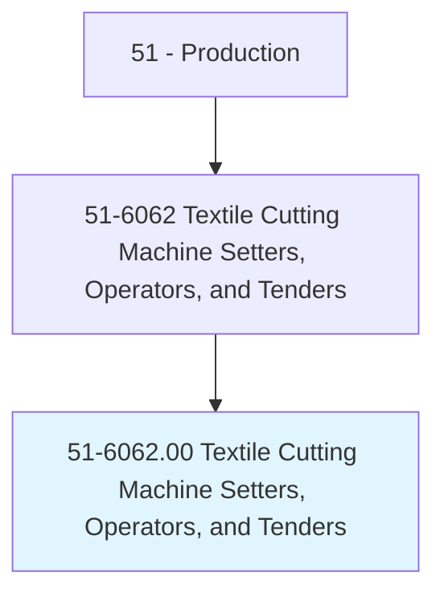
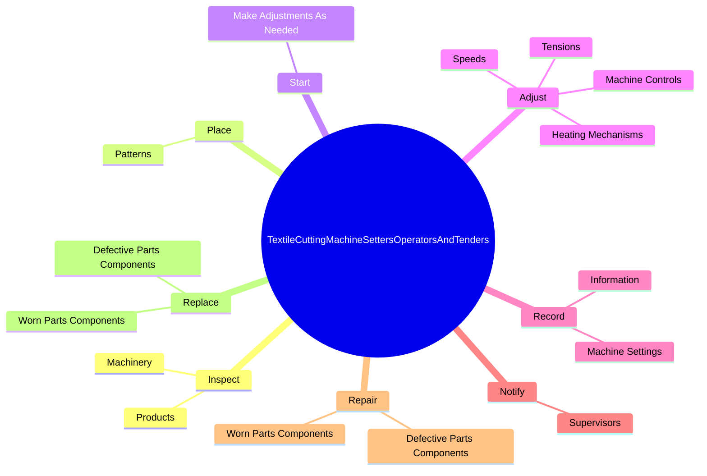

# Textile Cutting Machine Setters, Operators, and Tenders

> Set up, operate, or tend machines that cut textiles.

## Overview

Textile Cutting Machine Setters, Operators, and Tenders is classified under Production (SOC 51). Set up, operate, or tend machines that cut textiles.

## Classification Hierarchy

## Key Statistics

| Metric | Value |
|--------|-------|
| SOC Code | 51-6062.00 |
| Category | [Production](/occupations/Production/index) |
| Task Count | 81 |
| Source | O*NET |

## Core Tasks

### inspect.Products

Textile Cutting Machine Setters, Operators, and Tenders inspect products as part of their core responsibilities.

**Actions:**
- `inspect.Products.to.ensure.QualityStandardsAreMet`
- `inspect.Products.to.SpecificationsAreMet`
- `inspect.Machinery.to.determine.WhetherRepairsAreNeeded`

### place.Patterns

Textile Cutting Machine Setters, Operators, and Tenders place patterns as part of their core responsibilities.

**Actions:**
- `place.Patterns.on.Top.of.LayersOfFabric`
- `place.Patterns.on.CutFabricFollowingPatterns`
- `place.Patterns.on.UsingElectric`
- `place.Patterns.on.ManualKnives`

### start.MakeAdjustmentsAsNeeded

Textile Cutting Machine Setters, Operators, and Tenders start make adjustments as needed as part of their core responsibilities.

**Actions:**
- `start.MakeAdjustmentsAsNeeded`

## Skills & Competencies

### Technical Skills
- **Machine Operation** - Advanced
- **Quality Control** - Advanced
- **Production Processes** - Advanced

### Soft Skills
- **Communication** - Essential
- **Problem Solving** - Essential
- **Critical Thinking** - Important
- **Teamwork** - Important
- **Adaptability** - Important

## Related Occupations

## Industries

This occupation is found across multiple industries. See [Industries](/industries) for sector-specific employment data.

## Career Progression

---

*Source: O*NET 51-6062.00 - ONETOccupation*
