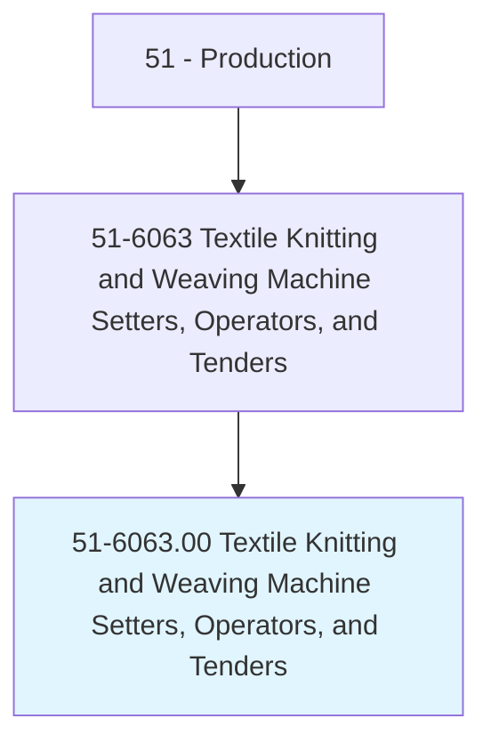
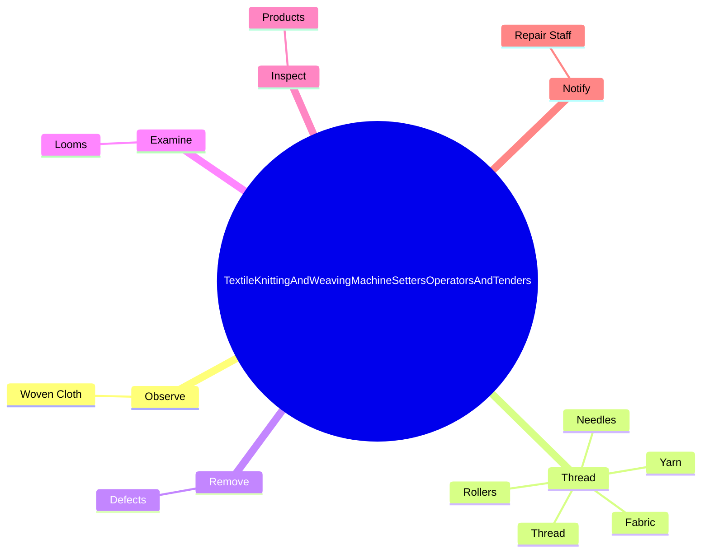
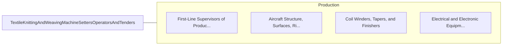

# Textile Knitting and Weaving Machine Setters, Operators, and Tenders

> Set up, operate, or tend machines that knit, loop, weave, or draw in textiles.

## Overview

Textile Knitting and Weaving Machine Setters, Operators, and Tenders is classified under Production (SOC 51). Set up, operate, or tend machines that knit, loop, weave, or draw in textiles.

## Classification Hierarchy

## Key Statistics

| Metric | Value |
|--------|-------|
| SOC Code | 51-6063.00 |
| Category | [Production](/occupations/Production/index) |
| Task Count | 50 |
| Source | O*NET |

## Core Tasks

### observe.WovenCloth

Textile Knitting and Weaving Machine Setters, Operators, and Tenders observe woven cloth as part of their core responsibilities.

**Actions:**
- `observe.WovenCloth.to.detect.WeavingDefects`

### thread.Yarn

Textile Knitting and Weaving Machine Setters, Operators, and Tenders thread yarn as part of their core responsibilities.

**Actions:**
- `thread.Yarn.of.Machines.for.Weaving`
- `thread.Yarn.of.Knitting`
- `thread.Yarn.of.OtherProcessing`
- `thread.Thread.of.Machines.for.Weaving`

### remove.Defects

Textile Knitting and Weaving Machine Setters, Operators, and Tenders remove defects as part of their core responsibilities.

**Actions:**
- `remove.Defects.in.Cloth.by.Cutting`
- `remove.Defects.in.PullingOutFilling`

## Skills & Competencies

### Technical Skills
- **Machine Operation** - Advanced
- **Quality Control** - Advanced
- **Production Processes** - Advanced

### Soft Skills
- **Communication** - Essential
- **Problem Solving** - Essential
- **Critical Thinking** - Important
- **Teamwork** - Important
- **Adaptability** - Important

## Related Occupations

## Industries

This occupation is found across multiple industries. See [Industries](/industries) for sector-specific employment data.

## Career Progression

---

*Source: O*NET 51-6063.00 - ONETOccupation*
