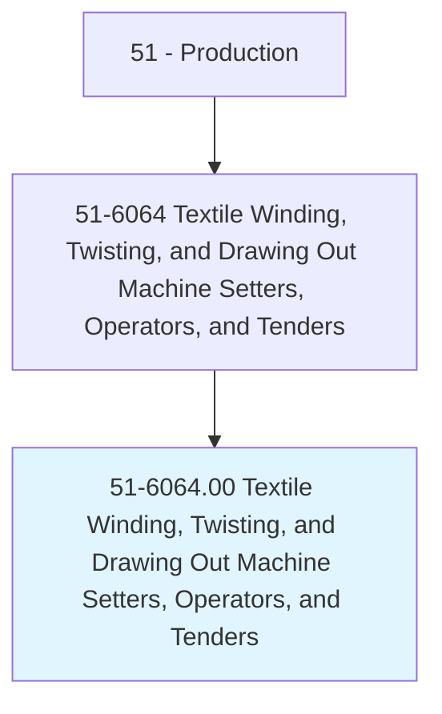
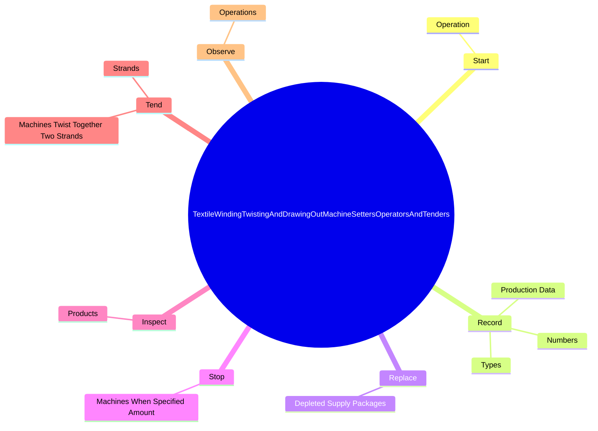

# Textile Winding, Twisting, and Drawing Out Machine Setters, Operators, and Tenders

> Set up, operate, or tend machines that wind or twist textiles; or draw out and combine sliver, such as wool, hemp, or synthetic fibers. Includes slubber machine and drawing frame operators.

## Overview

Textile Winding, Twisting, and Drawing Out Machine Setters, Operators, and Tenders is an occupation within the Production category. Set up, operate, or tend machines that wind or twist textiles; or draw out and combine sliver, such as wool, hemp, or synthetic fibers. 

## Classification Hierarchy

## Key Statistics

| Metric | Value |
|--------|-------|
| SOC Code | 51-6064.00 |
| Category | [Production](/occupations/Production/index) |
| Task Count | 44 |
| Source | O*NET |

## Core Tasks

### start.Operation

Textile Winding, Twisting, and Drawing Out Machine Setters, Operators, and Tenders start operation as part of their core responsibilities.

**Actions:**
- `start.Operation`

### record.ProductionData

Textile Winding, Twisting, and Drawing Out Machine Setters, Operators, and Tenders record production data as part of their core responsibilities.

**Actions:**
- `record.ProductionData.of.BobbinsWound`
- `record.Numbers.of.BobbinsWound`
- `record.Types.of.BobbinsWound`

### replace.DepletedSupplyPackages

Textile Winding, Twisting, and Drawing Out Machine Setters, Operators, and Tenders replace depleted supply packages as part of their core responsibilities.

**Actions:**
- `replace.DepletedSupplyPackages.with.FullPackages`

## Skills & Competencies

### Technical Skills
- **Machine Operation** - Advanced
- **Quality Control** - Advanced
- **Production Processes** - Advanced

### Soft Skills
- **Communication** - Essential
- **Problem Solving** - Essential
- **Critical Thinking** - Important
- **Teamwork** - Important
- **Adaptability** - Important

## Related Occupations

## Industries

This occupation is found across multiple industries. See [Industries](/industries) for sector-specific employment data.

## Career Progression

---

*Source: O*NET 51-6064.00 - ONETOccupation*
