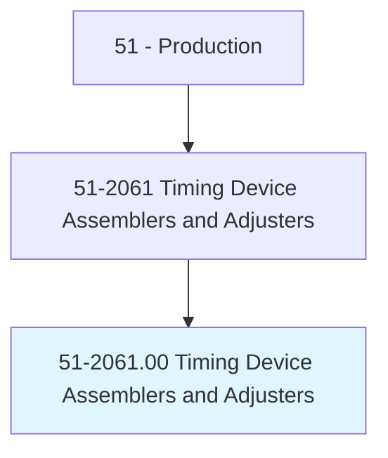
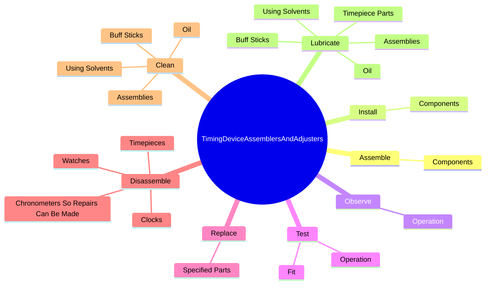
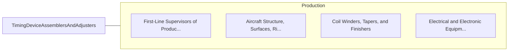

# Timing Device Assemblers and Adjusters

> Perform precision assembling or adjusting, within narrow tolerances, of timing devices such as digital clocks or timing devices with electrical or electronic components.

## Overview

Timing Device Assemblers and Adjusters is classified under Production (SOC 51). Perform precision assembling or adjusting, within narrow tolerances, of timing devices such as digital clocks or timing devices with electrical or electronic components.

## Classification Hierarchy

## Key Statistics

| Metric | Value |
|--------|-------|
| SOC Code | 51-2061.00 |
| Category | [Production](/occupations/Production) |
| Task Count | 95 |
| Source | O*NET |

## Core Tasks

### assemble.Components

Timing Device Assemblers and Adjusters assemble components as part of their core responsibilities.

**Actions:**
- `assemble.Components.of.Timepieces.to.complete.Mechanisms`
- `assemble.Components.of.UsingWatchmakersTools`
- `assemble.Components.of.Loupes`

### install.Components

Timing Device Assemblers and Adjusters install components as part of their core responsibilities.

**Actions:**
- `install.Components.of.Timepieces.to.complete.Mechanisms`
- `install.Components.of.UsingWatchmakersTools`
- `install.Components.of.Loupes`

### observe.Operation

Timing Device Assemblers and Adjusters observe operation as part of their core responsibilities.

**Actions:**
- `observe.Operation.of.TimepieceParts.to.determine.AccuracyOfMovement`
- `observe.Operation.of.Subassemblies.to.determine.AccuracyOfMovement`
- `observe.Operation.of.diagnose.CausesOfDefects`

## Skills & Competencies

### Technical Skills
- **Machine Operation** - Advanced
- **Quality Control** - Advanced
- **Production Processes** - Advanced

### Soft Skills
- **Communication** - Essential
- **Problem Solving** - Essential
- **Critical Thinking** - Important
- **Teamwork** - Important
- **Adaptability** - Important

## Related Occupations

## Industries

This occupation is found across multiple industries. See [Industries](/industries) for sector-specific employment data.

## Career Progression

---

*Source: O*NET 51-2061.00 - ONETOccupation*
