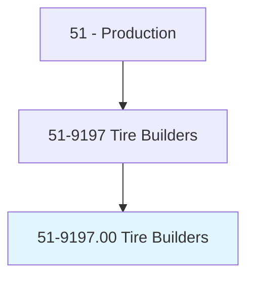
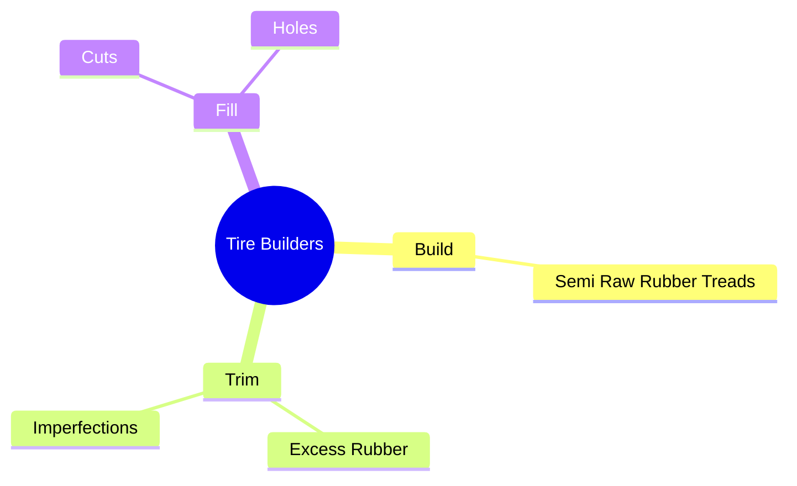
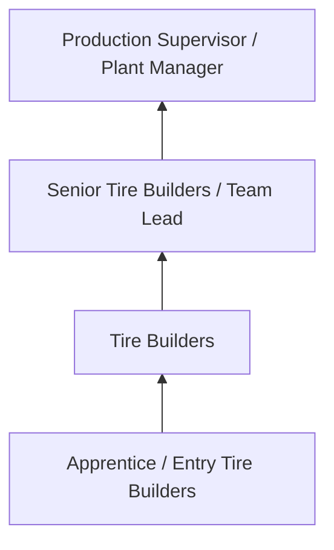
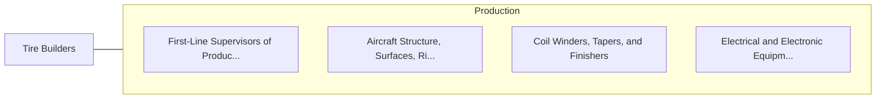

# Tire Builders

> Operate machines to build tires.

## Overview

Tire Builders professionals serve a vital function within the Production field. They bring specialized skills and knowledge to their roles, contributing to organizational objectives and societal needs.

These practitioners work in varied environments, adapting their expertise to meet specific requirements of their industry and employer. The role requires ongoing professional development to maintain competency and respond to changing demands.

Career paths in this field offer opportunities for advancement through experience, additional education, and specialized certifications. Employment prospects are influenced by industry trends, technological change, and workforce demographics.

## Classification Hierarchy



## Key Statistics

| Metric | Value |
|--------|-------|
| SOC Code | 51-9197.00 |
| Job Zone | N/A |
| Category | [Production](/occupations/Production/index) |
| Core Tasks | 55+ |
| Salary Range | $28,000 - $65,000 |
| Median Salary | $40,000 |
| Growth Outlook | 1% (Little or no change) |
| Source | O*NET |

## Core Tasks



### position.PlyStitcherRollers

Tire Builders position ply stitcher rollers as part of their core responsibilities.

**Actions:**
- `position.PlyStitcherRollers.to.WidthOfStock` - Position ply stitcher rollers and drums according to width of stock, using ha...
- `position.PlyStitcherRollers.to.UsingH` - Position ply stitcher rollers and drums according to width of stock, using ha...
- `position.PlyStitcherRollers.to.Tools` - Position ply stitcher rollers and drums according to width of stock, using ha...
- `position.PlyStitcherRollers.to.gauges` - Position ply stitcher rollers and drums according to width of stock, using ha...
- `position.DrumsAccording.to.WidthOfStock` - Position ply stitcher rollers and drums according to width of stock, using ha...

### inspect.WornTires

Tire Builders inspect worn tires as part of their core responsibilities.

**Actions:**
- `inspect.WornTires.for.Faults` - Inspect worn tires for faults, cracks, cuts, and nail holes, and to determine...
- `inspect.WornTires.for.Cracks` - Inspect worn tires for faults, cracks, cuts, and nail holes, and to determine...
- `inspect.WornTires.for.Cuts` - Inspect worn tires for faults, cracks, cuts, and nail holes, and to determine...
- `inspect.WornTires.for.NailHoles` - Inspect worn tires for faults, cracks, cuts, and nail holes, and to determine...
- `inspect.WornTires.for..to.determine.IfTiresAreSuitableF` - Inspect worn tires for faults, cracks, cuts, and nail holes, and to determine...

### fill.Cuts

Tire Builders fill cuts as part of their core responsibilities.

**Actions:**
- `fill.Cuts.in.Tires` - Fill cuts and holes in tires, using hot rubber.
- `fill.Cuts.in.UsingHotRubber` - Fill cuts and holes in tires, using hot rubber.
- `fill.Holes.in.Tires` - Fill cuts and holes in tires, using hot rubber.
- `fill.Holes.in.UsingHotRubber` - Fill cuts and holes in tires, using hot rubber.

### roll.HandRollers

Tire Builders roll hand rollers as part of their core responsibilities.

**Actions:**
- `roll.HandRollers.over.RebuiltCasings.to.ensure.AdhesionBetweenCamelbacks` - Roll hand rollers over rebuilt casings, exerting pressure to ensure adhesion ...
- `roll.HandRollers.over.RebuiltCasings.to.Casings` - Roll hand rollers over rebuilt casings, exerting pressure to ensure adhesion ...
- `roll.ExertingPressure.to.ensure.AdhesionBetweenCamelbacks` - Roll hand rollers over rebuilt casings, exerting pressure to ensure adhesion ...
- `roll.ExertingPressure.to.Casings` - Roll hand rollers over rebuilt casings, exerting pressure to ensure adhesion ...


## Skills & Competencies

### Technical Skills
- **Machine Operation** - Advanced
- **Quality Inspection** - Advanced
- **Safety Procedures** - Advanced
- **Blueprint Reading** - Proficient
- **Measurement Tools** - Proficient
- **Process Control** - Proficient

### Soft Skills
- **Attention to Detail** - Critical
- **Reliability** - Critical
- **Physical Dexterity** - Essential
- **Teamwork** - Essential
- **Problem Solving** - Important

## Education & Certifications

| Requirement | Details |
|-------------|---------|
| Typical Education | High school diploma or equivalent; some positions require technical training |
| Work Experience | 0-2 years manufacturing experience |
| On-the-Job Training | Moderate - equipment operation and safety procedures |
| Certifications | OSHA certifications, quality management certifications |

## Career Progression



## Industry Variations

### Discrete Manufacturing
Assembly of distinct products such as automobiles, electronics, or machinery. Tire Builders professionals work with precision equipment and quality standards.

### Process Manufacturing
Continuous production of chemicals, food, or materials. Focus on process control and consistency.

### Custom and Job Shop
Small-batch or custom production work. Requires versatility and ability to adapt to varied specifications.

### Automated Manufacturing
Technology-driven production with robotics and advanced systems. Increasing emphasis on programming and monitoring skills.

## Technology & Tools

- **Manufacturing execution systems (MES)**
- **Computer numerical control (CNC) machines**
- **Quality management software**
- **Programmable logic controllers (PLC)**
- **Enterprise resource planning (ERP) systems**

## Related Occupations



## Industries

- [Manufacturing](/industries/Manufacturing) - High Employment
- [Food Processing](/industries/FoodProcessing) - High Employment
- [Automotive](/industries/Automotive) - Moderate Employment
- [Electronics](/industries/Electronics) - Moderate Employment

## Departments

This occupation typically works in:
- [Manufacturing](/departments/Manufacturing)
- [Quality Control](/departments/QualityControl)
- [Production Planning](/departments/ProductionPlanning)

## GraphDL Semantic Structure

```
Tire Builders perform:
- build.SemiRawRubberTreads.onto.BuffedTireCasings.to.prepare.TiresForVulcanizationInRecappingProcesses
- build.SemiRawRubberTreads.onto.BuffedTireCasingsToRetreadingProcesses
- trim.ExcessRubber.during.RetreadingProcesses
- trim.Imperfections.during.RetreadingProcesses
- fill.Cuts.in.Tires
- fill.Cuts.in.UsingHotRubber
```

---

*Source: O*NET 51-9197.00 - ONETOccupation*
