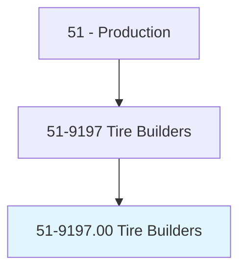
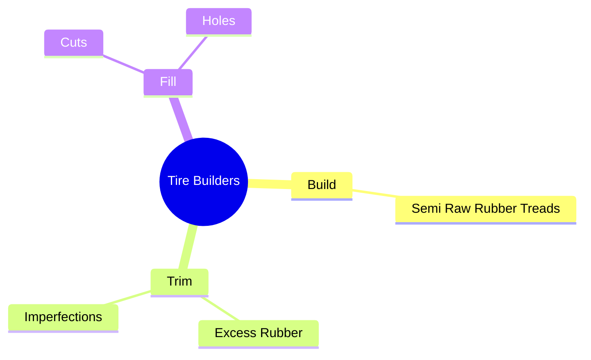
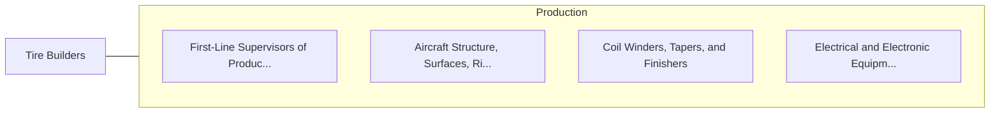

# Tire Builders

> Operate machines to build tires.

## Overview

Tire Builders is classified under Production (SOC 51). Operate machines to build tires.

## Classification Hierarchy

## Key Statistics

| Metric | Value |
|--------|-------|
| SOC Code | 51-9197.00 |
| Category | [Production](/occupations/Production) |
| Task Count | 55 |
| Source | O*NET |

## Core Tasks

### build.SemiRawRubberTreads

Tire Builders build semi raw rubber treads as part of their core responsibilities.

**Actions:**
- `build.SemiRawRubberTreads.onto.BuffedTireCasings.to.prepare.TiresForVulcanizationInRecappingProcesses`
- `build.SemiRawRubberTreads.onto.BuffedTireCasingsToRetreadingProcesses`

### trim.ExcessRubber

Tire Builders trim excess rubber as part of their core responsibilities.

**Actions:**
- `trim.ExcessRubber.during.RetreadingProcesses`
- `trim.Imperfections.during.RetreadingProcesses`

### fill.Cuts

Tire Builders fill cuts as part of their core responsibilities.

**Actions:**
- `fill.Cuts.in.Tires`
- `fill.Cuts.in.UsingHotRubber`
- `fill.Holes.in.Tires`
- `fill.Holes.in.UsingHotRubber`

## Skills & Competencies

### Technical Skills
- **Machine Operation** - Advanced
- **Quality Control** - Advanced
- **Production Processes** - Advanced

### Soft Skills
- **Communication** - Essential
- **Problem Solving** - Essential
- **Critical Thinking** - Important
- **Teamwork** - Important
- **Adaptability** - Important

## Related Occupations

## Industries

This occupation is found across multiple industries. See [Industries](/industries) for sector-specific employment data.

## Career Progression

---

*Source: O*NET 51-9197.00 - ONETOccupation*
