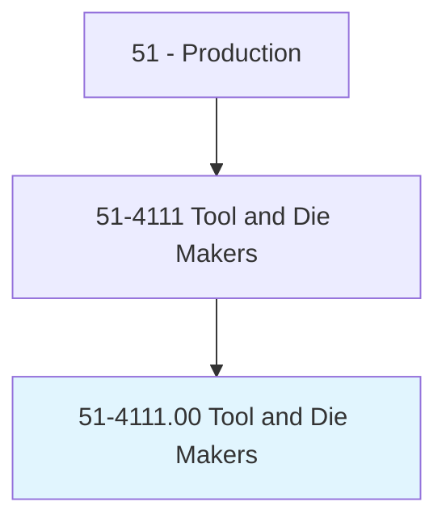
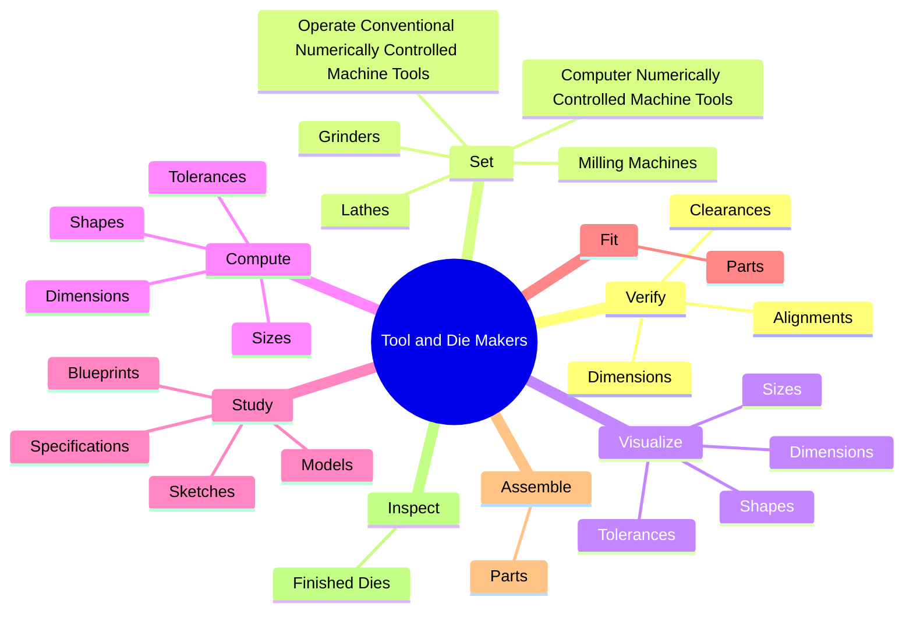
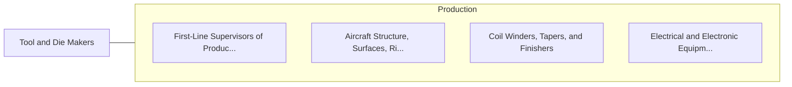

# Tool and Die Makers

> Analyze specifications, lay out metal stock, set up and operate machine tools, and fit and assemble parts to make and repair dies, cutting tools, jigs, fixtures, gauges, and machinists' hand tools.

## Overview

Tool and Die Makers is classified under Production (SOC 51). Analyze specifications, lay out metal stock, set up and operate machine tools, and fit and assemble parts to make and repair dies, cutting tools, jigs, fixtures, gauges, and machinists' hand tools.

## Classification Hierarchy

## Key Statistics

| Metric | Value |
|--------|-------|
| SOC Code | 51-4111.00 |
| Category | [Production](/occupations/Production) |
| Task Count | 218 |
| Source | O*NET |

## Core Tasks

### verify.Dimensions

Tool and Die Makers verify dimensions as part of their core responsibilities.

**Actions:**
- `verify.Dimensions.of.FinishedParts.for.ConformanceToSpecifications`
- `verify.Dimensions.of.Calipers`
- `verify.Dimensions.of.GaugeBlocks`
- `verify.Dimensions.of.Micrometers`

### set.OperateConventionalNumericallyControlledMachineTools

Tool and Die Makers set operate conventional numerically controlled machine tools as part of their core responsibilities.

**Actions:**
- `set.OperateConventionalNumericallyControlledMachineTools.to.cut`
- `set.OperateConventionalNumericallyControlledMachineTools.to.bore`
- `set.OperateConventionalNumericallyControlledMachineTools.to.grind`
- `set.OperateConventionalNumericallyControlledMachineTools.to.OtherwiseShapePartsToPrescribedDimensions`

### visualize.Dimensions

Tool and Die Makers visualize dimensions as part of their core responsibilities.

**Actions:**
- `visualize.Dimensions.of.Assemblies`
- `visualize.Dimensions.of.Based.on.Specifications`
- `visualize.Sizes.of.Assemblies`
- `visualize.Sizes.of.Based.on.Specifications`

## Skills & Competencies

### Technical Skills
- **Machine Operation** - Advanced
- **Quality Control** - Advanced
- **Production Processes** - Advanced

### Soft Skills
- **Communication** - Essential
- **Problem Solving** - Essential
- **Critical Thinking** - Important
- **Teamwork** - Important
- **Adaptability** - Important

## Related Occupations

## Industries

This occupation is found across multiple industries. See [Industries](/industries) for sector-specific employment data.

## Career Progression

---

*Source: O*NET 51-4111.00 - ONETOccupation*
