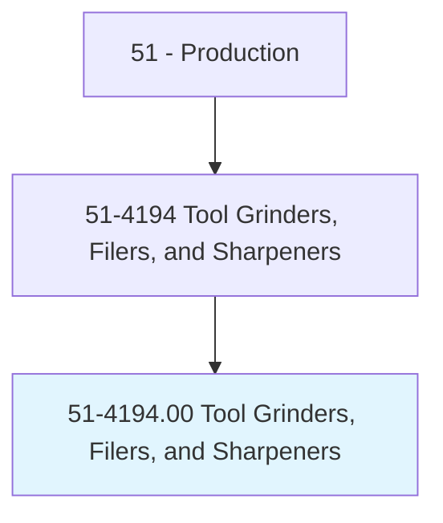
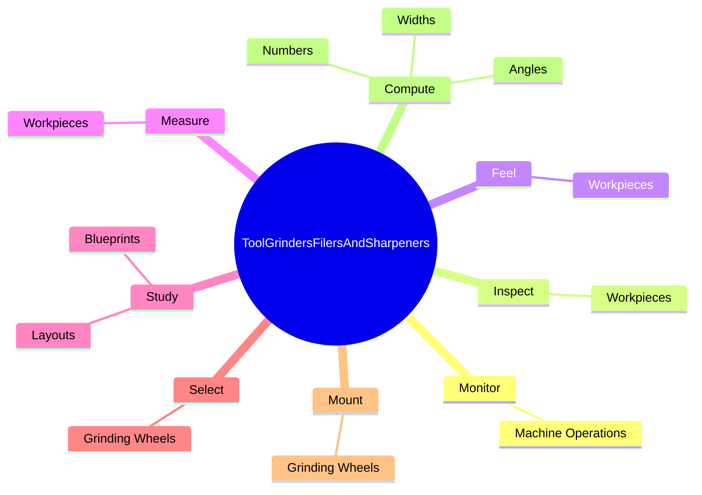
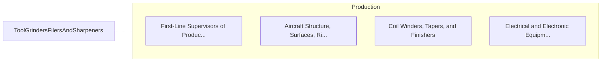

# Tool Grinders, Filers, and Sharpeners

> Perform precision smoothing, sharpening, polishing, or grinding of metal objects.

## Overview

Tool Grinders, Filers, and Sharpeners is classified under Production (SOC 51). Perform precision smoothing, sharpening, polishing, or grinding of metal objects.

## Classification Hierarchy

## Key Statistics

| Metric | Value |
|--------|-------|
| SOC Code | 51-4194.00 |
| Category | [Production](/occupations/Production) |
| Task Count | 87 |
| Source | O*NET |

## Core Tasks

### monitor.MachineOperations

Tool Grinders, Filers, and Sharpeners monitor machine operations as part of their core responsibilities.

**Actions:**
- `monitor.MachineOperations.to.determine.WhetherAdjustmentsAreNecessary`
- `monitor.MachineOperations.to.StoppingMachinesWhenProblemsOccur`

### inspect.Workpieces

Tool Grinders, Filers, and Sharpeners inspect workpieces as part of their core responsibilities.

**Actions:**
- `inspect.Workpieces.to.ensure.SurfacesMeetSpecifications`
- `inspect.Workpieces.to.DimensionsMeetSpecifications`

### feel.Workpieces

Tool Grinders, Filers, and Sharpeners feel workpieces as part of their core responsibilities.

**Actions:**
- `feel.Workpieces.to.ensure.SurfacesMeetSpecifications`
- `feel.Workpieces.to.DimensionsMeetSpecifications`

## Skills & Competencies

### Technical Skills
- **Machine Operation** - Advanced
- **Quality Control** - Advanced
- **Production Processes** - Advanced

### Soft Skills
- **Communication** - Essential
- **Problem Solving** - Essential
- **Critical Thinking** - Important
- **Teamwork** - Important
- **Adaptability** - Important

## Related Occupations

## Industries

This occupation is found across multiple industries. See [Industries](/industries) for sector-specific employment data.

## Career Progression

---

*Source: O*NET 51-4194.00 - ONETOccupation*
