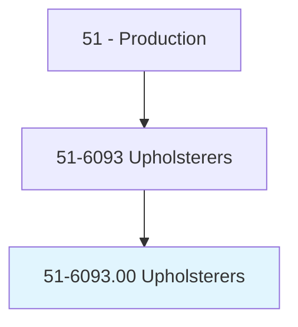
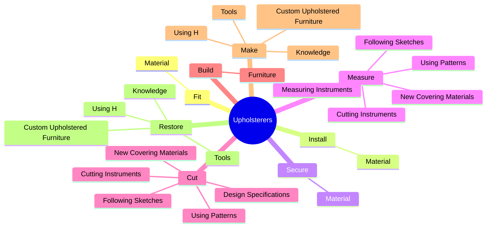
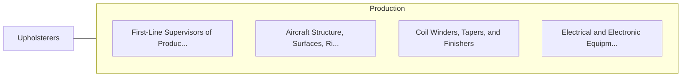

# Upholsterers

> Make, repair, or replace upholstery for household furniture or transportation vehicles.

## Overview

Upholsterers is classified under Production (SOC 51). Make, repair, or replace upholstery for household furniture or transportation vehicles.

## Classification Hierarchy

## Key Statistics

| Metric | Value |
|--------|-------|
| SOC Code | 51-6093.00 |
| Category | [Production](/occupations/Production/index) |
| Task Count | 188 |
| Source | O*NET |

## Core Tasks

### fit.Material

Upholsterers fit material as part of their core responsibilities.

**Actions:**
- `fit.Material.on.Frames`
- `fit.Material.on.UsingH`
- `fit.Material.on.Tools`
- `fit.Material.on.PowerTools`

### install.Material

Upholsterers install material as part of their core responsibilities.

**Actions:**
- `install.Material.on.Frames`
- `install.Material.on.UsingH`
- `install.Material.on.Tools`
- `install.Material.on.PowerTools`

### secure.Material

Upholsterers secure material as part of their core responsibilities.

**Actions:**
- `secure.Material.on.Frames`
- `secure.Material.on.UsingH`
- `secure.Material.on.Tools`
- `secure.Material.on.PowerTools`

## Skills & Competencies

### Technical Skills
- **Machine Operation** - Advanced
- **Quality Control** - Advanced
- **Production Processes** - Advanced

### Soft Skills
- **Communication** - Essential
- **Problem Solving** - Essential
- **Critical Thinking** - Important
- **Teamwork** - Important
- **Adaptability** - Important

## Related Occupations

## Industries

This occupation is found across multiple industries. See [Industries](/industries) for sector-specific employment data.

## Career Progression

---

*Source: O*NET 51-6093.00 - ONETOccupation*
