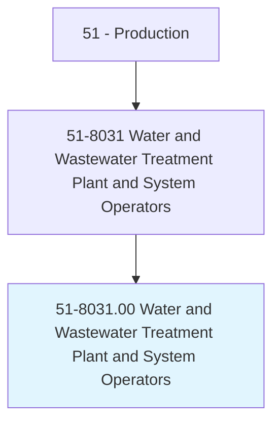
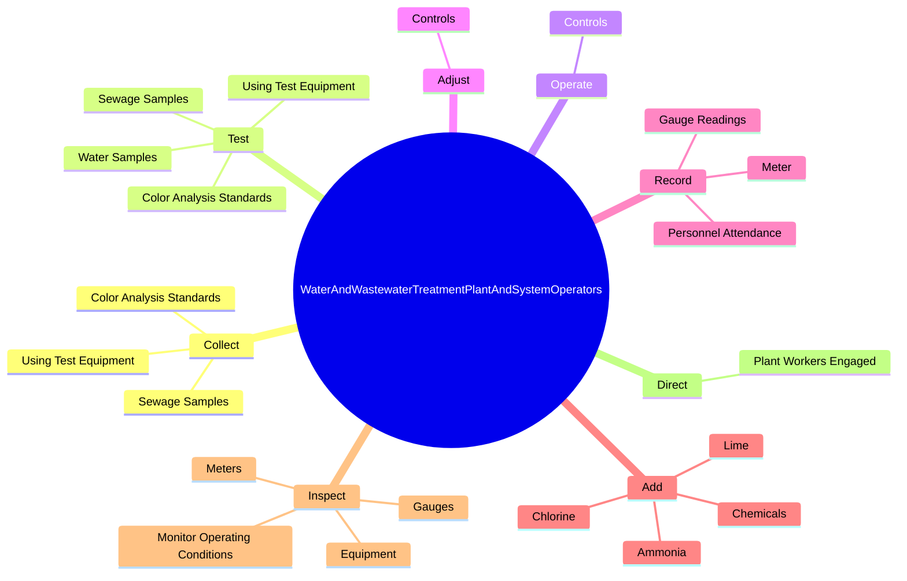
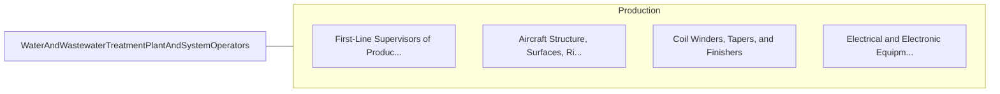

# Water and Wastewater Treatment Plant and System Operators

> Operate or control an entire process or system of machines, often through the use of control boards, to transfer or treat water or wastewater.

## Overview

Water and Wastewater Treatment Plant and System Operators is classified under Production (SOC 51). Operate or control an entire process or system of machines, often through the use of control boards, to transfer or treat water or wastewater.

## Classification Hierarchy

## Key Statistics

| Metric | Value |
|--------|-------|
| SOC Code | 51-8031.00 |
| Category | [Production](/occupations/Production/index) |
| Task Count | 48 |
| Source | O*NET |

## Core Tasks

### collect.SewageSamples

Water and Wastewater Treatment Plant and System Operators collect sewage samples as part of their core responsibilities.

**Actions:**
- `collect.SewageSamples`
- `collect.UsingTestEquipment`
- `collect.ColorAnalysisStandards`

### test.WaterSamples

Water and Wastewater Treatment Plant and System Operators test water samples as part of their core responsibilities.

**Actions:**
- `test.WaterSamples`
- `test.SewageSamples`
- `test.UsingTestEquipment`
- `test.ColorAnalysisStandards`

### operate.Controls

Water and Wastewater Treatment Plant and System Operators operate controls as part of their core responsibilities.

**Actions:**
- `operate.Controls.on.Equipment.to.Purify`
- `operate.Controls.on.ClarifyWater`
- `operate.Controls.on.Process`
- `operate.Controls.on.Dispose.of.Sewage`

## Skills & Competencies

### Technical Skills
- **Machine Operation** - Advanced
- **Quality Control** - Advanced
- **Production Processes** - Advanced

### Soft Skills
- **Communication** - Essential
- **Problem Solving** - Essential
- **Critical Thinking** - Important
- **Teamwork** - Important
- **Adaptability** - Important

## Related Occupations

## Industries

This occupation is found across multiple industries. See [Industries](/industries) for sector-specific employment data.

## Career Progression

---

*Source: O*NET 51-8031.00 - ONETOccupation*
