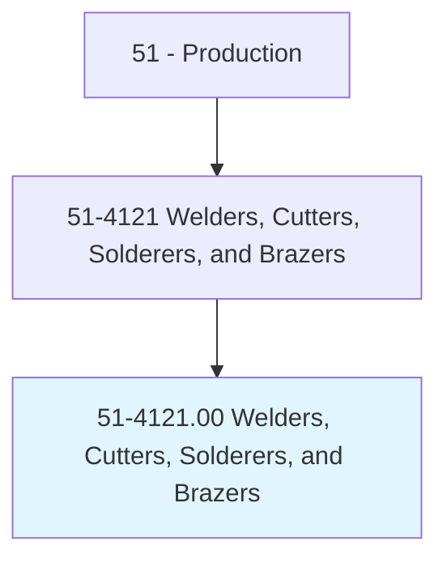
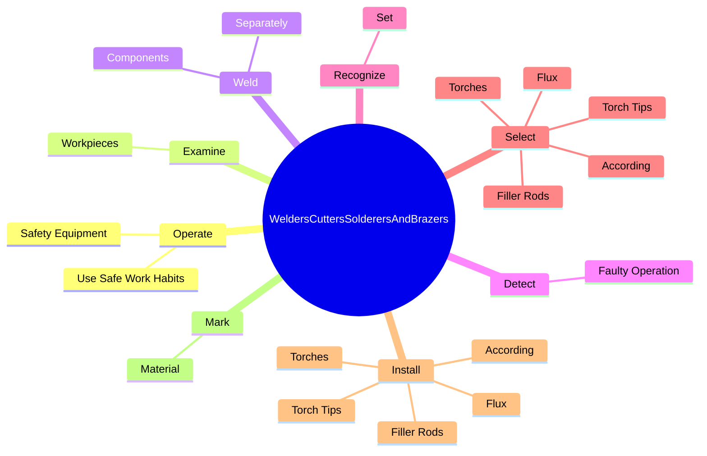

# Welders, Cutters, Solderers, and Brazers

> Use hand-welding, flame-cutting, hand-soldering, or brazing equipment to weld or join metal components or to fill holes, indentations, or seams of fabricated metal products.

## Overview

Welders, Cutters, Solderers, and Brazers is classified under Production (SOC 51). Use hand-welding, flame-cutting, hand-soldering, or brazing equipment to weld or join metal components or to fill holes, indentations, or seams of fabricated metal products.

## Classification Hierarchy

## Key Statistics

| Metric | Value |
|--------|-------|
| SOC Code | 51-4121.00 |
| Category | [Production](/occupations/Production) |
| Task Count | 249 |
| Source | O*NET |

## Core Tasks

### operate.SafetyEquipment

Welders, Cutters, Solderers, and Brazers operate safety equipment as part of their core responsibilities.

**Actions:**
- `operate.SafetyEquipment`
- `operate.UseSafeWorkHabits`

### examine.Workpieces

Welders, Cutters, Solderers, and Brazers examine workpieces as part of their core responsibilities.

**Actions:**
- `examine.Workpieces.for.Defects`
- `examine.Workpieces.for.MeasureWorkpiecesWithStraightedges.to.ensure.ConformanceWithSpecifications`
- `examine.Workpieces.for.Templates.to.ensure.ConformanceWithSpecifications`

### weld.Components

Welders, Cutters, Solderers, and Brazers weld components as part of their core responsibilities.

**Actions:**
- `weld.Components.in.Flat`
- `weld.Components.in.Vertical`
- `weld.Components.in.OverheadPositions`
- `weld.Separately.in.Combination`

## Skills & Competencies

### Technical Skills
- **Machine Operation** - Advanced
- **Quality Control** - Advanced
- **Production Processes** - Advanced

### Soft Skills
- **Communication** - Essential
- **Problem Solving** - Essential
- **Critical Thinking** - Important
- **Teamwork** - Important
- **Adaptability** - Important

## Related Occupations

## Industries

This occupation is found across multiple industries. See [Industries](/industries) for sector-specific employment data.

## Career Progression

---

*Source: O*NET 51-4121.00 - ONETOccupation*
