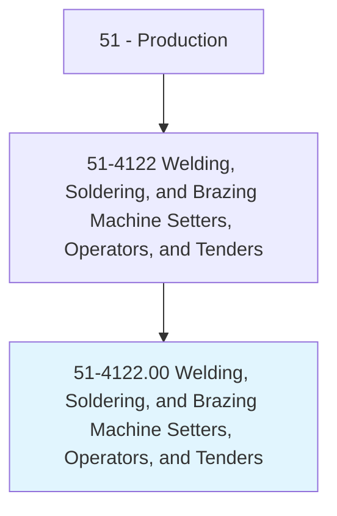
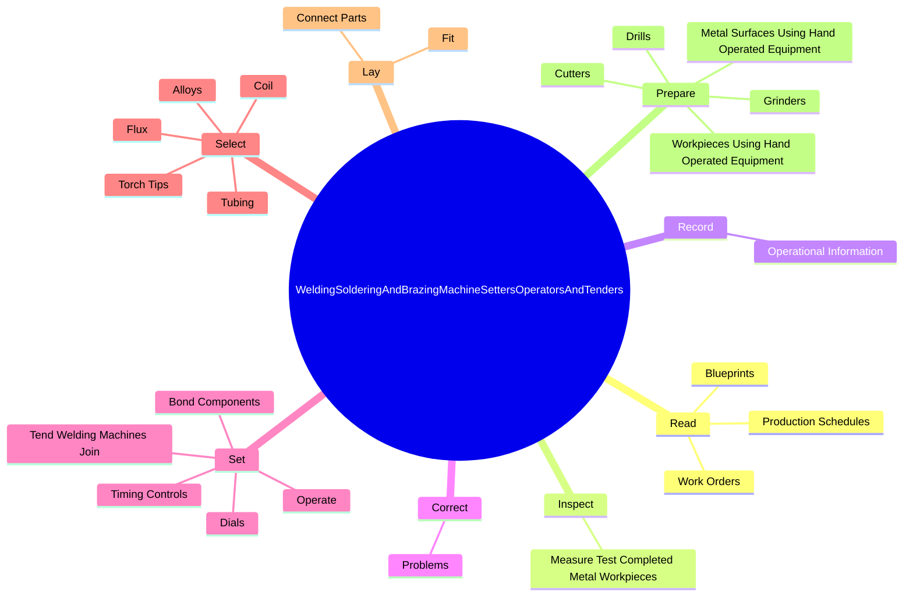

# Welding, Soldering, and Brazing Machine Setters, Operators, and Tenders

> Set up, operate, or tend welding, soldering, or brazing machines or robots that weld, braze, solder, or heat treat metal products, components, or assemblies. Includes workers who operate laser cutters or laser-beam machines.

## Overview

Welding, Soldering, and Brazing Machine Setters, Operators, and Tenders is an occupation within the Production category. Set up, operate, or tend welding, soldering, or brazing machines or robots that weld, braze, solder, or heat treat metal products, components, or assemblies. 

## Classification Hierarchy

## Key Statistics

| Metric | Value |
|--------|-------|
| SOC Code | 51-4122.00 |
| Category | [Production](/occupations/Production/index) |
| Task Count | 200 |
| Source | O*NET |

## Core Tasks

### read.Blueprints

Welding, Soldering, and Brazing Machine Setters, Operators, and Tenders read blueprints as part of their core responsibilities.

**Actions:**
- `read.Blueprints.to.determine.ProductInstructionsSpecifications`
- `read.Blueprints.to.JobInstructionsSpecifications`
- `read.WorkOrders.to.determine.ProductInstructionsSpecifications`
- `read.WorkOrders.to.JobInstructionsSpecifications`

### inspect.MeasureTestCompletedMetalWorkpieces

Welding, Soldering, and Brazing Machine Setters, Operators, and Tenders inspect measure test completed metal workpieces as part of their core responsibilities.

**Actions:**
- `inspect.MeasureTestCompletedMetalWorkpieces.to.ensure.ConformanceToSpecificationsUsingMeasuringTestingDevices`

### record.OperationalInformation

Welding, Soldering, and Brazing Machine Setters, Operators, and Tenders record operational information as part of their core responsibilities.

**Actions:**
- `record.OperationalInformation.on.SpecifiedProductionReports`

## Skills & Competencies

### Technical Skills
- **Machine Operation** - Advanced
- **Quality Control** - Advanced
- **Production Processes** - Advanced

### Soft Skills
- **Communication** - Essential
- **Problem Solving** - Essential
- **Critical Thinking** - Important
- **Teamwork** - Important
- **Adaptability** - Important

## Related Occupations

## Industries

This occupation is found across multiple industries. See [Industries](/industries) for sector-specific employment data.

## Career Progression

---

*Source: O*NET 51-4122.00 - ONETOccupation*
