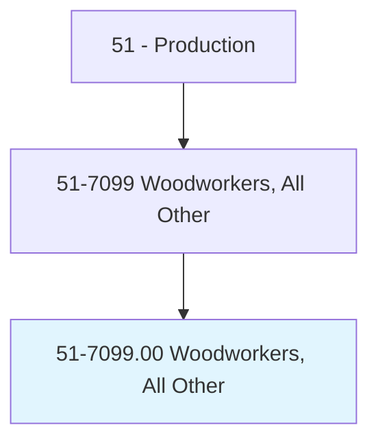

# Woodworkers, All Other

> All woodworkers not listed separately.

## Overview

Woodworkers, All Other is classified under Production (SOC 51). All woodworkers not listed separately.

## Classification Hierarchy

## Key Statistics

| Metric | Value |
|--------|-------|
| SOC Code | 51-7099.00 |
| Category | [Production](/occupations/Production) |
| Task Count | 0 |
| Source | O*NET |

## Core Tasks

Task data is being compiled for this occupation. See [O*NET 51-7099.00](https://www.onetonline.org/link/summary/51-7099.00) for detailed task information.

## Skills & Competencies

### Technical Skills
- **Machine Operation** - Advanced
- **Quality Control** - Advanced
- **Production Processes** - Advanced

### Soft Skills
- **Communication** - Essential
- **Problem Solving** - Essential
- **Critical Thinking** - Important
- **Teamwork** - Important
- **Adaptability** - Important

## Related Occupations

## Industries

This occupation is found across multiple industries. See [Industries](/industries) for sector-specific employment data.

## Career Progression

---

*Source: O*NET 51-7099.00 - ONETOccupation*
