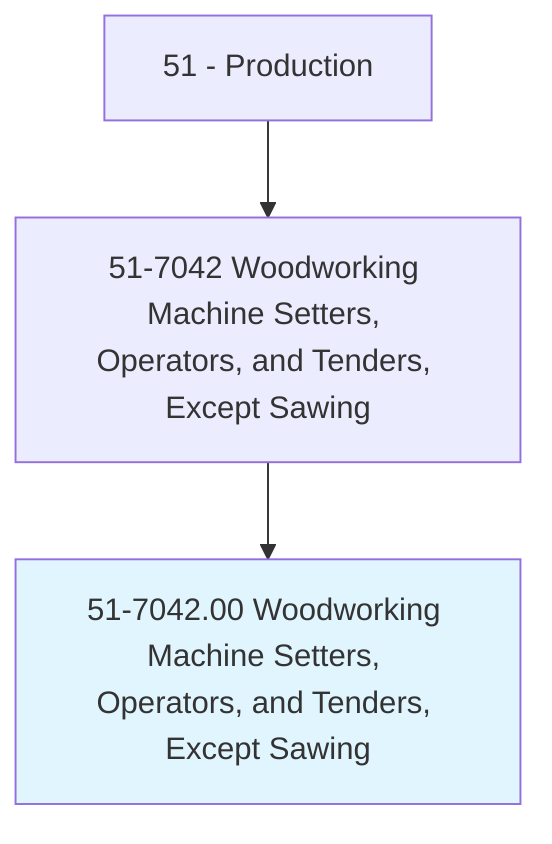
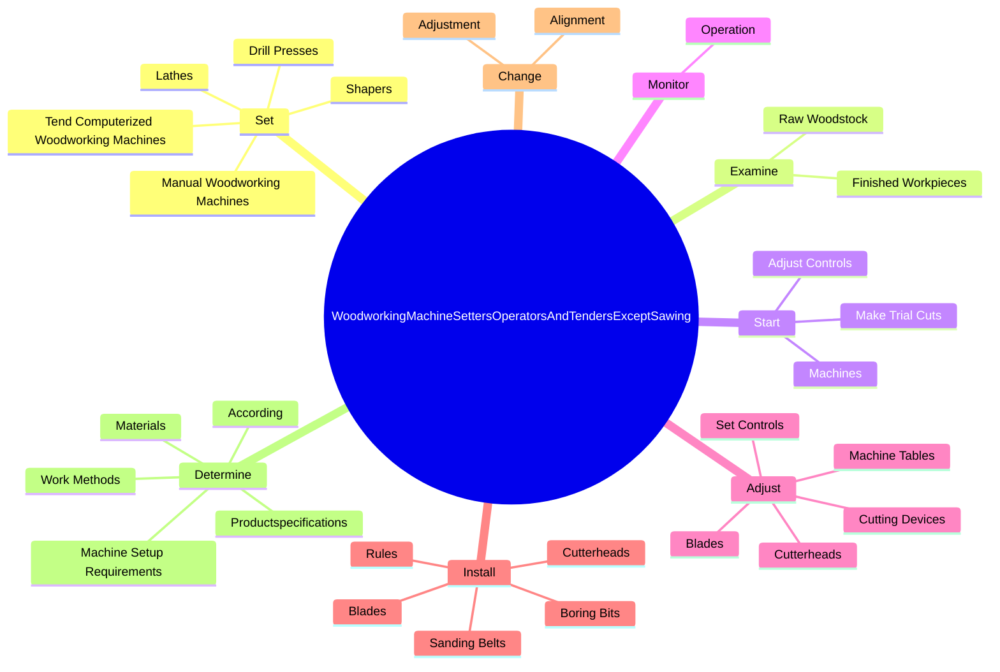

# Woodworking Machine Setters, Operators, and Tenders, Except Sawing

> Set up, operate, or tend woodworking machines, such as drill presses, lathes, shapers, routers, sanders, planers, and wood nailing machines. May operate computer numerically controlled (CNC) equipment.

## Overview

Woodworking Machine Setters, Operators, and Tenders, Except Sawing is an occupation within the Production category. Set up, operate, or tend woodworking machines, such as drill presses, lathes, shapers, routers, sanders, planers, and wood nailing machines. 

## Classification Hierarchy

## Key Statistics

| Metric | Value |
|--------|-------|
| SOC Code | 51-7042.00 |
| Category | [Production](/occupations/Production) |
| Task Count | 173 |
| Source | O*NET |

## Core Tasks

### set.TendComputerizedWoodworkingMachines

Woodworking Machine Setters, Operators, and Tenders, Except Sawing set tend computerized woodworking machines as part of their core responsibilities.

**Actions:**
- `set.TendComputerizedWoodworkingMachines`
- `set.ManualWoodworkingMachines`
- `set.DrillPresses`
- `set.Lathes`

### examine.FinishedWorkpieces

Woodworking Machine Setters, Operators, and Tenders, Except Sawing examine finished workpieces as part of their core responsibilities.

**Actions:**
- `examine.FinishedWorkpieces.for.Smoothness`
- `examine.FinishedWorkpieces.for.Shape`
- `examine.FinishedWorkpieces.for.Angle`
- `examine.FinishedWorkpieces.for.Depth.of.Cut`

### start.Machines

Woodworking Machine Setters, Operators, and Tenders, Except Sawing start machines as part of their core responsibilities.

**Actions:**
- `start.Machines.to.ensure.MachineryIsOperatingProperly`
- `start.AdjustControls.to.ensure.MachineryIsOperatingProperly`
- `start.MakeTrialCuts.to.ensure.MachineryIsOperatingProperly`

## Skills & Competencies

### Technical Skills
- **Machine Operation** - Advanced
- **Quality Control** - Advanced
- **Production Processes** - Advanced

### Soft Skills
- **Communication** - Essential
- **Problem Solving** - Essential
- **Critical Thinking** - Important
- **Teamwork** - Important
- **Adaptability** - Important

## Related Occupations

## Industries

This occupation is found across multiple industries. See [Industries](/industries) for sector-specific employment data.

## Career Progression

---

*Source: O*NET 51-7042.00 - ONETOccupation*
