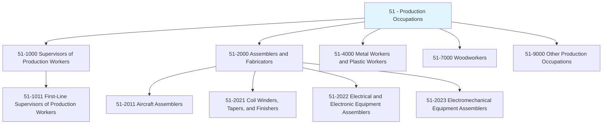
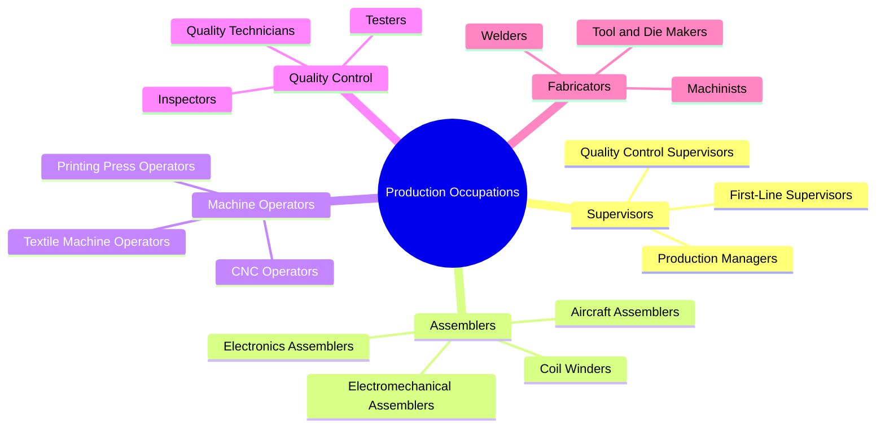
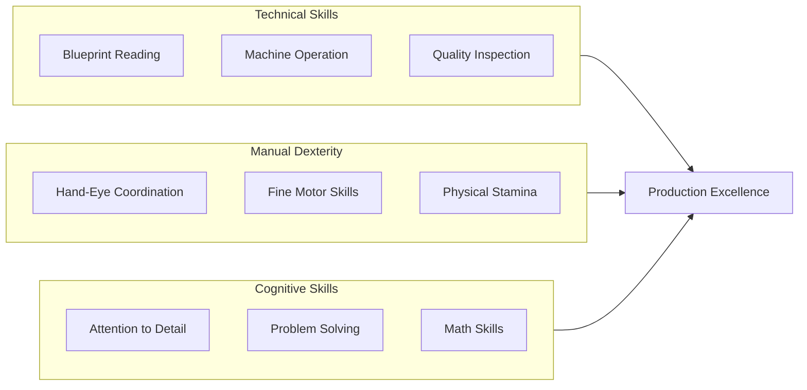
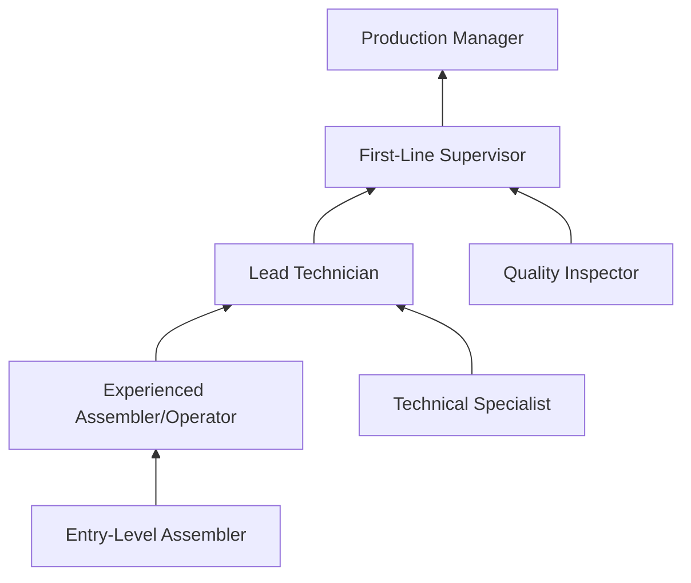

# Production Occupations

> Category 51 - Production occupations include workers who set up, operate, and tend machinery and equipment to produce goods. This category encompasses assemblers, fabricators, machine operators, inspectors, and first-line supervisors who oversee production processes.

## Overview

Production Occupations form the backbone of manufacturing and goods-producing industries. These workers transform raw materials into finished products through assembly, fabrication, machine operation, and quality control processes. From precision electronics assembly to heavy equipment manufacturing, production workers ensure products meet specifications and quality standards. The category spans skill levels from entry-level assemblers to experienced supervisors coordinating complex production operations.

## Classification Hierarchy

## Key Statistics

| Metric | Value |
|--------|-------|
| SOC Category Code | 51 |
| Major Groups | 9 |
| Detailed Occupations | 100+ |
| Source | O*NET / BLS |

## Occupations in this Category

### Supervisors of Production Workers (51-1000)

| Occupation | Code | Description |
|------------|------|-------------|
| [First-Line Supervisors of Production and Operating Workers](./ProductionSupervisors.mdx) | 51-1011.00 | Directly supervise and coordinate production and operating worker activities |

### Assemblers and Fabricators (51-2000)

| Occupation | Code | Description |
|------------|------|-------------|
| [Aircraft Structure, Surfaces, Rigging, and Systems Assemblers](./AircraftAssemblers.mdx) | 51-2011.00 | Assemble, fit, fasten, and install parts of airplanes, space vehicles, or missiles |
| [Coil Winders, Tapers, and Finishers](./CoilWinders.mdx) | 51-2021.00 | Wind wire coils used in electrical components and equipment |
| [Electrical and Electronic Equipment Assemblers](./ElectronicsAssemblers.mdx) | 51-2022.00 | Assemble or modify electrical or electronic equipment |
| [Electromechanical Equipment Assemblers](./ElectromechanicalAssemblers.mdx) | 51-2023.00 | Assemble or modify electromechanical equipment or devices |

## Category Overview Diagram

## Skills Common to Production Occupations

### Core Competencies

## Career Pathways

## Industries Employing Production Workers

- [Manufacturing](/industries/Manufacturing/index) - Primary employer
- Aerospace and Defense - Specialized assembly
- [Automotive Manufacturing](/industries/Manufacturing) - High volume production
- [Electronics Manufacturing](/industries/Electronics) - Precision assembly
- Food Processing - Processing and packaging
- [Pharmaceutical Manufacturing](/industries/Manufacturing/ChemicalManufacturing/Pharmaceutical) - Regulated production

## Education & Training Trends

| Level | Percentage of Workers |
|-------|----------------------|
| High School Diploma/GED | 45-55% |
| Some College/Technical Training | 25-30% |
| Associate's Degree | 10-15% |
| On-the-Job Training | Critical for all levels |

## Industry Variations

### Aerospace Manufacturing
- Highest precision requirements
- Extensive documentation
- FAA certification requirements
- Long training periods

### Electronics Manufacturing
- Clean room environments
- ESD protection protocols
- Microscope work common
- Rapid technology changes

### Heavy Equipment Manufacturing
- Larger scale assembly
- Heavy lifting requirements
- Welding certifications often required
- Outdoor/industrial environments

## Related Categories

- [Installation, Maintenance, and Repair](/occupations/InstallationAndRepair) - Category 49
- [Transportation and Material Moving](/occupations/TransportationAndMaterialMoving) - Category 53
- [Architecture and Engineering](/occupations/Architecture/index) - Category 17
- [Construction and Extraction](/occupations/Construction/index) - Category 47

---

*Source: O*NET / Bureau of Labor Statistics - SOC Category 51*
