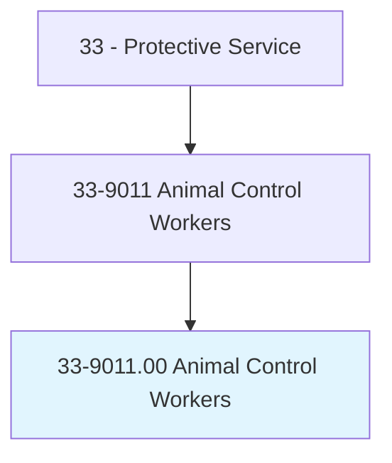
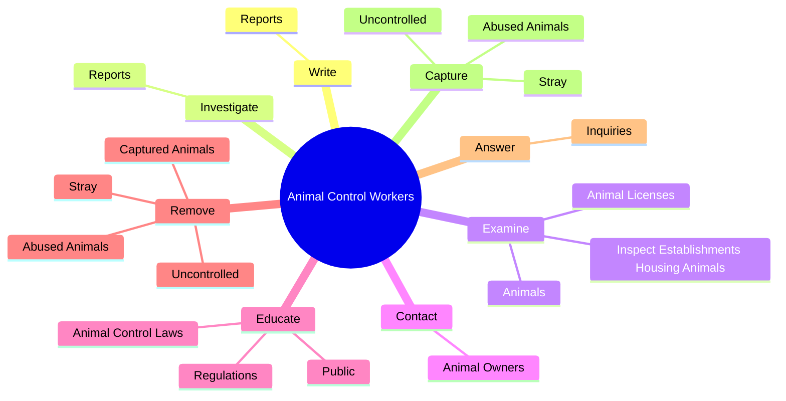
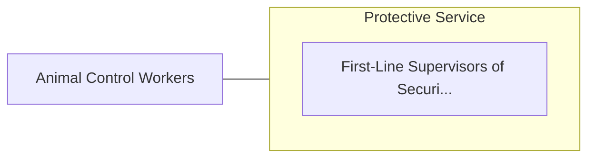

# Animal Control Workers

> Handle animals for the purpose of investigations of mistreatment, or control of abandoned, dangerous, or unattended animals.

## Overview

Animal Control Workers is classified under Protective Service (SOC 33). Handle animals for the purpose of investigations of mistreatment, or control of abandoned, dangerous, or unattended animals.

## Classification Hierarchy

## Key Statistics

| Metric | Value |
|--------|-------|
| SOC Code | 33-9011.00 |
| Category | [Protective Service](/occupations/PublicSafety) |
| Task Count | 68 |
| Source | O*NET |

## Core Tasks

### write.Reports

Animal Control Workers write reports as part of their core responsibilities.

**Actions:**
- `write.Reports.of.Activities`
- `write.Reports.of.MaintainFiles.of.Impoundments`
- `write.Reports.of.Dispositions.of.Animals`

### investigate.Reports

Animal Control Workers investigate reports as part of their core responsibilities.

**Actions:**
- `investigate.Reports.of.AnimalAttacksCruelty`
- `investigate.Reports.of.AnimalCruelty`
- `investigate.Reports.of.InterviewingWitnesses`
- `investigate.Reports.of.CollectingEvidence`

### examine.Animals

Animal Control Workers examine animals as part of their core responsibilities.

**Actions:**
- `examine.Animals.for.Injuries`
- `examine.Animals.for.Malnutrition`
- `examine.Animals.for.ArrangeF`
- `examine.Animals.for.NecessaryMedicalTreatment`

## Skills & Competencies

### Technical Skills
- **Law Enforcement** - Advanced
- **Emergency Response** - Advanced
- **Public Safety** - Advanced

### Soft Skills
- **Communication** - Essential
- **Problem Solving** - Essential
- **Critical Thinking** - Important
- **Teamwork** - Important
- **Adaptability** - Important

## Related Occupations

## Industries

This occupation is found across multiple industries. See [Industries](/industries) for sector-specific employment data.

## Career Progression

---

*Source: O*NET 33-9011.00 - ONETOccupation*
