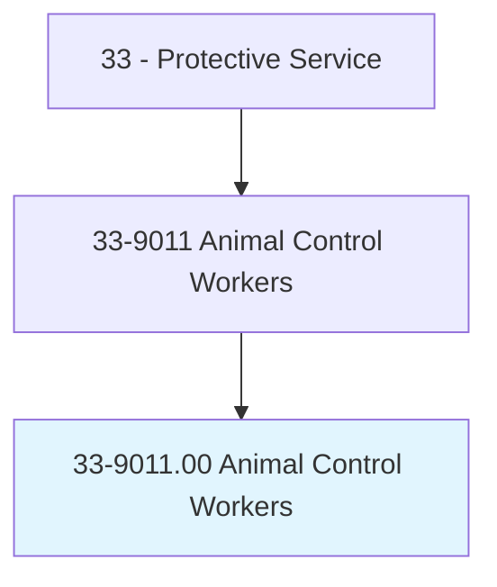
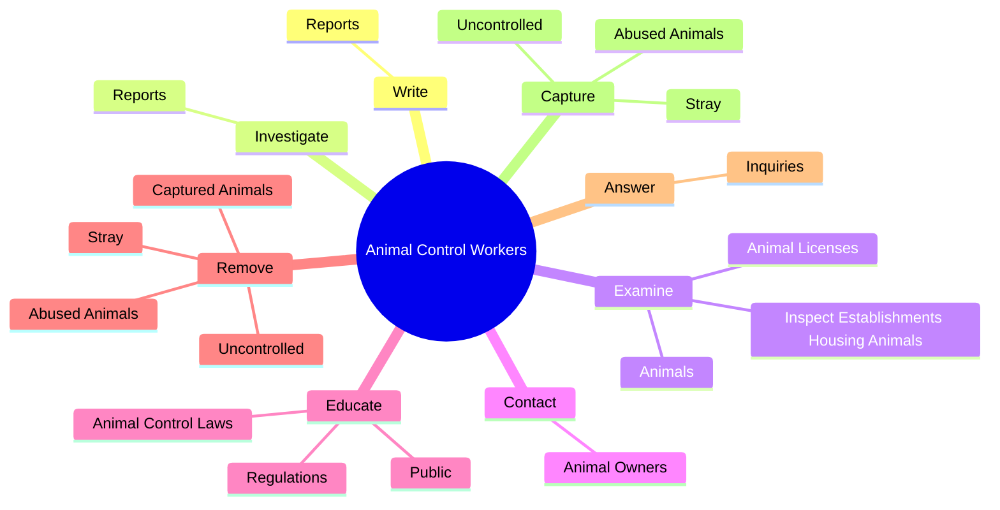
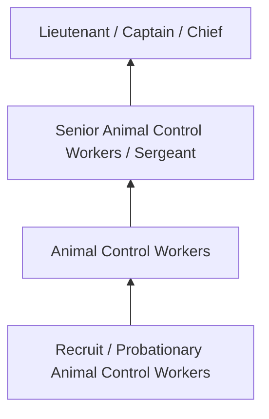
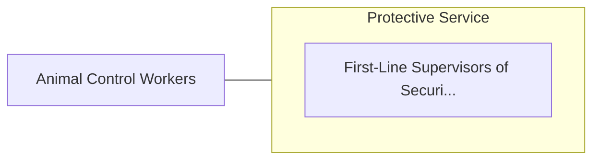

# Animal Control Workers

> Handle animals for the purpose of investigations of mistreatment, or control of abandoned, dangerous, or unattended animals.

## Overview

Animal Control Workers professionals handle animals for the purpose of investigations of mistreatment, or control of abandoned, dangerous, or unattended animals.. This occupation falls within the Protective Service category and requires a combination of specialized knowledge, technical skills, and practical experience.

These professionals work across diverse settings and organizational contexts, applying their expertise to meet the demands of their field. They must stay current with industry standards, emerging practices, and regulatory requirements that affect their work. The role demands both independent judgment and collaborative skills, as practitioners regularly interact with colleagues, stakeholders, and the public.

As the field continues to evolve, Animal Control Workers professionals increasingly leverage technology and data-driven approaches to enhance their effectiveness. Career opportunities span the public and private sectors, with demand influenced by economic conditions, demographic shifts, and technological advancement.

## Classification Hierarchy



## Key Statistics

| Metric | Value |
|--------|-------|
| SOC Code | 33-9011.00 |
| Job Zone | N/A |
| Category | [Protective Service](/occupations/PublicSafety/index) |
| Core Tasks | 68+ |
| Salary Range | $35,000 - $90,000 |
| Median Salary | $52,000 |
| Growth Outlook | 5% (As fast as average) |
| Source | O*NET |

## Core Tasks



### remove.CapturedAnimals

Animal Control Workers remove captured animals as part of their core responsibilities.

**Actions:**
- `remove.CapturedAnimals.from.AnimalControlServiceVehicles` - Remove captured animals from animal-control service vehicles and place animal...
- `remove.CapturedAnimals.from.PlaceAnimals.in.ShelterCagesEnclosures` - Remove captured animals from animal-control service vehicles and place animal...
- `remove.CapturedAnimals.from.OtherEnclosures` - Remove captured animals from animal-control service vehicles and place animal...
- `remove.Stray.from.UndesirableConditions` - Capture and remove stray, uncontrolled, or abused animals from undesirable co...
- `remove.Stray.from.UsingNets` - Capture and remove stray, uncontrolled, or abused animals from undesirable co...

### capture.Stray

Animal Control Workers capture stray as part of their core responsibilities.

**Actions:**
- `capture.Stray.from.UndesirableConditions` - Capture and remove stray, uncontrolled, or abused animals from undesirable co...
- `capture.Stray.from.UsingNets` - Capture and remove stray, uncontrolled, or abused animals from undesirable co...
- `capture.Stray.from.Nooses` - Capture and remove stray, uncontrolled, or abused animals from undesirable co...
- `capture.Stray.from.TranquilizerDartsAsNecessary` - Capture and remove stray, uncontrolled, or abused animals from undesirable co...
- `capture.Uncontrolled.from.UndesirableConditions` - Capture and remove stray, uncontrolled, or abused animals from undesirable co...

### examine.Animals

Animal Control Workers examine animals as part of their core responsibilities.

**Actions:**
- `examine.Animals.for.Injuries` - Examine animals for injuries or malnutrition, and arrange for any necessary m...
- `examine.Animals.for.Malnutrition` - Examine animals for injuries or malnutrition, and arrange for any necessary m...
- `examine.Animals.for.ArrangeF` - Examine animals for injuries or malnutrition, and arrange for any necessary m...
- `examine.Animals.for.NecessaryMedicalTreatment` - Examine animals for injuries or malnutrition, and arrange for any necessary m...
- `examine.AnimalLicenses.for.Compliance.with.Laws` - Examine animal licenses, and inspect establishments housing animals for compl...

### issue.Warnings

Animal Control Workers issue warnings as part of their core responsibilities.

**Actions:**
- `issue.Warnings.in.Connection.with.AnimalRelatedOffenses` - Issue warnings or citations in connection with animal-related offenses, or co...
- `issue.Warnings.in.ContactPolice.to.report.Violations` - Issue warnings or citations in connection with animal-related offenses, or co...
- `issue.Warnings.in.RequestArrests` - Issue warnings or citations in connection with animal-related offenses, or co...
- `issue.Citations.in.Connection.with.AnimalRelatedOffenses` - Issue warnings or citations in connection with animal-related offenses, or co...
- `issue.Citations.in.ContactPolice.to.report.Violations` - Issue warnings or citations in connection with animal-related offenses, or co...


## Skills & Competencies

### Technical Skills
- **Law Enforcement / Emergency Procedures** - Expert
- **Defensive Tactics** - Advanced
- **Report Writing** - Advanced
- **Emergency Response** - Advanced
- **Investigation Techniques** - Proficient
- **First Aid / CPR** - Proficient

### Soft Skills
- **Situational Awareness** - Critical
- **Decision Making Under Pressure** - Critical
- **Communication** - Essential
- **Physical Fitness** - Essential
- **Integrity** - Essential

## Education & Certifications

| Requirement | Details |
|-------------|---------|
| Typical Education | High school diploma to associate degree; academy training required |
| Work Experience | 0-2 years; field training period |
| On-the-Job Training | Extensive - police/fire/corrections academy |
| Certifications | State POST certification, EMT certification, firearms qualification |

## Career Progression



## Industry Variations

### Municipal Law Enforcement
City and county public safety services. Animal Control Workers professionals serve local communities through patrol, investigation, and prevention.

### Fire and Emergency Services
Emergency response and fire prevention. Focus on rapid response, incident command, and community safety education.

### Corrections
Custody and supervision of incarcerated individuals. Emphasis on security, rehabilitation, and institutional order.

### Private Security
Contract security services for commercial and residential clients. Focus on access control, surveillance, and risk assessment.

## Technology & Tools

- **Computer-aided dispatch (CAD) systems**
- **Body cameras and surveillance systems**
- **Records management systems**
- **Firearms and tactical equipment**
- **Emergency communication systems**

## Related Occupations



## Industries

- Local Government - High Employment
- State Government - High Employment
- Federal Government - Moderate Employment
- [Private Security Services](/industries/SecurityServices) - Moderate Employment

## Departments

This occupation typically works in:
- Patrol Division
- Investigations
- Emergency Services

## GraphDL Semantic Structure

```graphdl
Animal Control Workers perform:
- write.Reports.of.Activities
- write.Reports.of.MaintainFiles.of.Impoundments
- write.Reports.of.Dispositions.of.Animals
- investigate.Reports.of.AnimalAttacksCruelty
- investigate.Reports.of.AnimalCruelty
- investigate.Reports.of.InterviewingWitnesses
```

---

*Source: O*NET 33-9011.00 - ONETOccupation*
