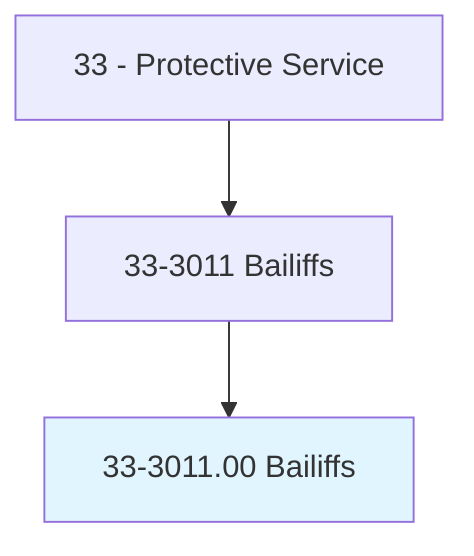
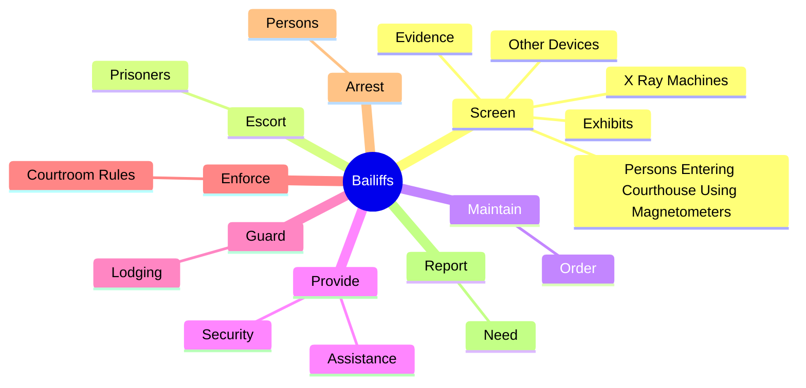
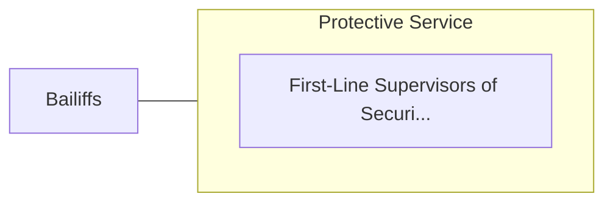

# Bailiffs

> Maintain order in courts of law.

## Overview

Bailiffs is classified under Protective Service (SOC 33). Maintain order in courts of law.

## Classification Hierarchy

## Key Statistics

| Metric | Value |
|--------|-------|
| SOC Code | 33-3011.00 |
| Category | [Protective Service](/occupations/PublicSafety/index) |
| Task Count | 38 |
| Source | O*NET |

## Core Tasks

### screen.PersonsEnteringCourthouseUsingMagnetometers

Bailiffs screen persons entering courthouse using magnetometers as part of their core responsibilities.

**Actions:**
- `screen.PersonsEnteringCourthouseUsingMagnetometers.to.collect.UnauthorizedFirearmsOtherContraband`
- `screen.PersonsEnteringCourthouseUsingMagnetometers.to.retain.UnauthorizedFirearmsOtherContraband`
- `screen.XRayMachines.to.collect.UnauthorizedFirearmsOtherContraband`
- `screen.XRayMachines.to.retain.UnauthorizedFirearmsOtherContraband`

### escort.Prisoners

Bailiffs escort prisoners as part of their core responsibilities.

**Actions:**
- `escort.Prisoners.to.FromCourthouse`
- `escort.Prisoners.to.maintain.CustodyOfPrisonersDuringCourtProceedings`

### maintain.Order

Bailiffs maintain order as part of their core responsibilities.

**Actions:**
- `maintain.Order.in.CourtroomDuringTrial`
- `maintain.Order.in.GuardJury.from.OutsideContact`

## Skills & Competencies

### Technical Skills
- **Law Enforcement** - Advanced
- **Emergency Response** - Advanced
- **Public Safety** - Advanced

### Soft Skills
- **Communication** - Essential
- **Problem Solving** - Essential
- **Critical Thinking** - Important
- **Teamwork** - Important
- **Adaptability** - Important

## Related Occupations

## Industries

This occupation is found across multiple industries. See [Industries](/industries) for sector-specific employment data.

## Career Progression

---

*Source: O*NET 33-3011.00 - ONETOccupation*
