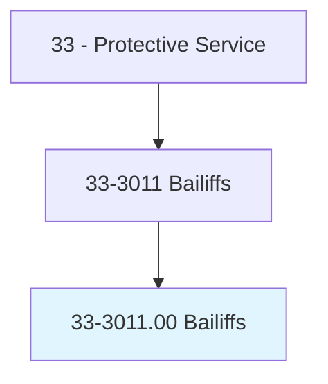
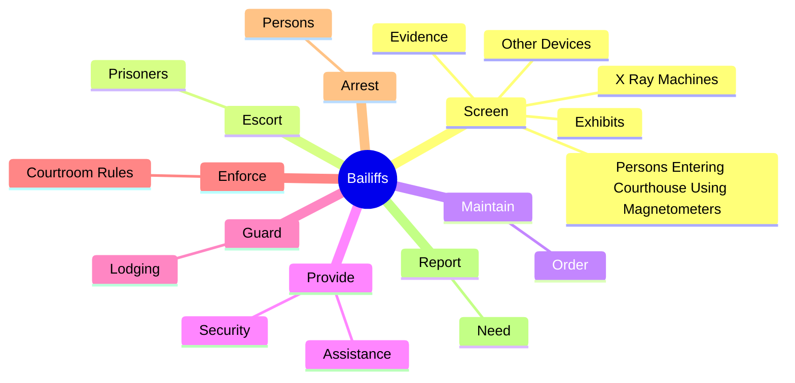
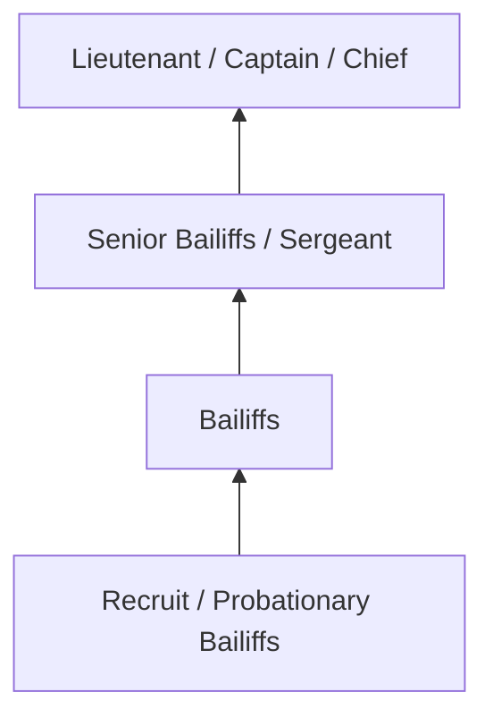
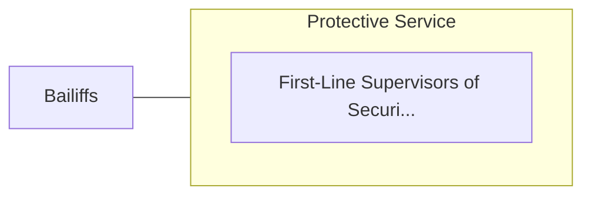

# Bailiffs

> Maintain order in courts of law.

## Overview

Bailiffs professionals serve a vital function within the Protective Service field. They bring specialized skills and knowledge to their roles, contributing to organizational objectives and societal needs.

These practitioners work in varied environments, adapting their expertise to meet specific requirements of their industry and employer. The role requires ongoing professional development to maintain competency and respond to changing demands.

Career paths in this field offer opportunities for advancement through experience, additional education, and specialized certifications. Employment prospects are influenced by industry trends, technological change, and workforce demographics.

## Classification Hierarchy



## Key Statistics

| Metric | Value |
|--------|-------|
| SOC Code | 33-3011.00 |
| Job Zone | N/A |
| Category | [Protective Service](/occupations/PublicSafety/index) |
| Core Tasks | 38+ |
| Salary Range | $35,000 - $90,000 |
| Median Salary | $52,000 |
| Growth Outlook | 5% (As fast as average) |
| Source | O*NET |

## Core Tasks



### screen.PersonsEnteringCourthouseUsingMagnetometers

Bailiffs screen persons entering courthouse using magnetometers as part of their core responsibilities.

**Actions:**
- `screen.PersonsEnteringCourthouseUsingMagnetometers.to.collect.UnauthorizedFirearmsOtherContraband` - Screen persons entering courthouse using magnetometers, x-ray machines, and o...
- `screen.PersonsEnteringCourthouseUsingMagnetometers.to.retain.UnauthorizedFirearmsOtherContraband` - Screen persons entering courthouse using magnetometers, x-ray machines, and o...
- `screen.XRayMachines.to.collect.UnauthorizedFirearmsOtherContraband` - Screen persons entering courthouse using magnetometers, x-ray machines, and o...
- `screen.XRayMachines.to.retain.UnauthorizedFirearmsOtherContraband` - Screen persons entering courthouse using magnetometers, x-ray machines, and o...
- `screen.OtherDevices.to.collect.UnauthorizedFirearmsOtherContraband` - Screen persons entering courthouse using magnetometers, x-ray machines, and o...

### provide.Security

Bailiffs provide security as part of their core responsibilities.

**Actions:**
- `provide.Security.by.PatrollingInterior.of.CourthouseEscortingJudgesOtherCourtEmployees` - Provide security by patrolling interior and exterior of courthouse and escort...
- `provide.Security.by.Exterior.of.CourthouseEscortingJudgesOtherCourtEmployees` - Provide security by patrolling interior and exterior of courthouse and escort...
- `provide.Assistance.to.Public` - Provide assistance to the public, such as directions to court offices.
- `provide.Assistance.to.DirectionsToCourtOffices` - Provide assistance to the public, such as directions to court offices.
- `provide.JuryEscort.to.RestaurantAreasOutsideOfCourtroomToPreventJuryContactWithPublic` - Provide jury escort to restaurant and other areas outside of courtroom to pre...

### check.Courtroom

Bailiffs check courtroom as part of their core responsibilities.

**Actions:**
- `check.Courtroom.for.SecurityAssureAvailability.of.SundrySupplies` - Check courtroom for security and cleanliness and assure availability of sundr...
- `check.Courtroom.for.CleanlinessAssureAvailability.of.SundrySupplies` - Check courtroom for security and cleanliness and assure availability of sundr...
- `check.Courtroom.for.Notepads` - Check courtroom for security and cleanliness and assure availability of sundr...
- `check.Courtroom.for.ForUseByJudge` - Check courtroom for security and cleanliness and assure availability of sundr...
- `check.Courtroom.for.Jurors` - Check courtroom for security and cleanliness and assure availability of sundr...

### maintain.Order

Bailiffs maintain order as part of their core responsibilities.

**Actions:**
- `maintain.Order.in.CourtroomDuringTrial` - Maintain order in courtroom during trial and guard jury from outside contact.
- `maintain.Order.in.GuardJury.from.OutsideContact` - Maintain order in courtroom during trial and guard jury from outside contact.
- `maintain.CourtDocket` - Maintain court docket.


## Skills & Competencies

### Technical Skills
- **Law Enforcement / Emergency Procedures** - Expert
- **Defensive Tactics** - Advanced
- **Report Writing** - Advanced
- **Emergency Response** - Advanced
- **Investigation Techniques** - Proficient
- **First Aid / CPR** - Proficient

### Soft Skills
- **Situational Awareness** - Critical
- **Decision Making Under Pressure** - Critical
- **Communication** - Essential
- **Physical Fitness** - Essential
- **Integrity** - Essential

## Education & Certifications

| Requirement | Details |
|-------------|---------|
| Typical Education | High school diploma to associate degree; academy training required |
| Work Experience | 0-2 years; field training period |
| On-the-Job Training | Extensive - police/fire/corrections academy |
| Certifications | State POST certification, EMT certification, firearms qualification |

## Career Progression



## Industry Variations

### Municipal Law Enforcement
City and county public safety services. Bailiffs professionals serve local communities through patrol, investigation, and prevention.

### Fire and Emergency Services
Emergency response and fire prevention. Focus on rapid response, incident command, and community safety education.

### Corrections
Custody and supervision of incarcerated individuals. Emphasis on security, rehabilitation, and institutional order.

### Private Security
Contract security services for commercial and residential clients. Focus on access control, surveillance, and risk assessment.

## Technology & Tools

- **Computer-aided dispatch (CAD) systems**
- **Body cameras and surveillance systems**
- **Records management systems**
- **Firearms and tactical equipment**
- **Emergency communication systems**

## Related Occupations



## Industries

- Local Government - High Employment
- State Government - High Employment
- Federal Government - Moderate Employment
- [Private Security Services](/industries/SecurityServices) - Moderate Employment

## Departments

This occupation typically works in:
- Patrol Division
- Investigations
- Emergency Services

## GraphDL Semantic Structure

```graphdl
Bailiffs perform:
- screen.PersonsEnteringCourthouseUsingMagnetometers.to.collect.UnauthorizedFirearmsOtherContraband
- screen.PersonsEnteringCourthouseUsingMagnetometers.to.retain.UnauthorizedFirearmsOtherContraband
- screen.XRayMachines.to.collect.UnauthorizedFirearmsOtherContraband
- screen.XRayMachines.to.retain.UnauthorizedFirearmsOtherContraband
- screen.OtherDevices.to.collect.UnauthorizedFirearmsOtherContraband
- screen.OtherDevices.to.retain.UnauthorizedFirearmsOtherContraband
```

---

*Source: O*NET 33-3011.00 - ONETOccupation*
