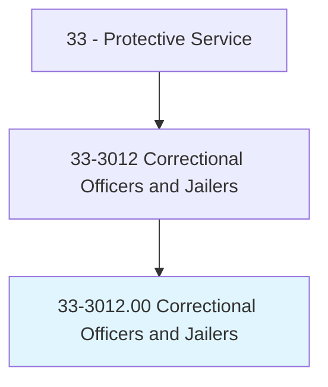
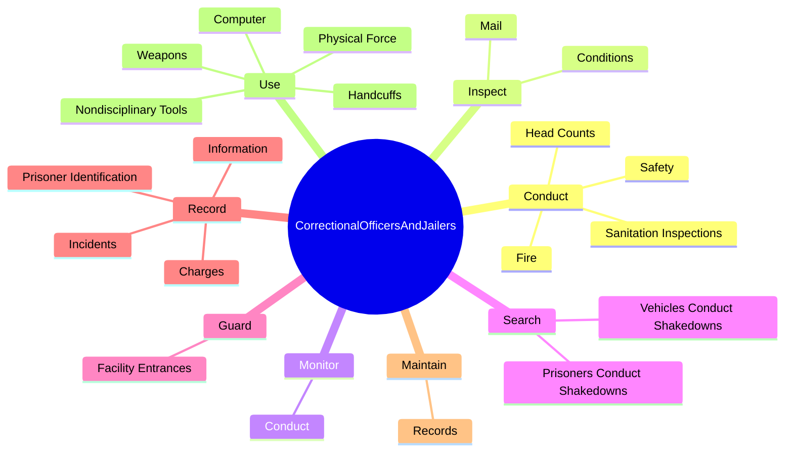

# Correctional Officers and Jailers

> Guard inmates in penal or rehabilitative institutions in accordance with established regulations and procedures. May guard prisoners in transit between jail, courtroom, prison, or other point. Includes deputy sheriffs and police who spend the majority of their time guarding prisoners in correctional institutions.

## Overview

Correctional Officers and Jailers is an occupation within the Protective Service category. Guard inmates in penal or rehabilitative institutions in accordance with established regulations and procedures. May guard prisoners in transit between jail, courtroom, prison, or other point.

## Classification Hierarchy

## Key Statistics

| Metric | Value |
|--------|-------|
| SOC Code | 33-3012.00 |
| Category | [Protective Service](/occupations/PublicSafety/index) |
| Task Count | 104 |
| Source | O*NET |

## Core Tasks

### conduct.HeadCounts

Correctional Officers and Jailers conduct head counts as part of their core responsibilities.

**Actions:**
- `conduct.HeadCounts.to.ensure.PrisonerIsPresent`
- `conduct.Fire`
- `conduct.Safety`
- `conduct.SanitationInspections`

### inspect.Conditions

Correctional Officers and Jailers inspect conditions as part of their core responsibilities.

**Actions:**
- `inspect.Conditions.of.Locks`
- `inspect.Conditions.of.WindowBars`
- `inspect.Conditions.of.Grills`
- `inspect.Conditions.of.Doors`

### monitor.Conduct

Correctional Officers and Jailers monitor conduct as part of their core responsibilities.

**Actions:**
- `monitor.Conduct.of.Prisoners.in.HousingUnit`
- `monitor.Conduct.of.DuringWork`
- `monitor.Conduct.of.RecreationalActivities`
- `monitor.Conduct.of.According.to.established.Policies`

## Skills & Competencies

### Technical Skills
- **Law Enforcement** - Advanced
- **Emergency Response** - Advanced
- **Public Safety** - Advanced

### Soft Skills
- **Communication** - Essential
- **Problem Solving** - Essential
- **Critical Thinking** - Important
- **Teamwork** - Important
- **Adaptability** - Important

## Related Occupations

## Industries

This occupation is found across multiple industries. See [Industries](/industries) for sector-specific employment data.

## Career Progression

---

*Source: O*NET 33-3012.00 - ONETOccupation*
