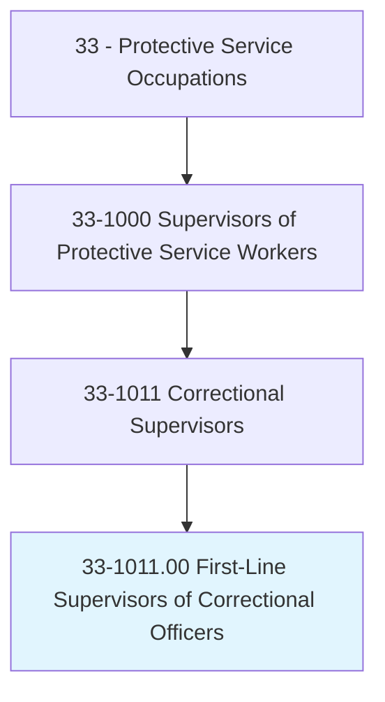
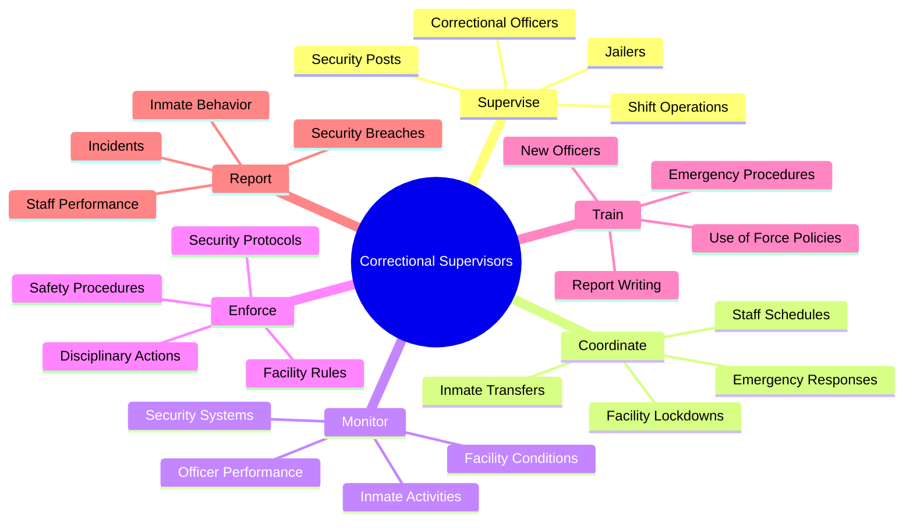
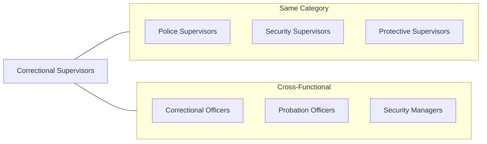
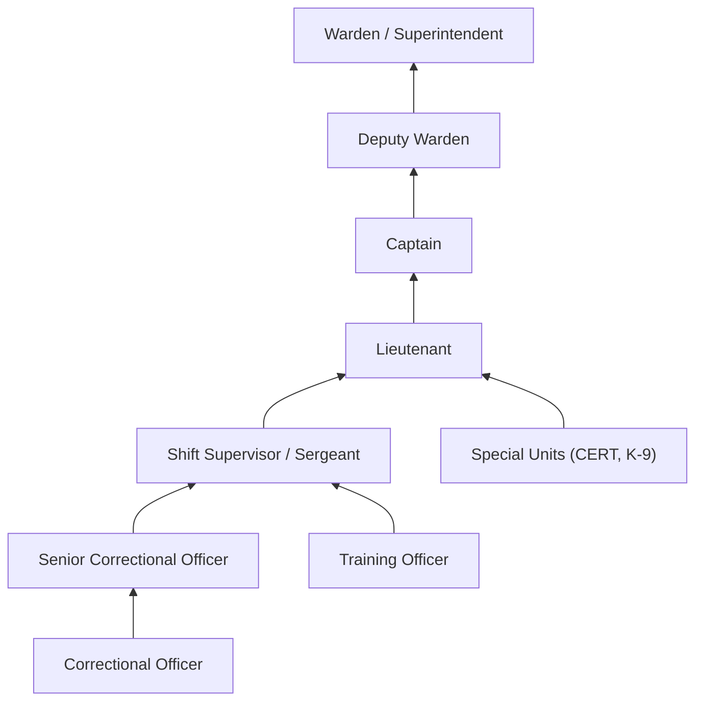

# First-Line Supervisors of Correctional Officers

> Directly supervise and coordinate activities of correctional officers and jailers.

## Overview

First-Line Supervisors of Correctional Officers serve as the critical management link in correctional facilities, overseeing the daily activities of correctional officers and jailers who guard inmates in prisons, jails, and detention centers. These supervisors ensure facility security, manage staff scheduling, respond to emergencies, and maintain order within their assigned areas. They balance the need for strict security protocols with rehabilitation goals, working in state and federal prisons, county jails, and private detention facilities. The role demands exceptional judgment, leadership under pressure, and the ability to manage both staff and inmate populations effectively.

## Classification Hierarchy

## Key Statistics

| Metric | Value |
|--------|-------|
| SOC Code | 33-1011.00 |
| Job Zone | 3 (Medium Preparation) |
| Category | [Protective Service](/occupations/PublicSafety/index) |
| Core Tasks | 12+ |
| Source | O*NET |

## Core Tasks

### supervise.CorrectionalOfficers

Correctional Supervisors oversee the daily work of correctional officers ensuring security and operational efficiency.

**Actions:**
- `supervise.CorrectionalOfficers.to.maintain.FacilitySecurity` - Direct officer activities to ensure secure facility operations
- `supervise.Officers.to.enforce.InmateRules` - Ensure staff properly enforces facility regulations
- `supervise.Staff.to.complete.ShiftDuties` - Oversee completion of all assigned shift responsibilities
- `coordinate.Officers.during.Emergencies` - Direct staff response during security incidents

### monitor.InmateActivities

Supervisors ensure proper oversight of inmate populations and facility conditions.

**Actions:**
- `monitor.InmateActivities.to.prevent.Disturbances` - Observe inmate behavior to identify potential issues
- `monitor.SecuritySystems.to.detect.Breaches` - Review surveillance and alarm systems continuously
- `inspect.FacilityAreas.to.ensure.Compliance` - Conduct regular inspections of cells, common areas, and perimeters
- `review.IncidentReports.to.identify.Patterns` - Analyze reports to detect security trends

### coordinate.EmergencyResponses

Supervisors lead staff during critical incidents requiring immediate action.

**Actions:**
- `coordinate.EmergencyResponses.during.Riots` - Direct officer deployment during inmate disturbances
- `coordinate.Staff.during.MedicalEmergencies` - Manage response to inmate medical crises
- `coordinate.Evacuations.during.Fires` - Lead orderly evacuation procedures
- `direct.Lockdowns.to.restore.Order` - Implement facility-wide security measures

### train.OfficerStaff

Supervisors develop and maintain officer competencies through ongoing training.

**Actions:**
- `train.NewOfficers.in.FacilityProcedures` - Onboard and orient new correctional staff
- `train.Staff.in.UseOfForce.Policies` - Ensure proper understanding of force continuum
- `train.Officers.in.EmergencyProtocols` - Prepare staff for crisis situations
- `evaluate.TrainingEffectiveness.to.improve.Programs` - Assess and enhance training curricula

### enforce.DisciplinaryActions

Supervisors administer discipline for both staff and inmates as required.

**Actions:**
- `enforce.DisciplinaryActions.for.InmateViolations` - Process and implement inmate discipline
- `document.Incidents.for.LegalRecords` - Create comprehensive incident documentation
- `recommend.Sanctions.based.on.Severity` - Determine appropriate disciplinary measures
- `review.Appeals.to.ensure.Fairness` - Evaluate disciplinary decision appeals

## Skills & Competencies

### Technical Skills
- **Security Management** - Advanced
- **Crisis Intervention** - Advanced
- **Report Writing** - Advanced
- **Surveillance Systems** - Proficient
- **Legal Knowledge (Corrections Law)** - Proficient

### Soft Skills
- **Leadership** - Critical
- **Decision Making Under Pressure** - Critical
- **Conflict Resolution** - Essential
- **Communication** - Essential
- **Stress Management** - Essential

## Related Occupations

## Industries

- State Government (Corrections) - Highest Employment
- Federal Government (Bureau of Prisons) - High Employment
- Local Government (County Jails) - Moderate Employment
- Private Corrections Facilities - Growing Sector
- Immigration Detention - Federal Contract Facilities

## Industry Variations

### State Prison Systems
- Manage large inmate populations in maximum, medium, and minimum security facilities
- Oversee specialized units: death row, protective custody, mental health
- Coordinate with state parole and rehabilitation programs
- Implement state-mandated training and certification requirements

### Federal Bureau of Prisons
- Supervise in facilities across security levels (USP, FCI, FPC)
- Follow federal sentencing guidelines and classification systems
- Coordinate with federal agencies (FBI, US Marshals, ICE)
- Implement federal training standards and career progression

### County/Local Jails
- Manage shorter-term populations with high turnover
- Handle pre-trial detainees and sentenced misdemeanants
- Coordinate closely with courts for inmate transport
- Work with smaller staff in more varied roles

### Private Detention Facilities
- Operate under government contracts with performance metrics
- Balance cost efficiency with security requirements
- Implement corporate policies alongside regulatory compliance
- Focus on documentation for contract accountability

## Career Progression

## Education & Training

| Requirement | Details |
|-------------|---------|
| Typical Education | High school diploma required; Associate's or Bachelor's degree preferred |
| Work Experience | 3-5 years as Correctional Officer |
| On-the-Job Training | 6-12 months supervisory training |
| Required Certifications | State Corrections Academy, CPR/First Aid, Firearms |
| Continuing Education | Annual in-service training, leadership development |

## Work Environment

| Factor | Description |
|--------|-------------|
| Setting | Prisons, jails, detention centers |
| Schedule | Shift work including nights, weekends, holidays (24/7 operations) |
| Physical Demands | Standing, walking, potential physical confrontation |
| Stress Level | High - managing security and personnel challenges |
| Risk Factors | Potential for violence, exposure to communicable diseases |

## Departments

This occupation typically works in:
- Corrections Operations
- Facility Security
- Inmate Services
- Staff Training

## Related Processes

- [Inmate Classification](/processes/InmateClassification)
- [Emergency Response Protocols](/processes/EmergencyResponse)
- [Shift Change Procedures](/processes/ShiftChange)
- [Incident Documentation](/processes/IncidentDocumentation)

---

*Source: O*NET 33-1011.00 - ONETOccupation*
